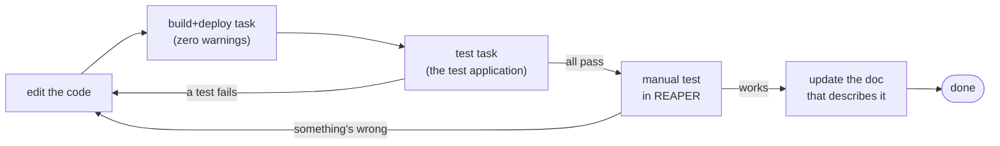

# Contributing to ReaShader

ReaShader runs inside REAPER's own process, on REAPER's threads, so a mistake in the plugin can crash or freeze REAPER, not just the plugin. The checks that catch such mistakes are spread across the compiler, a test application and a manual test, and the conventions that keep the code readable are spread across C++, CMake and a web page.

**The answer:** a change is done when it

- **builds with zero warnings,**
- **passes the test application and the manual test in REAPER,**
- **respects the four runtime rules** that keep REAPER alive,
- **follows the code style** of the files it touches,
- **and updates the doc** that describes what it changed.

This file covers each of those in turn. To find your way around the code first, read [doc/architecture.md](doc/architecture.md); to build it, [doc/building.md](doc/building.md); when something breaks in a strange way, [doc/gotchas.md](doc/gotchas.md).

Contents:

1. [Workflow](#1-workflow)
2. [Runtime rules](#2-runtime-rules)
3. [Code style](#3-code-style)
4. [Documentation](#4-documentation)

## 1. Workflow

**Every change goes through the same loop: build and deploy, run the tests, try it in REAPER, then update the docs.**



*What to see:* the two checks come in order of cost. The test application runs in seconds and catches most mistakes; the manual test needs a person and REAPER, and catches what the fake REAPER in the tests doesn't model.

1. **Build** with the `build+deploy` task (see [building.md](doc/building.md)). It also copies the plugin into your CLAP folder, so REAPER loads the new version.
2. **Run the test application** with the `test` task (see [testing.md](doc/testing.md)). Tests don't run on `build+deploy`, so an experiment can be deployed to REAPER while a test is red, but a change is done only when they pass.
3. **Test by hand in REAPER** ([testing.md §5](doc/testing.md#5-manual-testing-in-reaper)). This stays the final check.
4. **Update the docs** in the same change (see [section 4](#4-documentation)).

Along the way:

- **There is no lint step:** the compiler's warnings and `.clang-format` are the checks.
- **Zero warnings from our code.** A warning is often the real cause of a strange native crash (see [gotchas.md](doc/gotchas.md)).
- **Assets aren't dead just because nothing references them yet.** Images, meshes and styles in `res/` and `src/ui/` can be there for upcoming UI work. Ask before removing one.

## 2. Runtime rules

**Four rules keep REAPER running; breaking any of them crashes or freezes REAPER, not just the plugin.**

| Rule | What happens if it's broken | How the code keeps it |
|---|---|---|
| **Nothing throws out of a REAPER or CLAP callback** (a function REAPER calls in the plugin) | REAPER treats an escaped exception as fatal: `abort()`, with exception `0x40000015` "inside reaper.exe" | `ReaShaderRenderer` catches everything in its public functions: a Vulkan error during a frame sets `failed`, and video passes through until the next activation |
| **Never block REAPER's video thread** | playback stutters, or REAPER freezes while the thread waits | `renderFrame` only *tries* to take `frameMutex` (`try_lock`), and skips the frame when it's busy. `init`, `shutdown` and `changeRenderingDevice` hold that mutex |
| **`deactivate()` deletes the video processor,** and nothing else | REAPER would keep calling a half-torn-down plugin; or, if deactivation shut the GPU down, every reactivation would be slow | deactivation stops REAPER's frame calls; the renderer (the GPU) lives until the plugin is destroyed, created by the first `activate()`, so reactivating is fast |
| **REAPER's `'RGBA'` frames are B,G,R,A in memory** (byte 0 = B) | red and blue swap, in code that builds or reads pixels by hand | the renderer copies frames byte for byte into images of the same byte order (`B8G8R8A8_UNORM`), so shaders see the right channels |

Why these rules exist, and how the plugin is built around them, is in [architecture.md §2](doc/architecture.md#2-four-threads-one-rule).

## 3. Code style

**Code is written to be skimmed: formatted by tool where one exists, commented briefly about what and why, and named plainly.** Each kind of file has a few rules of its own.

### C++

**C++ is formatted by `.clang-format` and must compile with zero warnings under strict flags.**

- **Formatting:** [.clang-format](.clang-format) (based on Microsoft, tabs, 4 wide).
- **Warnings:** `-Wall -Wextra -Wpedantic -Wshadow -Wconversion`, and a missing `return` is an error. `-Wno-missing-field-initializers` is set on purpose: the `VkXxxInfo info{ VK_STRUCTURE_TYPE_XXX }` idiom zeroes the rest of the struct. Third-party code is exempt (`SYSTEM` includes, `-w` for its sources).
- **Vulkan flags:** combine bits into the `...Flags` type (e.g. `VkShaderStageFlags`), never the `...FlagBits` enum.
- **Windows:** call the explicit `...W` functions. See [gotchas.md](doc/gotchas.md#24-the-build-or-the-link-fails) for the header traps.

### File headers

**Every C++, JS and SCSS file in `src/` and `test/` starts with the same block.** `@file` stays bare (no file name), and `@brief` is one line:

```cpp
/**
 * @file
 * @brief ReaShaderRenderer: renders REAPER's frames on the GPU, never throws.
 * @author Emanuele Messina (https://github.com/emanuelemessina)
 * @copyright Copyright (c) Emanuele Messina. All rights reserved.
 *            Licensed under the MIT License: see https://github.com/emanuelemessina/ReaShader/blob/main/LICENSE
 */
```

GLSL, HTML and installer scripts have no header.

### Comments

**Comments say what the code does and why, briefly, for a reader who has only the code in front of them.**

- **No history:** comments in code, CMake and scripts never tell how the code got here ("was X", "replaced Y", "the old folder"), or what was tried and rejected. That belongs in commit messages.
- **Keep them short:** a summary line, or a bullet list of what a block does.

### Naming

**Names are plain and descriptive, with no project prefixes:** `PLUGIN_STAGE_DIR`, `SHADERS_STAGE_DIR`, `LIB_SUFFIX`, not `RS_STAGE_DIR`.

### CMake

**CMake files read top to bottom in the order the build happens.**

- **Files follow the build's pipeline,** in sections separated by `#################################` banners:
  - `CMakeLists.txt`: Tooling → Project configuration → Libraries → Target → Generated → Sources → Includes → Compiler options → Link → Staging → Install → Package;
  - `build.cmake`: Preset → Configure → Build → Test → Package → Deploy.
- **Comments** are the section banners, short summaries, and `# - ...` bullet lists of what a block does.
- **Presets:** shared settings (generator, compilers) go in the `base` preset.
- **No one-off migration steps** in build scripts (e.g. deleting a folder an older version created). Do a one-off cleanup by hand, once.
- **No new config file** when an existing one can hold the setting. For example, UTF-8 is enforced by `files.encoding` in `.vscode/settings.json`, not an `.editorconfig`.

### Frontend (`src/ui/`)

**The web UI is plain HTML, JS and SCSS loaded from a file: the page keeps no state of its own, and every color comes from one palette.** How its code is organized (which script does what, redrawing from snapshots, adding a control) is in [architecture.md §6.1](doc/architecture.md#61-the-page).

**Files:**

- **UTF-8 only.** A UTF-16 `index.html` loaded through `file://` shows as garbage text. After rewriting a file, `file index.html` must not say "UTF-16".
- **Indentation:** 4 spaces in HTML, JS and SCSS. There is no formatter for them, so keep to the surrounding code.

**Scripts:**

- **Plain sequential `<script>` tags, no ES modules:** `file://` blocks module imports. Scripts share the global scope, and `index.html` loads them in dependency order.
- **Only `native` (`api.js`) talks to the plugin:** one method per message, named after its `type`. Nothing else calls `window.postToNative`.
- **No state kept in the UI:** what the page shows comes from the last `snapshot`. An action sends a message and waits for the snapshot (or `paramValue`, `chainStatus`) that answers it, rather than changing the page itself. The exceptions are immediate feedback for the user's own action: a slider's value while dragging, the about box opening or closing, and `setStatus(..., 'busy')` before a slow request.
- **Build elements in JS** with the small `create*` helpers in `ui.js` (`createSlider`, `createSelect`, `createIconButton`), and set text with `textContent`, never `innerHTML` with data from the plugin (names come from files the user uploaded).
- **Naming:** functions `camelCase`, with verbs for what they do (`renderX` rebuilds a section from the snapshot, `createX` returns a new element, `setX` patches one in place); constant tables `UPPER_CASE` (`KINDS`); DOM ids built from an id and a prefix (`param_<id>`, `bypass_<uid>`).
- **Comments:** a short line above a function or block, saying what it's for. Sections of a file are separated by `// -------- name --------`.

**Styles:**

- **Every color comes from `components/_palette.scss`,** used as `c.$name` (`@use './palette' as c;`). A new color is added there first, with a name for its role (`$error`, `$link`), not its value.
- **One partial per kind of control** in `styles/components/_<control>.scss` (`button`, `input[type=range]`, `select`, ...), styling the element everywhere it appears. A partial that needs the palette or another partial `@use`s it itself. `ui.scss` `@use`s them, and holds the page layout and the styles of its sections.
- **Selectors:** ids for the page's fixed sections from `index.html` (`#chain`, `#renderingDevice`, `#about`), classes for everything inside them and for elements built in JS (`.node`, `.node-header`, `.status`). Nest a section's rules inside its selector, and express states as modifier classes on the element (`.node.bypassed`, `.status.busy`).
- **Units:** `rem` for text sizes, `px` for borders.
- **The CSS is a build output** (`index.css`, compressed), never committed.

## 4. Documentation

**Each doc has one audience and one subject, describes only what exists, and is updated in the same change as the code it describes.**

### Which doc covers what

| Doc | For | Covers |
|---|---|---|
| [README.md](README.md) | users | what ReaShader does, installing and using it, an index of the docs |
| [src/shaders/examples/README.md](src/shaders/examples/README.md) | users | writing a shader |
| [CONTRIBUTING.md](CONTRIBUTING.md) | developers | this file |
| [doc/building.md](doc/building.md) | developers | building, deploying, packaging |
| [doc/architecture.md](doc/architecture.md) | developers | how the plugin is put together |
| [doc/rendering.md](doc/rendering.md) | developers | the renderer, for readers who don't know Vulkan |
| [doc/testing.md](doc/testing.md) | developers | the test application and the manual test |
| [doc/gotchas.md](doc/gotchas.md) | developers | traps, and debugging crashes and hangs |

### When to update a doc

**A change that alters what a doc describes updates that doc in the same change:**

- `src/render/` or `src/shaders/internal/` → [rendering.md](doc/rendering.md) (barrier table, lifetimes, decisions);
- the test application (`test/`, the fake host's behavior, how tests run) → [testing.md](doc/testing.md). A REAPER behavior the fake host emulates is commented _observed_ (with how it was verified) or _assumed_;
- threads, params, state, the web UI protocol, or the layout → [architecture.md](doc/architecture.md);
- the build, deploy or installer → [building.md](doc/building.md);
- the shader contract (built-in inputs, `Params`, `//@param`) → the [examples README](src/shaders/examples/README.md).

Two rules apply to every doc:

- **Docs describe what exists** and how to use and change it: no roadmaps, "planned" sections or history.
- **Code is referenced by file and function,** never by line number.

### How docs are written

**Docs follow Barbara Minto's _The Pyramid Principle: Logic in Writing and Thinking_: the point first, then the ideas that support it, each expanded the same way.** A reader who stops after any paragraph should already have the most important part.

1. **Open with the answer.** The first paragraph says what the doc is about and the one thing to take away. For an explainer, give the situation, the complication, the question it raises and the answer, in a few sentences.
2. **Group the rest into 3 to 6 sections** that together support the opening, don't overlap, and leave nothing out. Order them by time (a process), by structure (the parts of a whole) or by importance.
3. **Start every section with its point** in one sentence, in bold, then group the details under it. The same rule applies at every level.
4. **Explain every term before using it.** A word that isn't everyday English, or that the doc uses in a special sense ("node", "snapshot", "pending for the host"), is defined where it first appears, or in a short table of terms after the opening. Never rely on context the reader doesn't have, such as a past discussion or the code itself.
5. **Concepts before code names.** Prose says what things do. Function and file names come after the concept, in a closing _In the code_ line, or in a reference section at the end, and are not the subjects of sentences.
6. **Draw what flows or connects,** with [Mermaid](https://mermaid.js.org/) blocks, which GitHub and VSCode render:
   - `flowchart` for data flows, processes and ownership;
   - `sequenceDiagram` for threads and messages over time, with `autonumber`;
   - `stateDiagram-v2` for lifecycles.

   **Every label says plainly who does what:** "render this frame, if the frame lock is free", not "try_lock". **Every diagram is followed by an explanation** of what to see in it; for a sequence, one line per numbered step. **An example is announced as one,** with where its names come from ("the shader `grain.frag`, as node B"), so the reader can tell the example's names from the general rule.

7. **Put lookup material last:** tables of messages, ids, files and options go in a reference section, where readers look things up rather than read.
8. **Sections are separated by their headings only,** with no horizontal rules.

[architecture.md](doc/architecture.md) is the model to follow.
