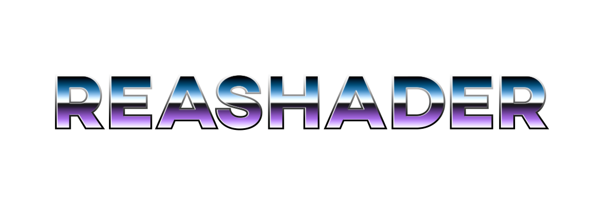
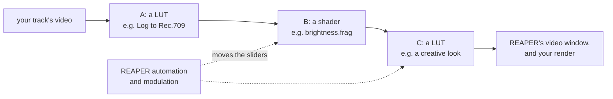

<h1 align="center"></h1>

**ReaShader is a video effect plugin for REAPER: it runs a track's video through a chain of GPU shaders and color LUTs, and every slider in it is a REAPER parameter you can automate.** You add it to a track like any audio effect, and it processes video frames instead of audio samples.



*Here is an example chain:* the video goes through each step, top to bottom in the plugin window; each step has a letter, and REAPER can automate its sliders like any plugin knob.

Contents:

1. [Why ReaShader](#1-why-reashader)
2. [What it does](#2-what-it-does)
3. [Installing](#3-installing)
4. [Using it](#4-using-it)
5. [Documentation](#5-documentation)
6. [Credits](#6-credits)

## 1. Why ReaShader

REAPER is a great, versatile DAW, and it edits video as well as audio. For many musicians and creators, that makes it the one place where a whole project lives: the song, the mix and the music video on the same timeline.

REAPER's own video effects, though, are limited. A custom effect means writing an EEL2 script against REAPER's video API, a language no other graphics tool shares. Meanwhile, the rest of the graphics world writes effects as **shaders**: small programs that run on the GPU, are fast enough for real time, and are shared by the thousands online.

ReaShader brings the two together:

- **Effects are shaders.** Write one, or adapt one you found, and upload it. The plugin compiles it and runs it on your GPU.
- **Shader params are REAPER params.** Every parameter a shader declares becomes a REAPER parameter, so it can be automated, modulated or linked like any plugin knob.
- **Color grading with LUTs.** Load a `.cube` LUT, the format most grading tools export, and apply it before or after a shader, or from inside one.

It started as my own experiment in making a video processor for REAPER, and grew into a full plugin. It took a lot of blood, sweat and tears: if you benefit from it, please cite me. Thank you 🙏

## 2. What it does

**ReaShader is a [CLAP](https://cleveraudio.org/) plugin that runs the track's video through a chain of GLSL fragment shaders and LUTs on the GPU, with Vulkan, edited from its own window inside REAPER.**

- **The plugin window** is a web page embedded in REAPER's FX window. From it you:
  - build the chain: add shaders and LUTs (up to 16), reorder, bypass, swap or remove them;
  - upload new shaders and `.cube` LUTs;
  - move each shader's sliders, and blend each LUT with its Mix;
  - choose the GPU.
- **Every slider is also a REAPER parameter,** so it can be automated. Each shader or LUT in the chain has a letter, shown on its card, and its parameters are named with it in REAPER (`[B] brightness: Brightness`), so the same shader twice can be told apart. The letter stays with it, and so does its automation, when you reorder the chain.
- **With an empty chain,** the video passes through unchanged.

It's a work in progress. Only Windows is supported for now; macOS/Linux builds are planned (the code has `TODO`s where platform work is missing).

## 3. Installing

**Run the installer from a release, or copy the plugin folder into your CLAP folder by hand.**

- **With the installer (Windows):** run `ReaShader-<version>-win64-setup.exe` from a release. It installs for your user only, needs no admin rights, and installs the VC++ runtime if it's missing. Upgrading keeps the shaders and LUTs you uploaded, and uninstalling asks whether to delete them.
- **By hand:** put the `ReaShader` plugin folder (from a release, or [built from source](doc/building.md)) inside your CLAP folder. Hosts search it recursively.
  - Windows: `%LOCALAPPDATA%\Programs\Common\CLAP\ReaShader`
  - macOS: `~/Library/Audio/Plug-Ins/CLAP/ReaShader`
  - Linux: `~/.clap/ReaShader`
- **What your machine needs:** Vulkan (from your GPU driver) and, on Windows, WebView2 (built into Windows 11).

The plugin folder contains:

```
ReaShader/
  ReaShader.clap
  ui/                        the plugin window (HTML/JS/CSS)
  resources/
    images/, meshes/
    shaders/examples/        example shader sources, to upload and learn from
    shaders/compiled/        shaders compiled on upload (the shader list)
    luts/                    LUTs read on upload (the LUT list)
  rs.log                     the plugin's log
```

## 4. Using it

**Add ReaShader to a track with video, upload a shader or a LUT, and arrange the chain in its window.**

### 4.1 First steps

1. In REAPER, add "ReaShader" (CLAP) to a track with a video item. If it's not listed, rescan: Preferences → Plug-ins → CLAP → Re-scan.
2. Open REAPER's video window (View → Video).
3. Under **Chain**, upload a shader with the folder button next to "Add a shader": try the examples in `resources/shaders/examples` inside the plugin folder. An uploaded shader is compiled once, added to the shader list, and appended to the chain.
4. Optionally, upload a `.cube` LUT (3D or 1D) the same way, next to "Add a LUT". It's read once, added to the LUT list, and appended to the chain.

Writing your own shader is simple: see [the examples' README](src/shaders/examples/README.md).

### 4.2 Building the chain

**The video goes through the chain top to bottom, and each card is one step.** On each card:

- **↑ / ↓** move it: a LUT before a shader (e.g. a camera Log to Rec.709 conversion, so the shader works on normal video), or after it (e.g. a creative look over the result);
- **Bypass** leaves it out, keeping its settings;
- **×** removes it, and the drop-down in its header swaps it for another stored shader or LUT;
- a LUT's **Mix** blends between its input (0%) and the LUT's result (100%);
- a shader's **LUT (iLut)** hands a LUT to the shader itself, which decides how to use it through `iLut()` (try `lut_split.frag`). It shows only for shaders that use a LUT.

Pick a stored shader or LUT from "Add a shader" / "Add a LUT" to append it again: the same one can be in the chain more than once, each with its own settings.

### 4.3 Automation and removed steps

**A step's automation follows its letter, and REAPER keeps a removed step's automation for the next step that gets the letter.**

- **Removing a step frees its letter** for the next step you add.
- **REAPER keeps the removed step's envelopes and parameter modulation** on that letter's parameters, and they will drive the next step that gets it. Delete them in REAPER when you remove an automated step.
- **Envelopes and modulation are separate in REAPER:** deleting an envelope lane doesn't remove an LFO or other modulation, which you turn off in its own window (Param → Parameter modulation/MIDI link).

## 5. Documentation

**For users:**

- [Writing a shader](src/shaders/examples/README.md): the built-in inputs, sliders and `//@param`, and using a LUT.

**For developers:**

- [Building](doc/building.md): prerequisites, building and deploying, packaging the installer.
- [Contributing](CONTRIBUTING.md): the workflow, runtime rules, code style and documentation rules.
- [Architecture](doc/architecture.md): how the plugin, the web UI and the renderer fit together.
- [Rendering](doc/rendering.md): the Vulkan renderer, explained for readers who don't know Vulkan.
- [Testing](doc/testing.md): the test application and the manual test in REAPER.
- [Gotchas](doc/gotchas.md): traps by symptom, and debugging crashes and hangs.

## 6. Credits

[License File](LICENSE)

### Author

[Emanuele Messina](https://www.linkedin.com/in/emanuelemessina-em)

### Open source libraries

- [CLAP](https://github.com/free-audio/clap) _by the CLever Audio Plug-in project_
- [Vulkan SDK](https://vulkan.lunarg.com/) _by Khronos Group_
- [Reaper SDK](https://github.com/justinfrankel/reaper-sdk) _by Cockos_
- [webview](https://github.com/webview/webview)
- [vk-bootstrap](https://github.com/charles-lunarg/vk-bootstrap)
- [Vulkan Memory Allocator](https://github.com/GPUOpen-LibrariesAndSDKs/VulkanMemoryAllocator)
- [shaderc](https://github.com/google/shaderc) (from the Vulkan SDK)
- [SPIRV-Reflect](https://github.com/KhronosGroup/SPIRV-Reflect)
- [GLM](https://github.com/g-truc/glm)
- [Tiny Obj Loader](https://github.com/tinyobjloader/tinyobjloader)
- [STB](https://github.com/nothings/stb)
- [nlohmann-json](https://github.com/nlohmann/json)
- [Boxer](https://github.com/aaronmjacobs/Boxer)
- [WDL](https://github.com/justinfrankel/WDL)
- [cmake-git-versioning](https://github.com/emanuelemessina/cmake-git-versioning)
- [Dart Sass](https://sass-lang.com/dart-sass/) (build tool)
- [doctest](https://github.com/doctest/doctest) (tests)

### Thanks to

- Sascha Willems : [Github](https://github.com/SaschaWillems/Vulkan)
- Victor Blanco : [Vulkan Guide](https://vkguide.dev/)
