# How ReaShader is put together

ReaShader runs inside REAPER as a CLAP plugin. For every video frame, REAPER hands it the picture, and ReaShader gives back that picture processed on the GPU by a chain of shaders and LUTs. Meanwhile, a web page inside the plugin's window lets the user edit that chain. The hard part is that REAPER calls into the plugin from several threads at once, and two of them, the audio and video threads, must never be kept waiting.

**The answer, in one picture:** ReaShader is **four parts** running on **four threads**, and only **three things flow** between them: video frames, parameter values and chain edits. Everything in this doc is a detail of one part, one thread or one flow.

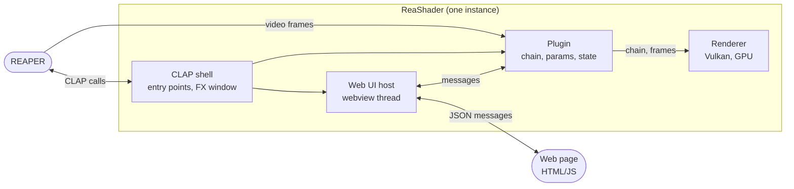

*Read it as ownership, left to right:* REAPER talks to the shell (for everything CLAP) and to the plugin (for video). The plugin owns the renderer, and the page reaches the plugin only through messages, relayed by the web UI host.

**Words this doc uses**, in the sense it uses them:

| Word | Meaning |
|---|---|
| host | the program that loads the plugin: here, REAPER |
| CLAP | the plugin format: a set of C functions the host calls in the plugin, plus a few services the host offers back |
| FX window | the window REAPER opens for a plugin's own interface |
| param | a parameter the host knows about: it has a numeric id, and the host can list it, automate it and modulate it |
| envelope | REAPER's automation curve for one param, saved in the project |
| chain | the ordered list of effects the video goes through |
| node | one step of the chain: a shader or a LUT |
| LUT | a lookup table that maps each input color to an output color (a color grade), read from a `.cube` file |
| slider | one adjustable value of a shader, declared by the shader itself; every slider is also a param |
| snapshot | the message that carries everything the web page shows |
| main-thread callback | CLAP's way to get work done on the main thread: the plugin asks the host for it, and the host later calls the plugin's `on_main_thread` from its main thread |
| lock-free | shared data read and written with atomic operations, so no thread ever waits for another |
| passthrough | returning REAPER's input frame unchanged, instead of a processed one |

Contents:

1. [The four parts](#1-the-four-parts)
2. [Four threads, one rule](#2-four-threads-one-rule)
3. [The three flows](#3-the-three-flows)
4. [The chain and its parameters](#4-the-chain-and-its-parameters)
5. [Saving and loading a project](#5-saving-and-loading-a-project)
6. [The web UI](#6-the-web-ui)
7. [The renderer and the shader contract](#7-the-renderer-and-the-shader-contract)
8. [Reference](#8-reference)

## 1. The four parts

**Each part has one job, and they depend on each other in one direction:** the shell on the plugin, the plugin on the renderer.

- **The CLAP shell** is what REAPER loads. It exposes the CLAP functions, forwards every call to the plugin, and creates the FX window that hosts the web UI. It holds no logic of its own.
  - *In the code:* `src/clap/plugin_entry.cpp` (entry, descriptor, callbacks), `plugin_state.h` (`ClapPluginState`: one per instance), `gui_win32.cpp` (the window).
- **The plugin** is one object per instance, with no processor/controller split. It owns the chain, the params, the saved state, the connection to the web UI, and the tap into REAPER's video.
  - *In the code:* `ReaShaderPlugin`, `src/plugin/plugin.*`; params in `params.*`.
- **The renderer** turns a frame and a chain into a new frame on the GPU. It never throws, never makes REAPER wait, and never compiles anything: it receives shaders and LUTs already compiled. It has its own guide: [rendering.md](rendering.md).
  - *In the code:* `ReaShaderRenderer`, `src/render/renderer.*`, and the `gpu::` objects beside it.
- **The web UI** is an HTML page shown by a webview (an embedded browser), which runs on its own thread. The page shows what the plugin sends it, and sends back what the user does.
  - *In the code:* `WebUIHost`, `src/clap/webui_host.*`; the page in `src/ui/`.

## 2. Four threads, one rule

**The rule: REAPER's audio and video threads never wait for anything.** If they did, REAPER's playback would stutter. So everything they touch is either lock-free, or protected by a lock that they only *try* to take: if another thread holds it, they skip the work instead of waiting (`try_lock`). Slow or blocking work belongs to the main thread or the webview thread.

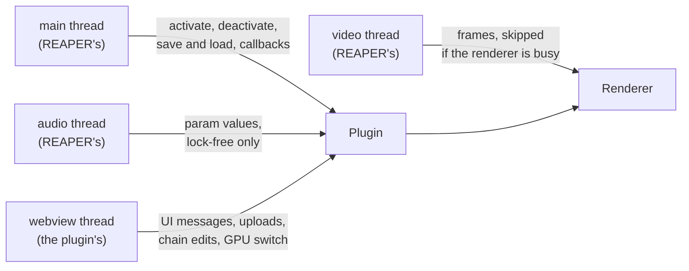

*What to see:* each thread enters through one door. Only the main and webview threads may block, and the video thread goes straight to the renderer, where it never waits.

| Thread | Who owns it | Does |
|---|---|---|
| main | REAPER | activation, deactivation, saving and loading, main-thread callbacks, message boxes |
| audio | REAPER | param values coming from the host: lock-free |
| video | REAPER | frames: the renderer, `try_lock` only |
| webview | the plugin | UI messages, uploads, chain edits, switching the GPU |

**Where locks are needed, they're always taken in the same order,** which rules out deadlocks: first the chain lock (held for a whole chain edit, so two threads never build chains from each other's stale copies), then the renderer's frame lock, then the plugin's state lock.

*In the code:* `chainMutex`, then `ReaShaderRenderer`'s `frameMutex`, then `stateMutex`; the thread list is in `plugin/plugin.h`.

## 3. The three flows

**Everything that happens at runtime is one of three flows:** a frame going through the chain, a param value changing, or the chain being edited. Each runs on a thread that is allowed to do its work, and none makes the audio or video thread wait.

### 3.1 A video frame

**REAPER asks for each frame on its video thread and gets an answer before the call returns:** a new frame from the GPU, or its own input unchanged.

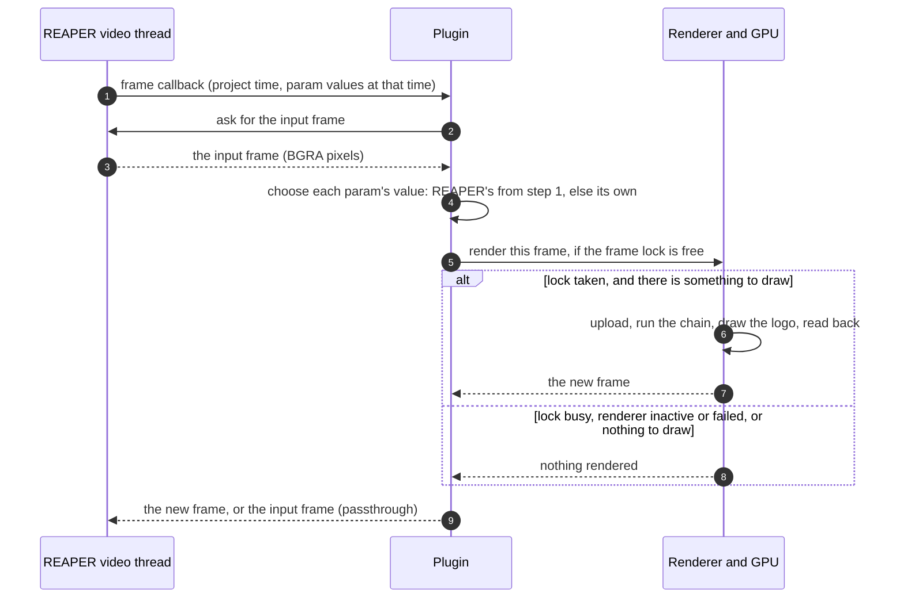

*The steps:*
- **1.** REAPER calls the plugin's frame callback with the project time of the frame and the value of every param *at that time*, which can differ from the current value when automation is playing.
- **2–3.** The plugin asks REAPER for the input frame: the video as it arrives from the track and the effects before this one.
- **4.** The plugin builds the list of values the shaders will use for this frame: for each param, the value REAPER passed in step 1, or, if REAPER passed none for it, the plugin's own current value.
- **5.** The plugin asks the renderer to draw. The renderer first tries to take its frame lock, which other threads hold while they change the GPU objects (a chain edit, a GPU switch).
- **6–7.** With the lock taken, the frame is uploaded to the GPU, sent through the chain's nodes that aren't bypassed, overdrawn with the logo if it's on, and copied back, all in one GPU submission.
- **8.** Otherwise the renderer draws nothing: the lock was busy, the renderer is inactive or has failed, or the chain is empty and the logo is off.
- **9.** The plugin returns the new frame, or the input frame unchanged (passthrough). Video never stops because of the plugin.

- **A failed renderer stays failed until reactivation:** a GPU error, or a submission that takes more than 2 seconds (a GPU hang), marks it failed, and video passes through until REAPER next activates the plugin.
- **How the frame callback gets installed:** when REAPER activates the plugin, the plugin asks REAPER for its extension, finds the FX it belongs to, and registers a REAPER *video processor* whose callback is this flow. Deactivation deletes the video processor, so REAPER stops calling. The renderer itself stays up until the plugin is destroyed, so reactivating is fast.

*In the code:* `ReaShaderPlugin::_processVideoFrame` (`plugin.cpp`), `ReaShaderRenderer::renderFrame`; the setup steps are in [Reference](#the-reaper-video-tap).

### 3.2 A parameter change

**A param's value lives in one place, an atomic slot per param, and it moves between the host and the page in both directions without locks.**

Two CLAP rules shape this flow:
- **The plugin can't touch the page from the audio thread,** so to tell the page about automation it asks for a main-thread callback.
- **The plugin can't push a value to the host whenever it likes.** It can only hand over *param events* when the host calls it to process audio, or, when audio isn't running, when the host calls its *flush* function. So a slider moved on the page is first **marked as pending for the host** (an atomic flag per param), then the plugin asks the host to call flush, and at the next process or flush call it sends one event per pending param.

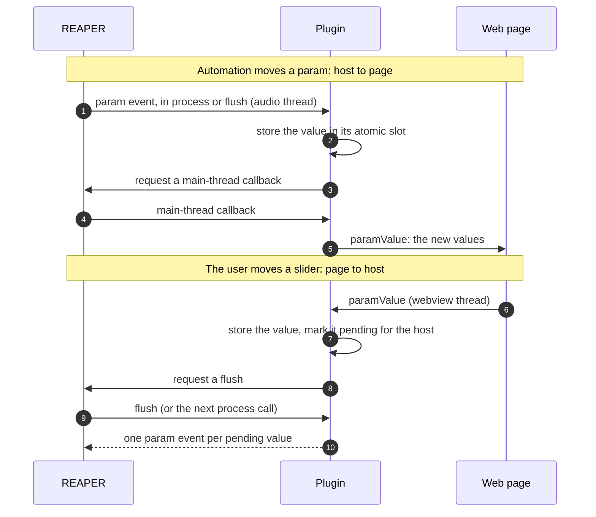

*The steps:*
- **1.** Automation plays, and REAPER hands the plugin a param event while processing audio (or in a flush call).
- **2.** The plugin stores the value in the param's atomic slot. From now on, the video thread renders with it.
- **3–4.** The page can't be reached from the audio thread, so the plugin asks for a main-thread callback, which REAPER makes a moment later.
- **5.** On the main thread, the plugin sends the page the params' current values, and the page moves those sliders.
- **6.** The user drags a slider, and the page sends its new value (it arrives on the webview thread).
- **7.** The plugin stores the value, so the video thread renders with it right away, and marks the param as pending for the host.
- **8–9.** The plugin asks REAPER to call flush, and REAPER does (or processes audio, which does the same).
- **10.** The plugin sends REAPER one param event per pending param. REAPER updates its own display, and records the move if it's writing automation.

*In the code:* `handleParamEvents()` (in process and flush) → `applyHostParamValue()` → `request_callback()` → `onMainThread()`; the page's `paramValue` → `ParamList::flagForHost()` + `host_params->request_flush()` → `takeParamChangeForHost()`.

### 3.3 A chain edit

**An edit is all or nothing:** it's made on a copy of the chain, the renderer builds the GPU objects for the copy, and only if that works does the copy replace the chain. Then the host is told about the params that changed.

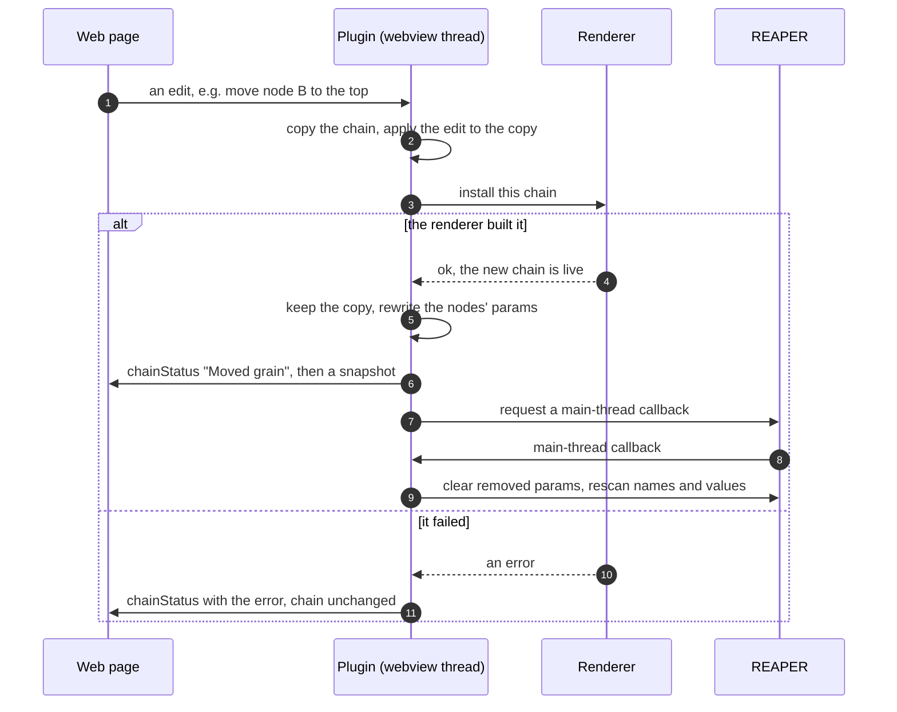

*The steps:*
- **1.** The page sends one edit: add, remove, move, swap or bypass a node, or change a shader node's LUT.
- **2.** The plugin copies the chain and applies the edit to the copy only, so a failure can't leave a half-edited chain.
- **3–4.** The renderer builds GPU objects for nodes that are new or whose content changed, keeps the others, and swaps chains while holding its frame lock.
- **5.** The copy becomes the chain. The plugin rewrites the param slots of the nodes that changed: their names, visibility, ranges and values (see [4.2](#42-parameters)). Bypass and a shader's LUT change no params, so they skip this.
- **6.** The page gets a status line saying what was done, then a snapshot to redraw itself from.
- **7–9.** On the main thread, the plugin tells REAPER about the params: it first *clears* the params that went away, asking REAPER to drop their automation and modulation, then asks REAPER to *rescan* names and values, so its lists show the new params. REAPER honors the rescan but not the clear: it keeps a removed param's envelope and modulation (see [4.2](#42-parameters)).
- **10–11.** On failure, the chain stays as it was, and the page shows the error.

*In the code:* `ReaShaderPlugin::_editChain(edit, paramsChange)`, `ReaShaderRenderer::setChain`, `_notifyHostParams()`.

## 4. The chain and its parameters

**Each node owns a fixed block of 40 param slots, chosen by a number it keeps for life, its uid, not by its position in the chain.** So a node's automation follows it wherever it moves, and the host's list of params never changes size.

### 4.1 Nodes

**The chain holds up to 16 nodes, each a stored shader or a stored LUT, identified by a uid from 0 to 15, shown to the user as a letter from A to P (its tag).**

Each node has:
- **a uid and its tag:** fixed for the node's whole life. The uid decides which param ids the node's sliders use (see [4.2](#42-parameters)).
- **its content:** the name of the stored shader or LUT and its data (what a project saves), plus a parsed form handed to the renderer. The parsed form is replaced only when the content changes, which is how the renderer knows what to rebuild.
- **a bypass flag:** a bypassed node is left out of the frame, but keeps its params.
- **for a shader node, an optional LUT,** which the shader can sample (see [the shader contract](#the-shader-contract)). Without one, it samples an identity LUT, which leaves colors unchanged.

**A new node takes the smallest free uid,** so a removed node's letter is reused by the very next node added. This is deliberate, because of how REAPER treats automation: when a node is removed, REAPER keeps its envelopes and modulation on its param ids (see [gotchas.md](gotchas.md#reaper)), and the next node on that uid inherits them. Reusing the smallest free letter makes that happen right away, on the letter the user just removed. Handing out fresh letters instead would only delay it: once all 16 had been used, old letters would come back with leftover automation the user no longer expects.

*In the code:* `ReaShaderPlugin::Node` (`uid`, `name`, `data`, `bypass`, and `lutName` + `lutData` for a shader's LUT; the parsed forms are `shared_ptr<const CompiledShader>` and `shared_ptr<const LutData>`), `tagOf`.

### 4.2 Parameters

**The host sees one fixed list of 641 params:** Audio Gain first, then 16 blocks of 40 slots, one block per uid. A node's sliders fill its block from the start, and unused slots are hidden.

Here is an example. The shader `grain.frag` has two sliders: its code declares the members `amount` and `size`, labelled "Amount" and "Grain size". Suppose it was added to the chain as a node with uid 1 (tag B), and now sits third in the chain.

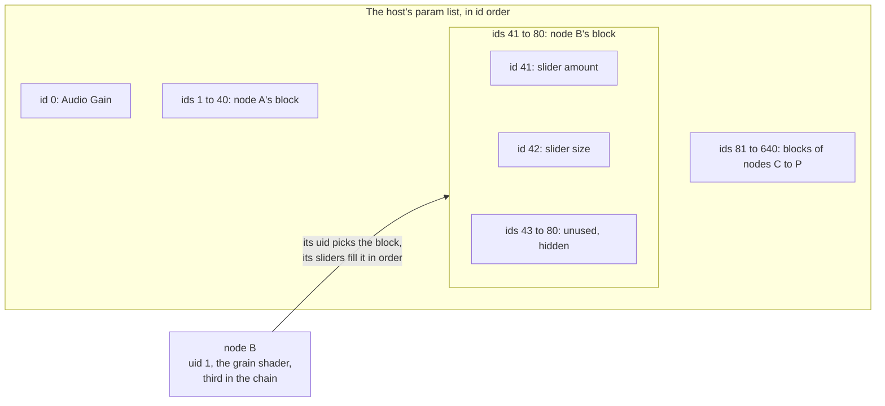

*What to see:* the node's position (third) plays no part. Its uid (1) picks the block (ids 41 to 80), and its two sliders take the block's first two slots, in the order the shader declares them.

The name REAPER shows for a param is built from three pieces, so the same slider reads the same way in every REAPER window:

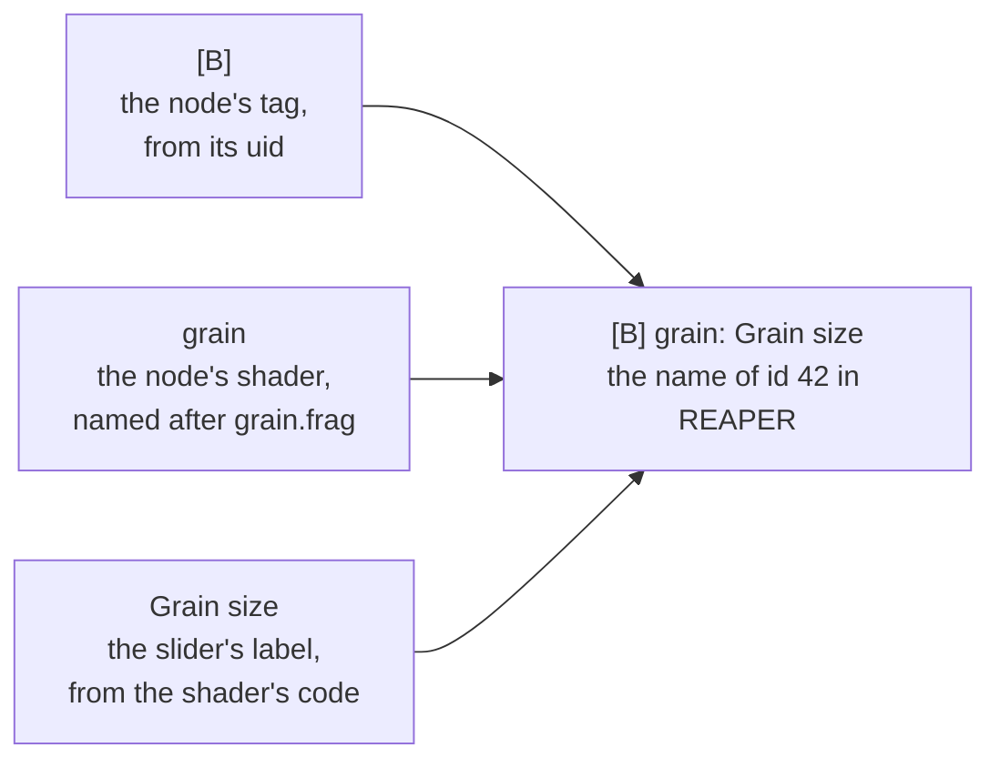

*What to see:* only the tag comes from the node's identity; the other two pieces come from the shader. The project, instead, saves the slider's value under the uid and the member's name in the code: `1/size`.

- **Why the list is fixed:** CLAP lets a plugin change how many params it has only while it's deactivated, but REAPER opens a project by activating the plugin first, then loading its state, then attaching the project's envelopes to param ids. So every id must exist from the start. A chain edit only renames, shows, hides and sets values of existing slots, which the host accepts while the plugin is active. An unused slot is hidden and has an empty name, and REAPER leaves it out of its menus.
- **What a node gets:**
  - a shader node, one param per slider, at most 40: a shader with more is rejected wherever it would enter the chain;
  - a LUT node, one `Mix` param: 0 is the frame as it was, 1 is fully through the LUT, and it starts at 1. (A LUT attached to a shader node gets no Mix: blending is up to the shader.)
- **The name REAPER shows never changes for a given param,** because REAPER keeps the name an envelope had when it was created. That's why it carries the fixed tag rather than the node's position. The tag also tells two copies of the same shader apart. The web UI shows only the slider's label, since the node's card already shows its tag and name.
- **The host sees every value as 0 to 1,** spread over the slider's real range: CLAP lets a param's range change only when its param list changes size, which can't happen while active. So the plugin converts at the edges. The web UI, the project and the shaders use real values, and REAPER displays the real value as text (`64.500`, or `50.0 %`).
- **Telling the host after an edit** is steps 7 to 9 of [3.3](#33-a-chain-edit). Params that went away are cleared first. The intended result is that REAPER drops their envelopes and modulation, so they don't drive whatever takes their id next. **In practice REAPER ignores the clear:** it keeps a removed param's envelope and modulation on its id, whatever flags the clear carries, and they drive the next node that takes the uid (see [gotchas.md](gotchas.md#reaper)). The plugin can't prevent this, which is why it reuses the smallest free uid: the leftover automation shows up at once, on the letter just removed ([4.1](#41-nodes)). A loaded project clears nothing, because its envelopes come with it.
- **Values survive edits:** a param in the new chain takes its value from the project being loaded (matched by saved name), else from the param that had the same id and name before the edit (limited to the new range), else its default.

*In the code:* `ParamList::replaceNodeParams`, `paramsOfNodes`, `nodeParamId`, `Param::toHost` / `toReal`, `checkSliders`. The full id scheme is in [Reference](#parameter-ids-and-values).

### 4.3 Stored shaders and LUTs

**Shaders are compiled, and LUTs read, exactly once, when the user uploads them,** and the result is stored as a JSON file. After that, adding, swapping or loading a node never compiles.

- **An upload** compiles the GLSL (or reads the `.cube`), writes the result to `resources/shaders/compiled/<name>.json` (or `resources/luts/<name>.json`), then adds a node with it at the end of the chain. On a full chain, the file is still stored.
- **LUTs** come only from `.cube` files. A 1D LUT (one curve per channel) is turned into a 33×33×33 color cube, and a cube whose input range isn't 0 to 1 is resampled onto 0 to 1. So every stored LUT is a 0-to-1 cube: `{ version, title, size, data }`, with `data` as base64 of half-precision RGB values.
- **The lists the page offers** are the files in those two folders. Nodes are added or swapped by name, and names coming from the page are reduced to a file name, never a path.
- **The plugin folder must be writable** for uploads. The per-user CLAP folder is; a system-wide install might not be.

*In the code:* `_upload()`, `gpu::compileShader`, `gpu::parseCube` (`render/lut_file.*`), `util/base64.*`, `util::paths::compiledShadersDir()` / `lutsDir()`.

## 5. Saving and loading a project

**A project stores the whole chain, already compiled, inside itself,** so it opens the same way on any machine and never needs the original files or a recompile.

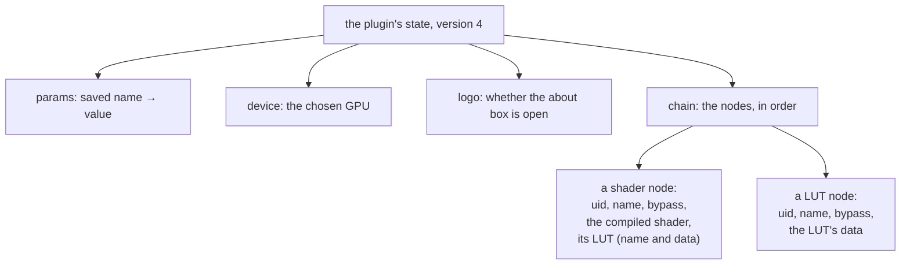

*What to see:* every node carries its own compiled data, and param values are saved by name (like `1/size`), not by id.

- **Loading runs on the main thread, and the params exist before it returns,** whether the plugin is active or not, because REAPER attaches the project's envelopes right after.
- **Invalid nodes are skipped,** with a warning and a message on the page: an unknown kind, a uid out of range or used twice, data that can't be read, or a shader with too many sliders.
- **Projects from before chains (version 3)** held one shader, one LUT and a LUT mode. They're converted on load: the shader becomes node 0 and the LUT node 1, so their params keep their ids. Mode `before` puts the LUT first, `after` second, and `shader` attaches the LUT to the shader node. Saved names get their node's prefix (`brightness` → `0/brightness`), and `LUT Mix` becomes `1/mix`. An older or unknown state leaves the current one as it is.
- **Two settings are saved but aren't params:**
  - **the GPU** that renders, changed from the page or by loading a project;
  - **the logo,** an easter egg, off by default. Clicking the page's logo opens the about box, and a 3D logo spins in REAPER's video window while it's open. Closing the box (×, a click outside it, or Escape) turns it off.

*In the code:* `saveState` / `loadState`, `migrateV3`, `changeRenderingDevice()`; the logo is `showLogo`, sent by the page as `logo { enabled }`, and drawn by `ReaShaderRenderer::setLogoEnabled()`.

## 6. The web UI

**The page is a view of the plugin's state:** it shows what the plugin sends, and every user action becomes a message to the plugin. The page runs in a webview on its own thread, so REAPER's window stays responsive.

### 6.1 The page

**The plugin owns all the state, and the page redraws itself entirely from each snapshot.**

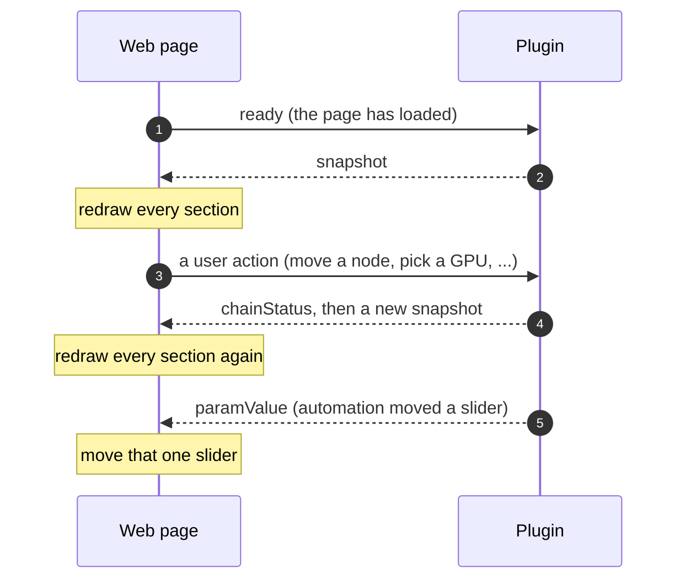

*The steps:*
- **1.** When the page has loaded, it tells the plugin it's ready.
- **2.** The plugin answers with a snapshot, and the page draws every section from it.
- **3.** The user does something: the page only sends the matching message, without changing itself.
- **4.** The plugin applies it, sends a status line, then a new snapshot, and the page redraws every section again.
- **5.** When automation moves a param, the plugin sends just that value, and the page moves that one slider without a full redraw.

- **Snapshots are sent** when the page says it's ready, when the plugin is activated, after a project loads, after a GPU switch, and after every chain edit. Redrawing always empties each section and builds it again, so the same snapshot always gives the same page.
- **Between snapshots,** only two messages change the page: `paramValue` moves one slider, and `chainStatus` sets the status line (which is kept across redraws).
- **The page changes itself only to give instant feedback on the user's own action:** a slider's value while dragging, the about box opening or closing, and a "busy" status before a slow request (an upload, adding or swapping a node).
- **Shaders and LUTs share the same chain editor.** Everything that differs between the two kinds (titles, accepted files, texts, which upload to call) sits in one table, `KINDS` in `ui.js`.

**Three scripts split the work by direction:** one sends to the plugin, one receives from it, and one draws.

| File | Role |
|---|---|
| `scripts/api.js` | **sends:** the `native` object, with one method per message to the plugin; nothing else sends |
| `scripts/client.js` | **receives:** handles each message from the plugin, and the page's own events (the about box); sends `ready` when everything has loaded |
| `scripts/ui.js` | **draws:** `renderSnapshot` redraws the page, with one `renderX` function per section and small `createX` helpers for controls |
| `index.html` | the fixed frame the scripts fill: background, logo, the GPU and chain sections, the about box |
| `styles/ui.scss` + `styles/components/` | the styles, compiled to `index.css`; every color comes from `_palette.scss` |

The scripts are plain `<script defer>` tags, because a page loaded from a file can't use JavaScript modules. They share one global scope and load in dependency order: `api.js`, `ui.js`, then `client.js`. The style rules are in [CONTRIBUTING.md](../CONTRIBUTING.md#frontend-srcui).

**Adding a control that changes something in the plugin** touches both sides, in this order:

1. **The message:** add a method to `native` in `api.js`, and handle the message in the plugin (`ReaShaderPlugin::handleWebUIMessage` in `plugin.cpp`, where every message is documented).
2. **The state:** put what the control changes into the snapshot, and have the plugin send a new snapshot after changing it.
3. **The control:** build it in its section's `renderX` in `ui.js`, taking its current value from the snapshot and calling the new `native` method when used. A new section also needs a fieldset in `index.html` and its own `renderX`, called from `renderSnapshot`.
4. **Its styles:** in `ui.scss`, or in a new partial for a new kind of control, with colors from the palette.
5. **Docs and tests:** a row in the [protocol table](#the-web-ui-protocol), and a `protocol` test (see [testing.md](testing.md)).

*In the code:* `renderSnapshot` redraws (each `renderX` empties its section with `replaceChildren`), `setParamValue` and `setStatus` patch, and control handlers call `native.*`.

### 6.2 The webview and its thread

**The page is drawn by a webview that runs on its own thread, so that REAPER's window never freezes.** Two facts about WebView2 (the browser engine Windows provides) force this: starting it blocks for seconds, which would freeze REAPER if done on REAPER's thread, and its objects can only be used from the thread that created them. Everything else in this section follows from keeping the webview on its thread while REAPER's thread keeps working.

Two Windows terms are needed here:
- **A window belongs to the thread that created it.** Windows delivers a window's events (resizing, closing, input) as *messages* to that thread, which handles them in its *message loop*.
- **Sending a message to another thread's window waits for that thread to answer.** If that thread is itself waiting, both wait forever: a deadlock.

#### Three windows, two threads

**The page sits in three nested windows: REAPER's, the plugin's container, and the webview's, and the last one belongs to the webview thread.**

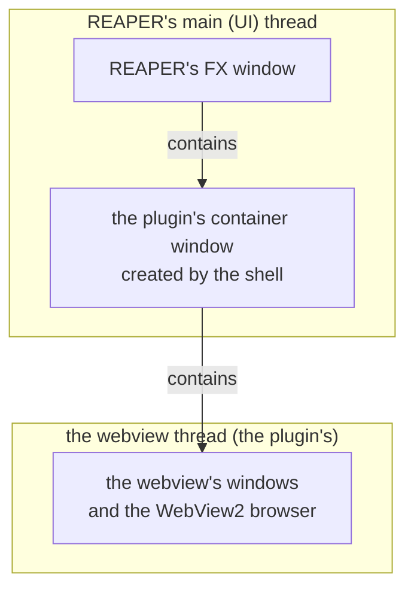

*What to see:* the container is the boundary. Above it, everything is REAPER's thread; inside it, everything is the webview thread. Any call that crosses that line has to be handed to the other thread rather than made directly.

#### Opening the window

**REAPER gets its window back at once, and the webview builds itself afterwards on its own thread.**

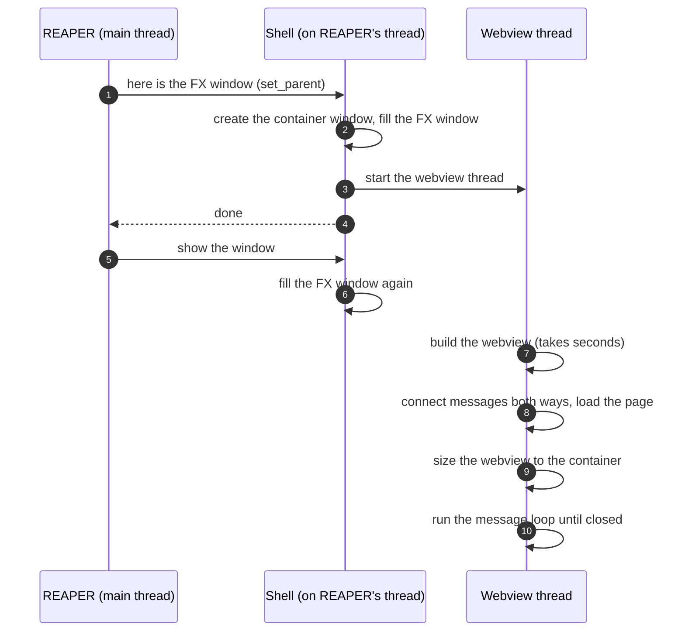

*The steps:*
- **1–2.** REAPER hands the plugin its FX window. The shell creates its container window inside it, at once: REAPER shows the window right after this call, and a window that doesn't exist yet would never appear.
- **3–4.** The shell starts the webview thread and returns, without waiting for the webview.
- **5–6.** REAPER shows the window, and the shell makes the container fill the FX window again, because REAPER doesn't report a size when it switches from its generic param list to the plugin's page.
- **7.** On its own thread, the webview starts up. This is the part that takes seconds, and REAPER keeps working meanwhile.
- **8.** It connects the two message directions (next subsection) and loads the page from the plugin folder.
- **9.** The webview starts with a size of zero, so it's resized to fill the container.
- **10.** The thread runs the webview's message loop, which also runs any work queued for it, until the window closes.

#### Talking across threads

**Anything that touches the webview from another thread is queued to run on the webview thread, never done directly** (`webview::dispatch`).

- **Page to plugin:** the page calls `postToNative(json)`. The call arrives on the webview thread, which passes the message to the plugin's handler (`ReaShaderPlugin::handleWebUIMessage`).
- **Plugin to page:** the plugin can send from any thread (the main thread for automation, the webview thread for answers). It calls a *sender*, a function the web UI host registered with it, which queues a script call, `window.__reashaderOnMessage(msg)`, to run in the page on the webview thread. With no sender registered (no window open), a send does nothing.
- **Resizing:** when REAPER resizes the FX window, the container's new size is queued to the webview thread too, because moving another thread's window makes the caller wait for that thread.
- **Two mutexes keep this safe:** one guards the plugin's sender, so unregistering it waits for a send in progress; one guards the host's pointer to the webview, which the webview thread creates and destroys while other threads read it.

#### Closing the window

**Closing has to stop the webview thread from REAPER's thread without the two waiting on each other.**

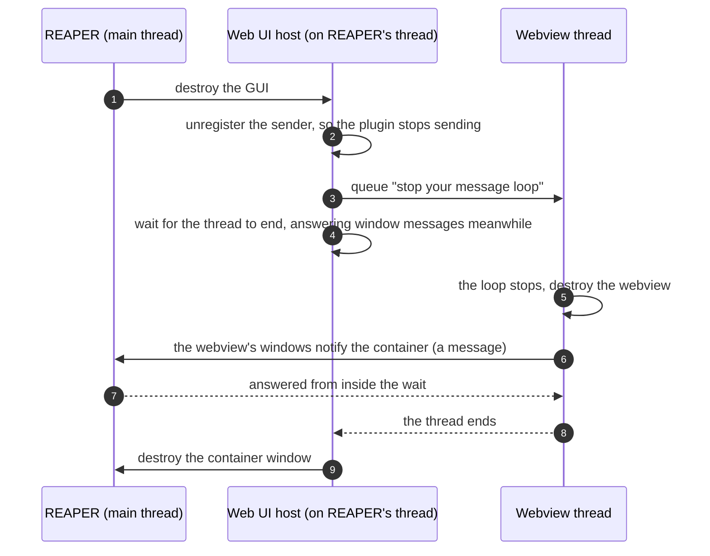

*The steps:*
- **1–2.** REAPER destroys the GUI. The host first unregisters the sender, waiting for any send in progress, so nothing new is queued for the page.
- **3.** The host asks the webview thread to stop its loop by queueing the request. On Windows, stopping a message loop only works from its own thread. If the webview is still starting up, a stop flag tells it not to start its loop at all.
- **4.** REAPER's thread waits for the webview thread to end, but keeps answering messages sent to its windows while it waits.
- **5–7.** The webview thread destroys the webview. Destroying its windows sends messages to the container, which belongs to REAPER's thread. Because that thread is still answering (step 4), they get through. A plain wait would deadlock here, and freeze REAPER.
- **8–9.** The thread ends, and the container window is destroyed last.

#### Other details

- **Ownership:** the shell holds the GUI (container window plus web UI host) through a `unique_ptr` whose deleter is defined next to the Windows code, so the cross-platform part of the shell never needs the Windows types. Destroying the GUI closes the webview first, then the window, as above.
- **DevTools:** debug builds turn on the browser's developer tools (right click → Inspect), for the console and the page's elements.

*In the code:* `WebUIHost` (`webui_host.*`: its constructor starts the thread, `Impl::mutex`, `stopRequested`, `~WebUIHost()` with `MsgWaitForMultipleObjects` + `PeekMessageW`, `resize()`), `webview::dispatch(fn)`, `bind("postToNative")` and `eval()`, the plugin's `WebUISender` (a `std::function`, set by `setWebUISender()`, removed by `clearWebUISender()`), `set_parent()` and `gui_show()` with `fillParent()` (`gui_win32.cpp`), `Gui` and `GuiDeleter`, `ClapPluginState::gui` (`unique_ptr<Gui, GuiDeleter>`, reset by `gui_destroy`), `MoveWindow` after `navigate()`.

## 7. The renderer and the shader contract

**The renderer and the shaders it runs each have their own doc; this section is the summary.** [rendering.md](rendering.md) explains the renderer step by step, and the [examples README](../src/shaders/examples/README.md) teaches users to write shaders.

### The renderer

**The renderer runs the chain on the GPU, and is built so that nothing it does can crash or stall REAPER.**

- **It never compiles or reads files.** The plugin hands it the chain as a list of nodes, already compiled, each with its uid, its bypass flag and where its param values are in each frame's values. It builds GPU objects only for nodes that are new or changed, keeps the others, and swaps chains while holding its frame lock (see [3.1](#31-a-video-frame)). If building fails, the current chain stays. While inactive, it keeps the chain and builds it on the next activation.
- **Each frame runs the nodes that aren't bypassed, in order:** the first reads the input frame, the last writes the output frame, and those between pass the picture along through two scratch images that they write and read in turn. A shader node without a LUT gets an identity LUT. Each shader keeps its own frame counter (`iFrame`), which pauses while it's bypassed.
- **Errors stop at its edge:** inside, Vulkan errors throw C++ exceptions, and every function the plugin calls catches them all. A failure marks the renderer failed, and video passes through.
- **Every GPU object has a plain, visible lifetime:** the device lives from the first activation until the plugin is destroyed, the frame's buffers and images follow the frame size, a node's objects follow its content, and the logo's objects exist from the first time it's shown. Switching GPUs destroys everything and rebuilds it on the new one.
- **The logo** is a small 3D scene drawn over the output while the about box is open.

*In the code:* `ReaShaderRenderer::setChain`, `FrameTargets::recordPasses`, `ChainNode`, `FrameInputs`, `gpu::Scene`. Details are in [Reference](#renderer-details), and the full lifetime table is in [rendering.md](rendering.md#3-the-objects-and-how-long-they-live).

### The shader contract

**A user's shader contains only a `main()` function, plus an optional block of sliders; ReaShader adds everything else before compiling it.** That added code (the *preamble*) gives the shader:

- `uv`, the pixel's position from 0 to 1 (top left is 0,0), and `fragColor`, the color it writes;
- `iChannel0`, the input frame;
- `iChannel1`, its node's LUT (or an identity), and `iLut(color)`, which looks a color up in it;
- `iResolution`, `iTime`, `iFrameRate` and `iFrame`: the frame's size in pixels, the project time, the frame rate, and the shader's frame counter.

**Sliders come from a `uniform Params { ... };` block:** every `float` member is one slider, and every `vec2`, `vec3` or `vec4` member gives one slider per component (`member.x`, `member.y`, ...), in the order they're declared.

**A comment sets a slider's label, default and range:** `//@param member 'Label' default min max`, anywhere in the source (label and numbers are optional, in that order). Without one, a slider is labelled with the member's name, starts at 0.5 and ranges from 0 to 1. The idea comes from REAPER's own video processor, which also uses `//@param`, but here it's matched by member name rather than position.

*In the code:* `shader_compiler.cpp` (`kShaderPreamble`, `gpu::compileShader`). The exact preamble, bindings and rules are in [Reference](#shader-contract-details).

## 8. Reference

Details to look up, not to read through.

### File layout

```
src/clap/plugin_entry.cpp    CLAP entry, descriptor, extension callbacks (forward to ReaShaderPlugin)
src/clap/plugin_state.h      ClapPluginState: clap_plugin_t + ReaShaderPlugin + Gui, one per instance
src/clap/gui_win32.cpp       clap.gui (Win32): Gui = container window + WebUIHost
src/clap/webui_host.*        WebUIHost: webview on its own thread, JSON bridge to the plugin (Win32)
src/plugin/plugin.*          ReaShaderPlugin: the chain, params, state, web UI messages, REAPER video tap
src/plugin/params.*          Param struct + ParamList (lock-free values)
src/render/renderer.*        ReaShaderRenderer: owns the GPU objects below, renders frames, never throws
src/render/context.*         gpu::Context: vk-bootstrap instance/device, queue, command buffer + fence, VMA
src/render/frame_targets.*   gpu::FrameTargets: upload/readback buffers + input/output/work images (per frame size),
                             recordPasses (chains the passes)
src/render/pass.*            gpu::Pass: the fullscreen pass interface, and what passes share (fullscreen.vert, ...)
src/render/shader_compiler.* gpu::compileShader (contract preamble, shaderc, SPIRV-Reflect, //@param), stored JSON form
src/render/shader_pass.*     gpu::ShaderPass: fullscreen pipeline for a compiled shader
src/render/lut.*             gpu::Lut (a LUT as a 3D image) + gpu::LutPass (the frame through a LUT, blended by its Mix)
src/render/scene.*           gpu::Scene: textured meshes (tinyobjloader, stb) + depth, drawn over the frame (the logo)
src/render/lut_file.*        .cube LUT parser, 1D/domain baking, stored JSON form (base64 half floats)
src/render/gpu.*             Vulkan helpers: VK_CHECK, Buffer, Image, createPipeline(), transition(); VMA implementation
src/render/frame_view.h      FrameView: a CPU frame (BGRA, rowBytes)
src/util/                    logging, paths, shell (openUrl), base64
src/ui/                      the web UI: index.html, scripts/{api,ui,client}.js, styles/ui.scss; staged as ui/
src/shaders/examples/        example shader sources + README for users, staged as resources/shaders/examples/
src/shaders/internal/        shaders built into the plugin (fullscreen.vert, lut.frag, scene.vert/.frag), compiled at build time
res/                         images and meshes, staged as resources/
installer/windows/           Inno Setup extras for the CPack installer: reashader.iss (sections), installer.pas (code)
test/                        the test application (see testing.md)
external/                    dependencies (git submodules)
doc/                         developer docs
```

### The REAPER video tap

`activate()`:

1. `host->get_extension(host, "cockos.reaper_extension")`, cast to `reaper_plugin_info_t*`;
2. `GetFunc("clap_get_reaper_context")`: with `sel=4` it gives the FxDsp context, with `1` the parent track;
3. `GetFunc("video_CreateVideoProcessor")(fxctx, VERSION)`, with `process_frame = _processVideoFrame` and `get_parameter_value = _getVideoParam`;
4. `reaShaderRenderer->init()`.

`deactivate()` deletes the video processor. The renderer stays initialized across activate/deactivate cycles, and a failed renderer starts over on the next `activate()`.

**Per frame** (`_processVideoFrame`):

1. `vproc->renderInputVideoFrame(0, 'RGBA')` gets the upstream frame. It is immutable, and is `Release()`d before returning.
2. Param values come from `parmlist` (`[0]` = wet/dry, then param `i` at `[i + 1]`, index = id), falling back to `ParamList::value()` for any REAPER doesn't pass.
3. `ReaShaderRenderer::renderFrame()`, under `try_lock(frameMutex)`:
   1. (re)creates `FrameTargets` if the size or row stride changed;
   2. `memcpy`s into the mapped upload buffer, and writes each shader's `Params` into its mapped UBO;
   3. records one command buffer: buffer → input image → the chain's passes → output image → logo scene (if enabled) → readback buffer;
   4. submits once and waits on one fence (2 s timeout = GPU hang = `failed`);
   5. `memcpy`s out into a new `vproc->newVideoFrame`.
4. If `renderFrame` returns `false`, the input frame is returned unchanged.

### Parameter ids and values

- **`Param`** is one plain struct: id, name (the state key), label (display), group (`Main` or `Node`), units, default, min, max, and its node's uid (a used `Node` slot). An unused slot has no node, name or label (`Param::used()`). A param's range is min..max: 0..1 by default, a shader param's `//@param` range.
- **A fixed list, index = id** (`kParamCount` = 641): Audio Gain is id 0 (group `Main`, not shown in the web UI), then 16 node uids × 40 slots (`kMaxNodes`, `kNodeSlots`, group `Node`): `nodeParamId(uid, slot)` = `1 + uid * 40 + slot`. 40 matches REAPER's own video processor, and fits about 99% of shaders in public collections (ISF, OBS shaderfilter, DCTL). The id is the CLAP param id, used by host automation, the web UI's `paramValue`, `ParamList::value()` and REAPER's `parmlist`, and it never changes for a node's param. REAPER lists the used params in id order, i.e. by node tag, not chain order.
- **Names:** the saved name is `"<uid>/<member>"` (`"1/size"`, `"5/mix"`); the label REAPER shows is `"[<tag>] <node name>: <slider label>"` (`"[B] grain: Grain size"`).
- **Unused slots** are `CLAP_PARAM_IS_HIDDEN` with an empty name (see [gotchas.md](gotchas.md#reaper)).
- **Host values vs real values:** `ParamList` stores host values (0..1). `Param::toHost` / `toReal` convert. The web UI, the state and `realValue()` use real values. `value_to_text` shows the real value in the host, `text_to_value` reads one, and the renderer maps a shader's slots onto its fields' ranges.
- **`ParamList`:**
  - Metadata is behind a mutex. `at(id)` gives any slot, `find(id)` and `list()` the used ones.
  - Values (`std::atomic<double>` by id) and `used(id)` are fixed arrays, so the audio and video threads never lock.
  - Pending-for-host flags: `flagForHost(id)` sets one, `takeFlaggedForHost()` takes them one at a time (an "any flagged" marker is cleared before each scan, so a flag set during a scan isn't missed).
  - `replaceNodeParams()` sets every node slot when the chain's nodes change, and returns the ids that went away (or now hold another param).
- **Host notification:** `_notifyHostParams()`, from `onMainThread()` or directly in `loadState()`, calls `host_params->clear(id, CLAP_PARAM_CLEAR_ALL | _AUTOMATIONS | _MODULATIONS)` for gone ids (`ParamsChange::Edit` only; `ParamsChange::Load` clears nothing; REAPER keeps the envelopes and modulation anyway, observed), then `host_params->rescan(CLAP_PARAM_RESCAN_INFO | CLAP_PARAM_RESCAN_VALUES)`.
- **Host automation** arrives in `process()`/`flush()` (`handleParamEvents()`) → `applyHostParamValue()`, then `onMainThread()` echoes values to the UI. **Web UI edits:** `ParamList::flagForHost()` + `host_params->request_flush()`, drained by `takeParamChangeForHost()` into `out_events`.

### The web UI protocol

Plain JSON objects with a `"type"` field. In C++ they're documented and handled in `plugin/plugin.cpp` (the web UI section), with an `if`/`else` on the type. On the JS side, `client.js` switches on the type, and `api.js` sends.

| Direction | Message | Payload / effect |
|---|---|---|
| to UI | `snapshot` | `{ version, track, params, devices, logo, chain, shaders, luts }`, with `chain` = `[{ uid, tag, kind, name, bypass, lut, samplesLut }]` (shader nodes only: `lut`, its LUT's name, and `samplesLut`, whether the shader uses a LUT at all). Its shader and LUT lists are rescanned each time. Sent on `ready`, activate, state load, device changes and chain changes |
| to UI | `paramValue` | `{ id, value }`: host automation |
| to UI | `chainStatus` | `{ status, state }`, with state = `busy`/`ok`/`error`: what was done (`Added tint`, `Moved invert`, ...) or the error |
| from UI | `ready` | — |
| from UI | `paramValue` | `{ id, value }` |
| from UI | `renderingDevice` | `{ index }` |
| from UI | `logo` | `{ enabled }`: the 3D logo, on while the about box is open |
| from UI | `openUrl` | `{ url }`: `https://` only, opened in the system browser (`util::shell::openUrl`); the webview itself never navigates away |
| from UI | `shaderUpload` | `{ name, source }`: GLSL sent as text, compiled, stored, and appended as a node |
| from UI | `lutUpload` | `{ name, source }`: a `.cube` file sent as text, parsed, stored, and appended as a node |
| from UI | `nodeAdd` | `{ kind, name, index }`: a stored shader or LUT (`kind` = `shader` / `lut`) as a new node at `index` (none, or past the end: last) |
| from UI | `nodeRemove` | `{ uid }` |
| from UI | `nodeMove` | `{ uid, index }`: past the end is last |
| from UI | `nodeBypass` | `{ uid, bypass }` |
| from UI | `nodeSet` | `{ uid, name }`: another stored shader or LUT, of the node's kind |
| from UI | `nodeLut` | `{ uid, name }`: a shader node's LUT (`iChannel1`), a stored LUT, `""` = none |

### The state document

```
{ version: 4, params: { name: value }, device, logo,
  chain: [ { uid, kind: "shader", name, bypass, data, lut: { name, data } },
           { uid, kind: "lut", name, bypass, data } ] }
```

### Renderer details

- **Vulkan 1.3** with dynamic rendering and synchronization2, so there are no render pass or framebuffer objects. The GPUs offered in the UI are the ones vk-bootstrap selects, and the UI's device index is an index into that list.
- **`setChain(nodes)`** takes `ChainNode`s: a shader (`shared_ptr<const CompiledShader>`, with an optional LUT as its `iChannel1`) or a LUT (`shared_ptr<const LutData>`), a uid, a bypass flag, and the node's params as a range of indices into `FrameInputs::paramValues`. At most 16 nodes, uids unique. Nodes are matched by uid and pointer to decide what to rebuild.
- **Passes:** `FrameTargets::recordPasses` chains them through two ping-pong work images (`work[2]`, created the first time a chain needs them). A shader node without a LUT gets a 17³ identity `Lut`.
- **Errors:** `VK_CHECK` throws `std::runtime_error`; `ReaShaderRenderer`'s public functions catch everything.
- **Lifetimes:** plain structs with `create()`/`destroy()`, no deletion queues: `Context` (instance, device), `FrameTargets` (frame size), per node a `ShaderPass` or `LutPass` and its `Lut` (kept across `setChain` while the content is the same), the identity `Lut` (with the device), `Scene` (from the first `setLogoEnabled(true)`, or with the device if the logo is on, until the device goes). A device switch destroys the scene, the nodes' objects, the identity, the targets and the device, then recreates the device, the identity, the nodes' objects and the scene; the targets come back with the next frame.
- **Internal shaders** (`fullscreen.vert`, `lut.frag`, `scene.vert`, `scene.frag`) are SPIR-V arrays compiled at build time, never read from disk.
- **The logo scene** (`scene.*`): objects (a `Mesh` from .obj via tinyobjloader, a `Texture` via stb, a local transform) drawn over the output with a depth buffer (`loadOp = LOAD`, depth resized by `prepare()` per frame size), with one pipeline whose push constant is the object's MVP matrix. Camera: z = -5, 70° field of view, the frame's aspect, y flipped via `proj[1][1] *= -1`. The logo spins one degree per video frame (`time * frameRate`), wobbling with time. `Mesh` and `Texture` can be reused for more 3D content.
- **Plugin data** is reached only through `getRenderingDeviceIndex`, `setRenderingDeviceIndex` and `setRenderingDevicesList`. The plugin builds the chain with `rendererChain`, and param values come in with each frame (`FrameInputs`).

### Shader contract details

- **The preamble:** `#version 450`; `in vec2 uv`; `out vec4 fragColor`; `sampler2D iChannel0`; `sampler3D iChannel1` and `vec3 iLut(vec3 color)`, which samples it at the texel centers; push constants `iResolution`, `iTime`, `iFrameRate`, `iFrame`. A user `#version` is dropped, `#extension` lines are moved above the preamble, and `#line 1` keeps error line numbers matching the user's file.
- **`samplesLut`:** whether `main()` reaches `iChannel1`, directly or through `iLut` (`CompiledShader::samplesLut`, from SPIRV-Reflect's entry-point bindings). The UI shows a shader's LUT selector only when it does, or while it has a LUT. It's computed on compile and on `fromJson`, never stored.
- **Bindings:** `iChannel0` is binding 0, `Params` binding 1 (shaderc shifts uniform blocks by 1, explicit ones too), `iChannel1` binding 2. Any other resource (samplers are shifted to 3 and up), or anything outside descriptor set 0, is rejected with an error.
- **Slider order** is SPIRV-Reflect's order of the `Params` members.
- **Keep in sync:** `gpu::ShaderInputs` must match `ReaShaderInputs` in the preamble (std430 push-constant layout, 20 bytes). See [rendering.md §7.2](rendering.md#72-extending) for adding an input.

### Version

`REASHADER_VERSION`, a compile definition from the last git tag, is used by the CLAP descriptor and the snapshot (the about box).

### Logging and paths

- **Logging:** `LOG(level, toConsole | toFile | toBox, sender, title, message)` from `util/logging.h`.
- **The log file** is `<plugin dir>/rs.log`. It is kept open, and truncated on the first write of each process.
- **`toBox`:** message boxes are modal, so they are never shown on the calling thread. `LOG` queues the box and calls the host's `request_callback()`, and `on_main_thread` shows it (`showQueuedBoxes()`). Each plugin instance registers the requester in `plugin_init`.
- **Paths:** `util::paths::pluginDir()`, `resourcesDir()`, `uiDir()`, `compiledShadersDir()` and `lutsDir()` return `std::filesystem::path`. Pass `.string()` to narrow file APIs (`fopen`, `ifstream`).
