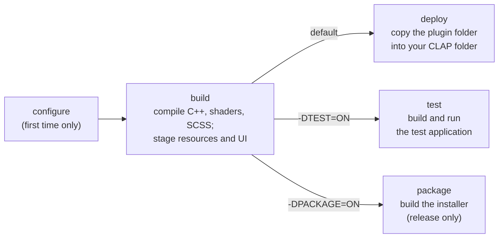
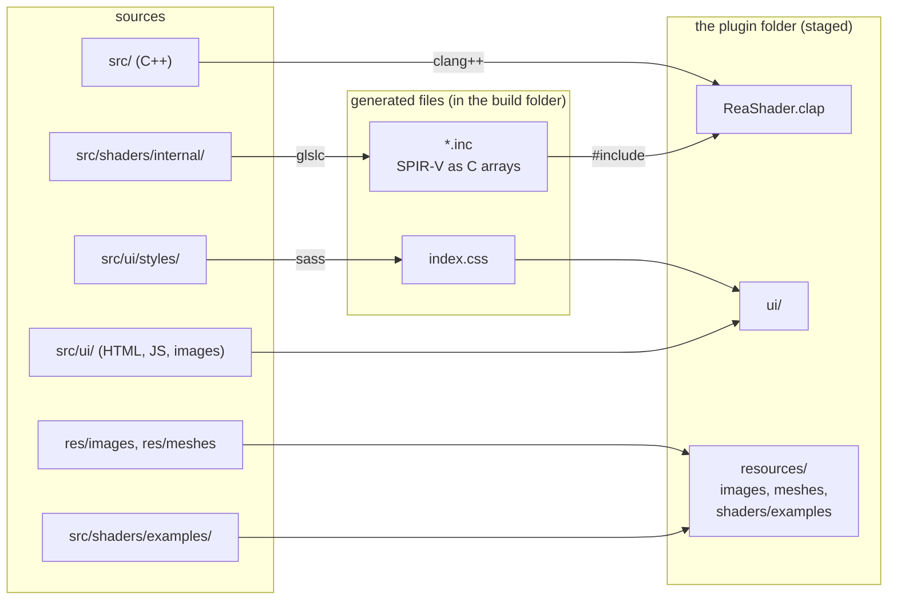
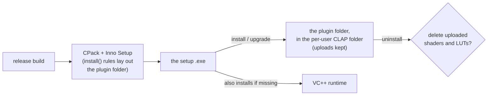

# Building ReaShader

ReaShader is a C++ plugin plus a web page, some shaders and some images, and REAPER finds it only if all of them sit together in a CLAP folder. Building it means compiling C++, GLSL and SCSS with different tools, then gathering the results in the right place, and sometimes producing an installer instead.

**The answer:** one script, `build.cmake`, drives everything. It **configures** the build once, **builds** the plugin (which also **stages** the web page and resources next to it), and then does one of three things: **deploys** the plugin folder to REAPER, **runs the tests**, or **packages** an installer. Each VS Code task is that script with different options.



*What to see:* configure and build always happen; the three endings are alternatives, chosen by an option. Only the default ending touches REAPER's CLAP folder.

**Words this doc uses:**

| Word | Meaning |
|---|---|
| preset | a named set of CMake settings in `CMakePresets.json`, e.g. `windows-debug` |
| profile | `debug` or `release`: which preset to use |
| stage | copy the plugin's runtime files (UI, images, example shaders) next to the built `.clap`, so it can run from the build folder |
| CLAP folder | the folder where REAPER looks for CLAP plugins |
| deploy | copy the staged plugin folder into the CLAP folder |
| package | build an installer that does the deploy on someone else's machine |

Contents:

1. [Prerequisites](#1-prerequisites)
2. [Everyday building](#2-everyday-building)
3. [Debug and release](#3-debug-and-release)
4. [What the build produces](#4-what-the-build-produces)
5. [Dependencies](#5-dependencies)
6. [Packaging](#6-packaging)
7. [Platforms](#7-platforms)

## 1. Prerequisites

**Install five tools and fetch the submodules; everything else comes with the repository.**

| What | Why | How to get it |
|---|---|---|
| [CMake](https://cmake.org/) **3.25+** and [Ninja](https://ninja-build.org/) | the build system (`CMakePresets.json` uses schema v6) | their installers, or a package manager |
| [clang](https://releases.llvm.org/) (`clang++`, the GNU driver; not `clang-cl` or MSVC `cl`) on `PATH` | the compiler; the Windows presets pin `clang`/`clang++` | the LLVM installer |
| The [Vulkan SDK](https://www.lunarg.com/vulkan-sdk/) | Vulkan itself, glslc (compiles the built-in shaders), and shaderc (compiles shaders the user uploads) | its installer, which sets `VULKAN_SDK`: that's how the build finds it (`find_package(Vulkan COMPONENTS shaderc_combined)`), picking the matching debug variant automatically |
| [Dart Sass](https://sass-lang.com/install/) (`sass`) on `PATH` | compiles the UI's SCSS; configure fails with an install hint without it | `choco install sass`, `npm install -g sass` or `brew install sass/sass/sass` |
| The submodules | every other dependency; configure fails without them | `git submodule update --init --recursive`, or clone with `git clone --recurse-submodules` |

- **Network, once:** the first configure downloads the WebView2 headers from NuGet, if no system copy is found.
- **Packaging only:** [Inno Setup 6](https://jrsoftware.org/isinfo.php) (`choco install innosetup`, or `winget install --id JRSoftware.InnoSetup --scope user`), and a Visual Studio or Build Tools install, for `vc_redist.x64.exe` (see [Packaging](#6-packaging)).

## 2. Everyday building

**Use the VS Code tasks; each runs `build.cmake` with the right options, and the default one leaves the plugin ready in REAPER.**

### 2.1 The tasks

| Task | Does |
|---|---|
| **build+deploy** (default, Ctrl+Shift+B) | configures (the first time), builds, and deploys the plugin folder to your CLAP folder |
| **test** | builds the plugin without deploying, then builds and runs the test application (see [testing.md](testing.md)) |
| **package** | builds the release preset, then the installer (see [Packaging](#6-packaging)) |
| **clean** | wipes the preset's build directory and its tests' build directory, for a fresh configure |

`build+deploy` and `test` ask for a profile: `debug` or `release`.

### 2.2 From the command line

**Every task runs the same script:**

```bash
cmake -DPROFILE=debug -P build.cmake
```

| Option | Effect |
|---|---|
| `-DPROFILE=debug` / `release` | the preset: `windows-debug` or `windows-release` |
| `-DTEST=ON` | build without deploying, then build and run the tests |
| `-DTEST_ARGS="<doctest options>"` | options for the test run, e.g. `--test-suite=render` |
| `-DPACKAGE=ON` | build the installer instead of deploying (release only) |

To build without deploying, use the presets directly:

```bash
cmake --preset windows-debug
```

```bash
cmake --build --preset windows-debug
```

### 2.3 Deploy

**Deploying copies the `.clap`, `resources/` and `ui/` into the plugin's own folder inside your per-user CLAP folder, where REAPER finds it.** Hosts search CLAP folders recursively.

| OS | CLAP folder |
|---|---|
| Windows | `%LOCALAPPDATA%\Programs\Common\CLAP` |
| macOS | `~/Library/Audio/Plug-Ins/CLAP` |
| Linux | `~/.clap` |

- **If REAPER has the plugin loaded,** it holds the `.clap` open, so the deploy is skipped with a warning. Close REAPER and build again.
- **The user's uploads survive a deploy:** it replaces `resources/images`, `resources/meshes`, `resources/shaders/examples` and `ui` one by one, so `resources/shaders/compiled` and `resources/luts` (the user's uploaded shaders and LUTs) are kept.

### 2.4 IntelliSense

**IntelliSense reads `build/windows-debug/compile_commands.json`, which configure writes;** on a fresh clone, run the build task once.

## 3. Debug and release

**Debug and release are separate plugins, so both can be installed side by side.**

|  | Release | Debug |
|---|---|---|
| Name in REAPER | `ReaShader` | `ReaShader (Debug)` |
| CLAP id | `com.emanuelemessina.reashader` | `com.emanuelemessina.reashader.debug` |
| Binary / deploy folder | `ReaShader.clap` in `ReaShader/` | `ReaShader-Debug.clap` in `ReaShader-Debug/` |

- **Projects saved with one don't load the other,** because REAPER identifies a plugin by its CLAP id.
- **Debug builds also:**
  - enable the Vulkan validation layer with synchronization validation (see [rendering.md](rendering.md#73-debugging));
  - create the webview with DevTools on (right click → Inspect).

*In the code:* `CMakeLists.txt` sets the identity from `CMAKE_BUILD_TYPE` (the `REASHADER_NAME`/`REASHADER_ID` defines and `OUTPUT_NAME`), and `build.cmake` reads the file name from the build tree's cache (`PLUGIN_FILE_NAME`).

## 4. What the build produces

**The build turns three kinds of source into one plugin folder: C++ into the `.clap`, shaders and styles into generated files, and the rest copied as is.**



*What to see:* the built-in shaders end up *inside* the `.clap`, while the page and its resources travel next to it. The plugin finds `resources/` and `ui/` relative to its own binary, so they must always travel with it.

- **Generated files**, in `build/<preset>/generated/`:
  - `src/shaders/internal/*` → `<name>.inc`: SPIR-V as a C array (glslc `-mfmt=num`), `#include`d by the renderer. Built-in shaders are never read from disk.
  - `src/ui/styles/ui.scss` → `index.css` (compressed, with `sass`). The CSS is a build output, not committed.
  - `webview-include/`: a patched copy of webview's header (Windows, at configure time). Its `GetModuleHandle(nullptr)` becomes this module's handle, so webview's window classes belong to the plugin rather than to REAPER (see [gotchas.md](gotchas.md#21-reaper-crashes)). The folder is put first on the include path of webview's own library and, through it, of the plugin. Configure fails if the patched line is missing from a new webview version.
- **Staging** runs on every build (the `stage` target), so a UI or shader edit alone gets staged too:
  - `res/images`, `res/meshes` → `resources/images`, `resources/meshes`;
  - `src/shaders/examples` → `resources/shaders/examples`;
  - `src/ui` (minus `styles/`, plus `index.css`) → `ui`.

  The staged `resources/` and `ui/` are wiped first, so no stale files are left.
- **Example shaders** are sources for the user to try, and the plugin never reads that folder. User shaders are compiled only on upload, so the repo has no `.spv` files.
- **Version:** `REASHADER_VERSION` comes from the last git tag (through [cmake-git-versioning](https://github.com/emanuelemessina/cmake-git-versioning)). It's shown in the CLAP descriptor and the UI's about box.

## 5. Dependencies

**Every dependency except the Vulkan SDK is a pinned git submodule, compiled with warnings off, and never modified.**

- **Everything in `external/` is a git submodule,** pinned (e.g. CLAP at `1.2.10`, webview at `0.12.0`, doctest at `v2.5.3`). Only the Vulkan SDK is installed separately. Submodules aren't modified: webview's one fix is applied to a generated copy of its header (see [What the build produces](#4-what-the-build-produces)).
- **vk-bootstrap and SPIRV-Reflect are pinned to the installed SDK's version** (`v1.4.357`, `vulkan-sdk-1.4.357.0`). Update them together with the SDK.
- **Third-party code is compiled with warnings off:** its headers are `SYSTEM` includes, and its sources build with `-w`. `spirv_reflect.cpp` exists upstream to build the C file as C++, so the project stays C++ only.
- **GLM and VMA stay submodules** even though the Vulkan SDK ships both. The SDK's GLM is older and doesn't compile with this code, and taking only VMA from the SDK would source dependencies two different ways for no gain.

## 6. Packaging

**The `package` task builds a Windows installer that installs the plugin for the current user, keeps their uploads across upgrades, and asks before deleting them.**



*What to see:* the installer does what a deploy does, on a machine without the build tools, plus the C++ runtime and a question on uninstall.

- **The task** runs `cmake -DPROFILE=release -DPACKAGE=ON -P build.cmake`: it builds the release preset, then runs CPack instead of deploying. The output is `build/windows-release/package/ReaShader-<version>-win64-setup.exe`. It's release only, because the debug build needs the debug C++ runtime, which can't be redistributed.
- **One CMake description, one native installer per OS:** `install()` rules in `CMakeLists.txt` lay out the plugin folder (`.clap`, `resources/`, `ui/`), and a CPack generator per OS builds the installer. Windows uses CPack's Inno Setup generator, with extras in `installer/windows/`:
  - `reashader.iss`: extra sections;
  - `installer.pas`: installer code.

**The Windows installer:**

- **Where it installs:** per user, into `%LOCALAPPDATA%\Programs\Common\CLAP\<plugin file name>`, with no admin rights. The folder must be writable for uploaded shaders and LUTs. Its `AppId` is the CLAP id.
- **Upgrades:** `[InstallDelete]` in `reashader.iss` replaces the shipped folders like the deploy does, and keeps `resources/shaders/compiled` and `resources/luts`.
- **Uninstall:** `installer.pas` asks once whether to delete the uploaded shaders and LUTs, listing the folders that exist (a silent uninstall keeps them), then removes the folders left empty.
- **The VC++ runtime:** the release binary imports `MSVCP140`/`VCRUNTIME140`. A static runtime isn't possible, because the SDK's `shaderc_combined` is built with `/MD`. So CMake finds the newest `VC/Redist/MSVC/<version>/vc_redist.x64.exe` and passes its path and version to the script (`CPACK_INNOSETUP_DEFINE_*`). The installer runs it when the registry's runtime (`VisualStudio\14.0\VC\Runtimes\x64`) is missing or older.
- **No tasks page:** CPack always emits a "desktop icon" task, so `installer.pas` skips that page.
- **What the target machine needs:** Vulkan (from the GPU driver) and WebView2 (built into Windows 11).
- **`ISCC`** (Inno Setup's compiler) is looked up in Program Files, Program Files (x86) and `%LOCALAPPDATA%\Programs`.
- **Debugging the installer:** the generated script is `build/windows-release/package/_CPack_Packages/win64/INNOSETUP/ISScript.iss`.

## 7. Platforms

**Only Windows is built and tested; the macOS and Linux branches exist, and warn about what's missing.** The presets and `CMakeLists.txt` print `TODO` warnings for:

- the plugin window: `clap.gui` is Win32 only, though webview itself supports WKWebView (macOS) and WebKitGTK (Linux);
- Boxer (message boxes), untested there;
- the installers: only the Windows CPack generator exists.
