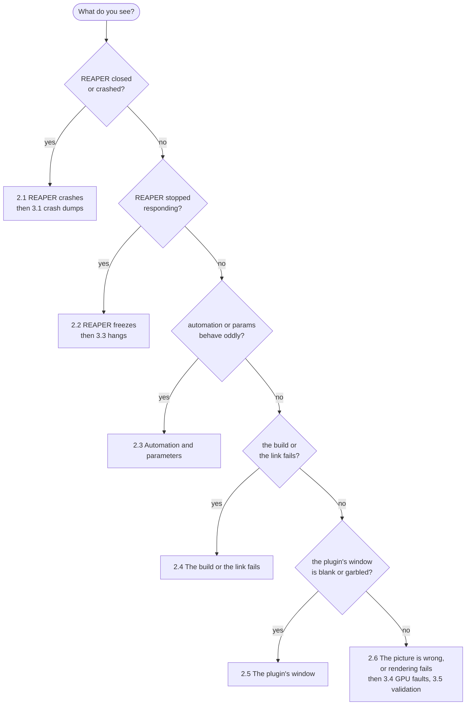

# Gotchas and debugging

ReaShader lives inside REAPER, between a C plugin API, two GPU-related SDKs, an embedded browser and Windows itself, and several of their traps have cost real time: a crash inside REAPER's own code, a freeze at 100% CPU, automation landing on the wrong parameter, a build that breaks only at link time.

**The answer:** this doc is organized **by what you see**, not by which library is to blame. Start from the symptom in [section 1](#1-find-your-problem); each entry in [section 2](#2-symptoms-causes-and-fixes) gives the symptom, its cause and the fix; and [section 3](#3-debugging-tools) has the tools for a crash or freeze nobody has seen before, with no debugger IDE needed.

**Words this doc uses:**

| Word | Meaning |
|---|---|
| callback | a function of the plugin that REAPER calls (through CLAP, or through REAPER's video API) |
| envelope | REAPER's automation curve for one parameter, saved in the project |
| param id | the number by which REAPER and the plugin identify a parameter |
| rescan | the plugin asking REAPER to re-read its parameters; `rescan(INFO)` re-reads names and visibility, `rescan(ALL)` the whole list |
| dump | a file Windows writes when a program crashes, holding its memory and threads at that moment |

Contents:

1. [Find your problem](#1-find-your-problem)
2. [Symptoms, causes and fixes](#2-symptoms-causes-and-fixes)
3. [Debugging tools](#3-debugging-tools)

## 1. Find your problem

**Pick the branch that matches what you see; it leads to the group of known causes, and, for a new problem, to the tool to investigate it.**



*What to see:* each question narrows the kind of failure; the box it ends in names the subsection with the known causes, and, where the cause may be new, the tool to find it.

## 2. Symptoms, causes and fixes

**Every entry starts with what you see in bold, then says why it happens and what to do.** The groups follow the order of the chart above.

### 2.1 REAPER crashes

**A crash inside REAPER usually means an exception escaped the plugin, a compiler warning was ignored, or two plugins shared code they shouldn't.**

- **REAPER aborts with exception `0x40000015`, at a fixed offset "inside reaper.exe".**
  - *Why:* a C++ exception escaped one of the plugin's callbacks. REAPER treats that as fatal and calls `abort()`.
  - *Fix:* catch everything at the edge of every callback (see the runtime rules in [CONTRIBUTING.md](../CONTRIBUTING.md#2-runtime-rules)). To find which one threw, look in the dump for the plugin's frame that threw ([3.1](#31-crash-dumps)).
- **A bizarre native crash, such as an illegal instruction (`STATUS_ILLEGAL_INSTRUCTION`), in code that looks fine.**
  - *Why:* usually a compiler warning that got ignored. A function missing its `return` compiles, and clang can turn it into a hardware trap.
  - *Fix:* grep the build log for `-Wreturn-type` and `-Wuninitialized` before suspecting the toolchain. The project builds with zero warnings, and a missing `return` is an error, to prevent this.
- **With ReaShader and ReaShader (Debug) loaded in one session, REAPER crashes inside the *other* plugin's `.clap`.**
  - *Why:* webview, as shipped, registers its window classes (`webview_widget`, `webview_message`) under `GetModuleHandle(nullptr)`, the *host's* module (reaper.exe), not the plugin's. Every plugin in the process that links webview then shares those classes: the first one loaded owns their window procedures, and the next one's windows run the first one's code with its own data.
  - *Fix:* the build patches a copy of webview's header to register the classes under the plugin's own module (see [building.md](building.md#4-what-the-build-produces)). Don't include `external/webview/.../webview.h` directly, bypassing that copy.

### 2.2 REAPER freezes

**A freeze is almost always two threads waiting on each other, or a loop on REAPER's main thread; the plugin's window is where both have happened.**

- **REAPER stops responding, at 100% of one CPU core, once the plugin's page has keyboard focus.**
  - *Why:* REAPER's FX window is a dialog. When the user presses Tab, the dialog's tab navigation (`GetNextDlgTabItem`) starts from the focused window and climbs its parents to find the next control. It can only climb out through parents marked `WS_EX_CONTROLPARENT`, so an unmarked container window makes it loop forever on the main thread.
  - *Fix:* the GUI's container window is created with `WS_EX_CONTROLPARENT`. Keep it.
- **REAPER freezes when the plugin's window closes.**
  - *Why:* on Windows, webview's `terminate()` is a bare `PostQuitMessage`, which stops only the *calling* thread's message loop, despite the library's docs. Called from REAPER's thread, it never stops the webview thread; and a plain `join()` on that thread deadlocks, because tearing down the webview's windows sends messages to the container on REAPER's thread.
  - *Fix:* queue `terminate()` onto the webview thread, and wait while still answering window messages. The sequence is in [architecture.md §6.2](architecture.md#62-the-webview-and-its-thread).

### 2.3 Automation and parameters

**REAPER binds envelopes to param ids and remembers what it saw first, so a param's id, name and range must never shift under an envelope.** These are all facts about REAPER, observed in projects and probes; the plugin's fixed param list is built around them (see [architecture.md §4.2](architecture.md#42-parameters)).

- **An envelope's name doesn't match its param any more.**
  - *Why:* REAPER binds a CLAP plugin's envelopes by param id, and freezes their names. A project stores an FX envelope as `<PARMENV <index>:<CLAP id> ... "<param name> / <FX name>"`. The index follows the param list, but the name is the one the param had when the envelope was created, and a later rescan doesn't update it.
  - *Fix:* a param's label must never change for the same param. Anything positional in a label (like "the third node") goes stale in envelopes.
- **After reopening a project, an envelope has lost its param, or drives another one (e.g. Audio Gain).**
  - *Why:* REAPER opens a project by activating the plugin, then loading its state, then binding the envelopes by id. Params that only appear later (on a main-thread callback, or after a restart) aren't found when the envelopes bind. And `rescan(ALL)`, the only way to change how many params there are, isn't allowed while the plugin is active.
  - *Fix:* every param id must exist from the start: that's why the param list is fixed.
- **Automation or modulation of a param uses the wrong range.**
  - *Why:* a CLAP param's range and default are fixed after REAPER's first scan. Changing them needs `rescan(ALL)`, which isn't allowed while active; `rescan(INFO)` covers only the name, module, hidden and periodic flags. REAPER then clamps and maps automation and modulation with the old range.
  - *Fix:* every param is 0..1 to the host, and the plugin maps it to its real range.
- **A removed node's envelope or modulation drives whatever takes its param id next.**
  - *Why:* REAPER keeps a removed param's envelope and parameter modulation (a `PROGRAMENV` block in the project) on its id. It keeps them even after the plugin calls `params.clear`, with every flag (observed), and even when the param leaves the list through `rescan(ALL)` during a restart, briefly or until the next restart (observed). REAPER's own Video Processor seems to lose an LFO when its script drops the param, but that happens inside REAPER, and a CLAP plugin can't trigger it. Deleting the envelope lane doesn't remove the modulation either: that's a separate REAPER feature, turned off in its own window, whether or not the param still exists.
  - *Fix:* none from the plugin. ReaShader reuses the smallest free node letter, so the leftover automation shows up at once, on the letter just removed; the user removes it in REAPER.
- **Hidden params still show up in REAPER's menus, greyed.**
  - *Why:* a `CLAP_PARAM_IS_HIDDEN` param is left out of the generic UI, but still listed, greyed, in the FX's param menus (track envelope, modulation, learn), unless its name is empty: then it's in none. `rescan(INFO)` (names, hidden) is honored while active, and an envelope stays bound to its id while the param is hidden.
  - *Fix:* unused slots are hidden *and* have an empty name.

### 2.4 The build or the link fails

**Most build traps come from headers that need a particular order or definition, and from SDK versions that have to match.**

- **Compile errors in `video_frame.h` about `WDL_FIXALIGN` or `INT_PTR`.**
  - *Why:* REAPER's SDK header uses them without including their definitions.
  - *Fix:* include `wdltypes.h` first.
- **A type error where the code uses `IVideoFrame::get_bits()`.**
  - *Why:* it returns `char*` in the vendored SDK.
  - *Fix:* cast at the call site.
- **A `.c` file's functions are missing at link time, though the file is listed in the sources.**
  - *Why:* the project only enables `CXX`, and CMake silently skips `.c` files.
  - *Fix:* add `C` to `project(LANGUAGES ...)`.
- **Compile errors inside `<shellapi.h>`.**
  - *Why:* it relies on types from `<windows.h>`.
  - *Fix:* include `<shellapi.h>` after `<windows.h>`.
- **`std::max` or `std::min` fail to compile in a file that includes `<windows.h>`.**
  - *Why:* `<windows.h>` defines `max` and `min` macros, and the plugin doesn't define `NOMINMAX`.
  - *Fix:* use plain comparisons there. (The test application's `test/host/reaper_sdk.h` defines `NOMINMAX`, for test code only.)
- **Win32 functions don't accept wide-string arguments (`GetModuleFileName`, ...).**
  - *Why:* clang's GNU driver doesn't define `UNICODE`, so the bare Win32 names resolve to the ANSI `...A` versions.
  - *Fix:* call the explicit `...W` functions.
- **The build breaks after a Vulkan SDK update.**
  - *Why:* vk-bootstrap and SPIRV-Reflect are pinned to the installed Vulkan SDK's version.
  - *Fix:* update them together with the SDK (see [building.md](building.md#5-dependencies)).
- **GLM fails to compile when taken from the Vulkan SDK.**
  - *Why:* the SDK's GLM is older than the submodule, even though its `GLM_VERSION` macro looks the same.
  - *Fix:* keep the GLM submodule. To compare versions, check `GLM_VERSION_MINOR` and `GLM_VERSION_PATCH` in `detail/setup.hpp`.

### 2.5 The plugin's window

**A blank or garbled plugin window comes from creating the window at the wrong time, or from how a page loaded from a file is read.**

- **The plugin's window isn't created: `CreateWindowExW` fails with error 1406, though the window class is registered.**
  - *Why:* error 1406 is `ERROR_TLW_WITH_WSCHILD`: a `WS_CHILD` window was created with no parent. It's easy to misread as a class-registration problem.
  - *Fix:* create the window in `set_parent()`, where REAPER provides the parent, not in `gui::create()`. In general, look a Win32 error up in `winerror.h` rather than trusting memory.
- **The page shows as garbage text.**
  - *Why:* a page loaded through `file://` gets no encoding detection, so a UTF-16 file is read as UTF-8.
  - *Fix:* keep frontend files UTF-8, and check with `file` after rewriting one.
- **The page's scripts don't run: a module import is blocked.**
  - *Why:* ES modules don't load from `file://`.
  - *Fix:* use plain `<script>` tags, in dependency order.

### 2.6 The picture is wrong, or rendering fails

**Wrong colors and failed frames come from the pixel format, from Vulkan flags of the wrong type, or from the GPU itself rejecting what the plugin asked.**

- **Red and blue are swapped.**
  - *Why:* REAPER's `'RGBA'` frames are B,G,R,A in memory (byte 0 = B).
  - *Fix:* code that builds or reads pixels by hand must use that order. The renderer copies whole frames into images of the same byte order, so shaders see the right channels.
- **Combining two Vulkan bits with `|` gives a wrong value (e.g. a shader stage goes missing).**
  - *Why:* `VK_SHADER_STAGE_VERTEX_BIT | VK_SHADER_STAGE_FRAGMENT_BIT` stored as a `...FlagBits` enum is a different, invalid value.
  - *Fix:* combine flags into the `...Flags` type (e.g. `VkShaderStageFlags`), never the `...FlagBits` enum.
- **The UI says "Rendering failed", and video passes through until the FX is reactivated.**
  - *Why:* the GPU didn't finish a frame within 2 seconds (a GPU hang), or a Vulkan call failed.
  - *Fix:* check the Windows System log ([3.4](#34-gpu-faults)) and, in a debug build, the validation messages ([3.5](#35-vulkan-validation)).

## 3. Debugging tools

**For a new crash or freeze, get the stack of every thread at the moment it happened; for a GPU problem, read the validation messages and the System log.** No WinDbg is needed: `lldb` and `llvm-symbolizer` come with clang.

### 3.1 Crash dumps

**Windows writes a full dump of every REAPER crash; open it with lldb to see each thread's stack.**

- Windows Error Reporting writes full dumps to `%LOCALAPPDATA%\CrashDumps\reaper.exe.<pid>.dmp`.
- To list crash records, in PowerShell:

  ```powershell
  Get-WinEvent -FilterHashtable @{LogName='Application'; ProviderName='Application Error'}
  ```

- Open a dump with `lldb -c <dump>`, then run `thread list` / `bt all`.
- If a stack won't unwind, run `memory read --format A --count 3000 $rsp` and look for `_CxxThrowException` and return addresses inside `ReaShader-Debug.clap` (or `ReaShader.clap` for release).
- **An exception escaping into REAPER** shows up as `abort()` with exception `0x40000015` at a fixed offset "inside reaper.exe". Look for the plugin frame that threw.

### 3.2 Symbolizing

**An address inside the plugin becomes a function and line with `llvm-symbolizer`:**

```bash
llvm-symbolizer --obj=build/windows-debug/ReaShader-Debug.clap <address>
```

where `<address>` is the crash address − the module base + `0x180000000`. This only works if the binary hasn't been rebuilt since the crash.

### 3.3 Hangs

**Attach lldb to the frozen REAPER and dump every thread's stack:**

```powershell
"" | lldb -p <pid> -o "bt all" -o "process detach" -o quit
```

(not `--batch`). Get the module base with `(Get-Process -Id <pid>).Modules`.

### 3.4 GPU faults

**Recurring `nvlddmkm` events in the Windows System log mean the Vulkan code is doing something invalid.** In the plugin, a GPU hang shows up as "Rendering failed" (the 2-second fence timeout), then passthrough until reactivation.

### 3.5 Vulkan validation

**Debug builds check every Vulkan call, including barriers, and any message they log is a bug.**

- Debug builds request the Khronos validation layer (if installed), with synchronization validation on. Warnings and errors go to `rs.log` next to the plugin.
- Normal use produces none, so **any message is a bug**. The test application fails a GPU test on any of them.
- `VK_LOADER_DEBUG=layer` shows whether the loader found the layer.
- See [rendering.md §7.3](rendering.md#73-debugging) for the renderer's side, and [testing.md](testing.md) for running the GPU code without REAPER (`--test-suite=render`).
