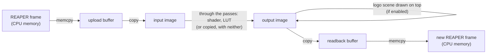

# How ReaShader renders

This is a guide to `src/render/`. It explains the Vulkan concepts the renderer uses, maps each one to our code, and gives the reasons behind the design, so you can change the renderer without reverse-engineering it first.

It assumes you know C++ and what a shader is, but not Vulkan. Each Vulkan term is explained where it first appears (in **bold**), then used freely.

Contents:

1. [The big picture](#1-the-big-picture)
2. [Vulkan in ten concepts](#2-vulkan-in-ten-concepts)
3. [File by file](#3-file-by-file)
4. [A frame, step by step](#4-a-frame-step-by-step)
5. [The shader contract](#5-the-shader-contract)
6. [Threads and safety](#6-threads-and-safety)
7. [Decisions and why](#7-decisions-and-why)
8. [How to extend](#8-how-to-extend)
9. [Debugging](#9-debugging)

## 1. The big picture

REAPER calls the plugin once per video frame, on its video thread, and waits for the result (`ReaShaderPlugin::_processVideoFrame` in `src/plugin/plugin.cpp`). The plugin hands the frame to `ReaShaderRenderer::renderFrame`, which sends it through the GPU and back:



- **One command buffer, one submit, one wait per frame.** Everything between the two `memcpy`s is recorded into a single list of GPU commands. It is sent to the GPU once, and the CPU waits for it to finish.
- **Why wait?** REAPER's callback is synchronous: it wants the finished frame as the return value. There is nothing useful to overlap, so the simplest correct scheme is also the right one (see [Decisions](#7-decisions-and-why)).
- **The passes:** the chain's shaders and LUTs, each a fullscreen pass, in the chain's order (see [the chain](#the-chain)). Between passes the frame goes through two work images.
- **When nothing is rendered:** `renderFrame` returns `false` if the renderer is busy (another thread holds it), has failed, or has no shader, no LUT and no logo. The plugin then returns REAPER's input frame unchanged: **passthrough**.

## 2. Vulkan in ten concepts

Vulkan is explicit: nothing happens unless you ask for it, including memory allocation, the order of GPU operations, and telling the GPU how an image will be used next. That's why even a simple renderer needs a lot of code. These ten concepts cover everything `src/render/` does.

### 2.1 Instance and physical devices

- The **instance** is the connection between our code and the Vulkan library (`vulkan-1.dll`). Validation layers are enabled on it.
- A **physical device** is a GPU as the system reports it: its name, its features, the Vulkan version it supports.

**In our code:** `Context::createInstance` (`context.cpp`) uses [vk-bootstrap](https://github.com/charles-lunarg/vk-bootstrap) to create the instance and list the usable GPUs:

- "usable" means Vulkan 1.3 with the `dynamicRendering` and `synchronization2` features (both explained below);
- the instance is _headless_: we never show anything in a window, so there's no surface or swapchain.

The UI's GPU list is `Context::deviceNames()`, in the same order.

### 2.2 Logical device and queue

- The **device** (logical device) is our open session with one physical device. Almost every other Vulkan object belongs to a device and dies with it.
- A **queue** is where work is sent to the GPU. Queues come in families by capability (graphics, compute, transfer). We use one graphics queue, which can also copy.

**In our code:** `Context::createDevice(index)` creates the device on the chosen GPU and gets its graphics queue. It also creates everything that lives exactly as long as the device (see [lifetimes](#lifetimes)).

### 2.3 Command buffers

The GPU doesn't execute calls one at a time. You **record** commands (copies, barriers, draws) into a **command buffer**, then **submit** the whole buffer to a queue. `vkCmd...` functions only record, and nothing runs until the submit.

- A **command pool** allocates command buffers.
- `ONE_TIME_SUBMIT` tells the driver a recording is used once and then re-recorded.

**In our code:** the device has exactly one command buffer. `Context::beginCommands()` resets it and starts recording. Each piece of the frame appends its commands (`recordUpload`, `ShaderPass::record`, ...). `Context::submitAndWait()` ends the recording and submits it. Uploading the logo's texture and a LUT reuses the same pair, outside frames.

### 2.4 Fences: the CPU waits for the GPU

A **fence** is a flag the GPU sets when a submitted batch has finished. The CPU can wait on it.

**In our code:** `submitAndWait()` resets the fence, submits (`vkQueueSubmit2`), then waits on the fence for up to **2 seconds** (`kFrameTimeoutNs`).

- **A timeout counts as a GPU hang:** the wait returns `VK_TIMEOUT`, `VK_CHECK` throws, and the renderer goes to `failed` (see [Threads and safety](#6-threads-and-safety)).
- **What it guarantees:** after the wait, the GPU has finished with every buffer and image of that frame. That's why the next frame can safely overwrite them, and why nothing needs to be synchronized _between_ frames.

### 2.5 Memory and VMA

In Vulkan you allocate GPU memory yourself, then bind buffers and images to it. Memory comes in types with different properties:

- **device-local:** fast for the GPU, usually not reachable by the CPU;
- **host-visible:** the CPU can **map** it (get a pointer) and read or write it directly;
- **host-coherent or not:** on non-coherent memory, CPU writes must be **flushed** before the GPU sees them, and GPU writes must be **invalidated** before the CPU sees them.

[VMA](https://github.com/GPUOpen-LibrariesAndSDKs/VulkanMemoryAllocator) (Vulkan Memory Allocator) picks memory types and suballocates them for us. It is compiled in `gpu.cpp` (`VMA_IMPLEMENTATION`).

**In our code:**

- **`gpu::Buffer`** (`gpu.h`) is always host-visible and stays mapped for its whole life (`mapped`). Its `hostAccess` flag tells VMA how the CPU uses it:
  - `HOST_ACCESS_SEQUENTIAL_WRITE`: the CPU only writes, front to back. VMA may pick write-combined memory, which is fast to write and very slow to read. Used by the upload buffer, the shader's params, and mesh data.
  - `HOST_ACCESS_RANDOM`: the CPU reads it back. VMA picks cached memory. Used by the readback buffer.
- **`flush()`** after CPU writes and **`invalidate()`** before CPU reads. Both are no-ops on coherent memory, so we always call them.
- **`gpu::Image`** asks VMA for device-local memory (`AUTO_PREFER_DEVICE`).

### 2.6 Buffers, images and image views

- A **buffer** is plain bytes. The GPU can copy from and to it, or read it as vertices, indices or uniforms.
- An **image** is pixels with a **format** (e.g. `B8G8R8A8_UNORM`: 4 bytes per pixel, blue first, each channel 0..1). Its memory layout is up to the driver (**optimal tiling**), which is what makes sampling and rendering fast. The CPU can't read it directly, so pixels go in and out through buffers (`vkCmdCopyBufferToImage`, `vkCmdCopyImageToBuffer`).
- An image declares up front what it will be used for (**usage flags**: transfer source or destination, sampled, color attachment, depth attachment).
- Shaders and rendering don't use an image directly but an **image view**: which part of it, and read as what.

**In our code:**

- `gpu::Image` is an image plus its view: 2D (`create`), or a 3D cube (`create3D`, for a LUT). Every image we make has one mip level and one layer.
- `FrameTargets` (`frame_targets.*`) owns the frame's buffers and images:

| Object     | Kind                     | Usage                                             | Role                                                                                                 |
| ---------- | ------------------------ | ------------------------------------------------- | ---------------------------------------------------------------------------------------------------- |
| `upload`   | buffer, host write       | transfer source                                   | REAPER's pixels are copied in here                                                                   |
| `input`    | image, `B8G8R8A8_UNORM`  | transfer destination and source, sampled          | the frame as the shader's `iChannel0`                                                                |
| `output`   | image, `B8G8R8A8_UNORM`  | color attachment, transfer source and destination | what the last pass (and the logo) renders into                                                       |
| `work[2]`  | images, `B8G8R8A8_UNORM` | color attachment, sampled                         | between passes: one pass renders to it, the next samples it. Created the first time a chain needs it |
| `readback` | buffer, host read        | transfer destination                              | the result, copied back for REAPER                                                                   |

- A **LUT** (`gpu::Lut`, `lut.*`) is a `size`³ 3D image in `R16G16B16A16_SFLOAT` (half floats; alpha unused), sampled with the shared linear sampler, so the hardware interpolates between the table's entries (trilinear).

### 2.7 Image layouts and barriers

This is the concept most bugs come from.

**Layouts.** An image is always in a **layout** that suits one kind of use:

- `TRANSFER_DST_OPTIMAL` to be copied into;
- `SHADER_READ_ONLY_OPTIMAL` to be sampled;
- `COLOR_ATTACHMENT_OPTIMAL` to be rendered to;
- `TRANSFER_SRC_OPTIMAL` to be copied from.

You change layouts explicitly. `UNDEFINED` as the old layout means "I don't care about the current contents": the driver may discard them, which is cheap.

**Barriers.** The GPU runs commands in parallel and out of order, unless told otherwise. A **pipeline barrier** tells it: "work of _these_ stages, with _these_ memory accesses, must finish and be visible before work of _those_ stages with _those_ accesses starts". An **image barrier** can also change the image's layout on the way.

A barrier has two halves:

- **source** (`srcStage` + `srcAccess`): what must be finished, e.g. `COPY` stage + `TRANSFER_WRITE`;
- **destination** (`dstStage` + `dstAccess`): what must wait for it, e.g. `FRAGMENT_SHADER` stage + `SHADER_READ`.

Stages are steps of the GPU's work: `COPY`, `FRAGMENT_SHADER`, `COLOR_ATTACHMENT_OUTPUT` (writing rendered pixels), `EARLY_FRAGMENT_TESTS` (depth test), `HOST` (the CPU), ... `NONE` as the source means "nothing to wait for".

Two barriers chain only if the first one's destination stages overlap the second one's source stages.

**synchronization2** is the Vulkan 1.3 form of barriers (`VkImageMemoryBarrier2`, `vkCmdPipelineBarrier2`), with each stage and access in the same struct. It's easier to read than the original API.

**In our code:** `gpu::transition()` (`gpu.cpp`) records one image barrier with all of the above as arguments. Every barrier of a frame is listed with its reason in [A frame, step by step](#4-a-frame-step-by-step). `FrameTargets::recordDownload` also records one **buffer** barrier, which makes the GPU's copy visible to the CPU.

### 2.8 Descriptors and push constants: feeding data to shaders

A shader reads two kinds of external data. Vulkan offers several ways to provide them, and we use two.

**Descriptors** are handles to resources (an image plus a sampler, a uniform buffer, ...), organized as follows:

- A **descriptor set layout** declares the slots: "binding 0 is a sampled image, binding 1 is a uniform buffer".
- A **descriptor set** is one filled instance of a layout, allocated from a **descriptor pool** and written with `vkUpdateDescriptorSets`.
- A **sampler** is the "how to read" part of a sampled image: filtering (linear) and what happens outside 0..1 (clamp to edge).
- A **uniform buffer** holds a block of constants the shader reads (`uniform Params { ... }`).

**Push constants** are a few bytes (at least 128 are guaranteed) written straight into the command buffer with `vkCmdPushConstants`. They need no buffer or descriptor, and suit small values that change every draw.

A **pipeline layout** ties them together: which set layouts and which push-constant ranges a pipeline uses.

**In our code:**

- `Context::createDevice` creates one descriptor pool (64 sets, 128 image samplers, 64 uniform buffers, with individually freeable sets) and one sampler (linear, clamp to edge on all three axes), shared by everything.
- **`ShaderPass`** has one set:
  - binding 0 = `iChannel0` (the pass's input);
  - binding 1 = the `Params` uniform buffer;
  - binding 2 = `iChannel1` (a LUT: the current one in `Shader` mode, otherwise an identity).

  Its push constants are `ShaderInputs` (resolution, time, frame rate, frame: 20 bytes).

- **`LutPass`** has one set:
  - binding 0 = the pass's input;
  - binding 1 = the LUT.

  Its push constant is `amount` (the LUT node's Mix, one float).

- **`Scene`** has one set per object:
  - binding 0 = the object's texture.

  Its push constant is the object's 4×4 matrix.

### 2.9 Pipelines and dynamic rendering

A **graphics pipeline** is one baked, immutable object that holds everything about how to draw:

- the shaders;
- how vertices are read (**vertex input**);
- primitives (triangle list);
- rasterization (fill, no culling);
- depth testing;
- blending;
- the formats of the images drawn into.

Baking it once lets the driver optimize. The few things we want to change per draw are declared **dynamic state**: we set the viewport and scissor at record time, so one pipeline works for any frame size.

**Rendering.** Drawing happens between `vkCmdBeginRendering` and `vkCmdEndRendering`. **Dynamic rendering** (Vulkan 1.3) names the target images (**attachments**) right there. Older Vulkan needed separate render pass and framebuffer objects, which we don't have. Each attachment says:

- **load op:** what to do with the existing contents first: `LOAD` (keep), `CLEAR`, or `DONT_CARE` (garbage is fine, since we'll overwrite everything);
- **store op:** whether to keep the result: `STORE`, or `DONT_CARE` (e.g. a depth buffer nobody reads afterwards).

**In our code:** `gpu::createPipeline(device, PipelineDesc)` builds every pipeline we have:

- triangle list;
- no culling, no blending;
- dynamic viewport and scissor;
- one color attachment in the frame format;
- a depth test only if `depthFormat` is set.

There are three pipelines: one per `ShaderPass` (the user's shader), one in `LutPass`, and one in `Scene` (the logo). Both passes draw with `fullscreen.vert`.

### 2.10 SPIR-V and shader modules

Vulkan doesn't take GLSL. It takes **SPIR-V**, a binary intermediate language (an array of 32-bit words). A **shader module** wraps SPIR-V for pipeline creation. We destroy modules right after `createPipeline`, since the pipeline keeps what it needs.

**In our code**, GLSL becomes SPIR-V in two places:

- **Built-in (internal) shaders** (`src/shaders/internal/`: `fullscreen.vert`, `lut.frag`, `scene.vert`, `scene.frag`) are compiled **at build time** by `glslc` into C arrays (`build/<preset>/generated/*.inc`). They are `#include`d into `pass.cpp`, `lut.cpp` and `scene.cpp`, so they are never read from disk.
- **User shaders** are compiled **at runtime, once, when uploaded**, by [shaderc](https://github.com/google/shaderc) (`gpu::compileShader` in `shader_compiler.cpp`). [SPIRV-Reflect](https://github.com/KhronosGroup/SPIRV-Reflect) then reads the result to find the `Params` block. See [The shader contract](#5-the-shader-contract).

## 3. File by file

| File                     | What it is                                                                                                                                                                          |
| ------------------------ | ----------------------------------------------------------------------------------------------------------------------------------------------------------------------------------- |
| `renderer.h/.cpp`        | **`ReaShaderRenderer`**: the only class the plugin talks to. Owns everything below, holds `frameMutex`, builds the chain's passes (`setChain`), records a frame, never throws.             |
| `context.h/.cpp`         | **`gpu::Context`**: instance, GPU list, device, queue, the one command buffer + fence, VMA allocator, descriptor pool, sampler.                                                     |
| `frame_targets.h/.cpp`   | **`gpu::FrameTargets`**: the frame's upload/readback buffers and input/output/work images, the commands that move pixels between them, and `recordPasses`, which chains the passes. |
| `pass.h/.cpp`            | **`gpu::Pass`**: the interface of a fullscreen pass (`bindInput`, `record`), plus what passes share: `fullscreen.vert`, `beginFullscreenRendering`, `writeImageDescriptor`.         |
| `shader_pass.h/.cpp`     | **`gpu::ShaderPass`**: one user shader as a fullscreen pipeline, its descriptor set and params buffer.                                                                              |
| `lut.h/.cpp`             | **`gpu::Lut`**: a LUT as a 3D image, uploaded once. **`gpu::LutPass`**: the frame through a LUT (`lut.frag`), blended by its Mix.                                                    |
| `lut_file.h/.cpp`        | **`gpu::parseCube`**: `.cube` files to a `LutData` table (1D LUTs and `DOMAIN`s baked into a 0..1 cube), and the stored JSON form. No Vulkan objects.                               |
| `shader_compiler.h/.cpp` | **`gpu::compileShader`**: the shader contract (preamble), GLSL → SPIR-V, reflection of `Params`, `//@param` annotations, and the stored JSON form. No Vulkan objects.               |
| `scene.h/.cpp`           | **`gpu::Scene`**: textured meshes drawn over the frame with a depth buffer (today: the logo). Also `Mesh` (.obj via tinyobjloader) and `Texture` (png/jpg via stb_image).           |
| `gpu.h/.cpp`             | Shared helpers: `VK_CHECK`, `Buffer`, `Image`, `createPipeline`, `transition`, `kFrameFormat`. The VMA implementation.                                                              |
| `frame_view.h`           | **`FrameView`**: a CPU frame (width, height, `rowBytes`, BGRA pixels). The boundary between REAPER and the renderer.                                                                |

### Lifetimes

There are no deletion queues or reference counting. Each object is a plain struct with `create()`/`destroy()` that list its handles, owned by `ReaShaderRenderer` through a `unique_ptr`, and grouped by what it depends on:

| Object                                                                      | Created                                                                      | Destroyed                                                                              |
| --------------------------------------------------------------------------- | ---------------------------------------------------------------------------- | -------------------------------------------------------------------------------------- |
| `Context` instance                                                          | `init()` (the plugin's first `activate()`, or after a failure)               | `shutdown()` / the renderer's destructor (plugin destroyed), or `init()` starting over |
| `Context` device (+ queue, command buffer, fence, allocator, pool, sampler) | with the instance; `changeRenderingDevice()`                                 | before the instance; `changeRenderingDevice()`                                         |
| a node's pass (`ShaderPass` or `LutPass`)                                   | `setChain()` for a new uid or new content, or with the device                | a `setChain()` without that uid, or with new content; with the device                  |
| a node's `Lut` (a LUT node's table, or a shader node's `iChannel1`)         | `setChain()` for a new uid or a new table, or with the device                | a `setChain()` without that uid, or with a new table; with the device                  |
| the identity `Lut`                                                          | with the device                                                              | with the device                                                                        |
| `Scene`                                                                     | the first `setLogoEnabled(true)`, or with the device if the logo is on       | with the device (turning the logo off only stops drawing it)                           |
| `FrameTargets`                                                              | the first frame, or a frame whose size or row stride changed                 | the next size/stride change; with the device                                           |
| `FrameTargets`' work images                                                 | the first chain of two or more passes (the second work image: three or more) | with the targets                                                                       |
| `Scene`'s depth image                                                       | `Scene::prepare()` when the frame size changes                               | the next size change; with the scene                                                   |

- **A node's objects** (`NodeObjects` in `renderer.cpp`) are grouped per node, in the chain's order. `setChain` keeps the pass of a node whose uid is in the current chain with the same `shader` pointer (or, for a LUT node, still a LUT node), and its `Lut` when the table pointer is the same. So adding, removing, moving or bypassing a node rebuilds nothing else. It builds everything new first, and only then takes the kept objects and destroys the old chain's rest: an error leaves the current chain untouched.
- **Destroy order on a device change** (`_destroyDevice`): scene, the nodes' objects, the identity, targets, then the device. They all belong to it.
- **Recreate order** (`_createDevice`): the device, the identity, every node's objects (from the kept chain) and the scene (if the logo is on). The targets come back with the next frame.
- **The chain is kept by the renderer** (`ChainNode`s holding `shared_ptr`s to the `CompiledShader`s and `LutData`s), not only on the GPU. That's why a device change can rebuild the passes and re-upload the LUTs without recompiling or re-parsing, and why `setChain` works with no device (the next `init()` installs it).

## 4. A frame, step by step

### The chain

The chain is a list of nodes (`ReaShaderRenderer::ChainNode`), set with `setChain`. Each node is a shader or a LUT:

- **a shader node** is a `ShaderPass`, with its own `Lut` as `iChannel1` (`shaderLut`), or the identity;
- **a LUT node** is a `LutPass` with its table.

`renderFrame` lists the passes every frame: the nodes in order, bypassed ones left out. With no passes at all (the logo alone), the input is copied to the output; with no passes and no logo, the frame passes through.

**Params per node:** each node names its params in `FrameInputs::paramValues`, the plugin's values by index (`firstParam`, `paramCount`). A shader node's go to its `Params` block in order; a LUT node's one param is its Mix. Values past `FrameInputs::paramCount` (params still waiting for the host's rescan) get their defaults: the shader's, and 1 for a Mix.

The plugin's own chain (see [architecture.md](architecture.md#the-chain)) maps one to one: `rendererChain` in `plugin.cpp` turns each of its nodes into a `ChainNode`, with its params' indices.

`FrameTargets::recordPasses` records them in order. The first pass samples `input`, the last renders to `output`, and the ones between render to `work[0]`, `work[1]`, `work[0]`, ... Each pass's input is bound right before it's recorded, so a pass object appears at most once in a chain (it has one descriptor set).

### Commands

`ReaShaderRenderer::renderFrame` with a shader node then a LUT node, and the logo on. The steps are in order; "B*n*" is a barrier.

**CPU, before recording:**

1. If needed, recreate `FrameTargets`. `scene->prepare()` makes the depth image the right size.
2. `FrameTargets::writeInput`: `memcpy` REAPER's pixels into the mapped upload buffer, then `flush`.
3. `ShaderPass::writeParams`: write each slider's value at its reflected byte offset in the mapped params buffer, then `flush`. Sliders without a value (the plugin's params are still pending) get their default.
4. Bind the LUTs: the shader's `iChannel1` (its node's LUT, otherwise the identity) and the LUT pass's table. Set the LUT pass's amount (its node's Mix).

**GPU commands** (`Context::beginCommands` → ... → `submitAndWait`):

| #   | Where                                    | Image / buffer                                                 | Layout                                  | Waits for (src)                  | Before (dst)                        | Why                                                                                                                                                                         |
| --- | ---------------------------------------- | -------------------------------------------------------------- | --------------------------------------- | -------------------------------- | ----------------------------------- | --------------------------------------------------------------------------------------------------------------------------------------------------------------------------- |
| B1  | `recordUpload`                           | input                                                          | `UNDEFINED` → `TRANSFER_DST`            | nothing                          | copy writes                         | the copy fully overwrites it, so the old contents can be discarded                                                                                                          |
|     |                                          | _copy upload buffer → input_                                   |                                         |                                  |                                     |                                                                                                                                                                             |
| B2  | `recordUpload`                           | input                                                          | `TRANSFER_DST` → `SHADER_READ_ONLY`     | copy writes                      | fragment shader reads               | the first pass must see the finished copy                                                                                                                                   |
| B3  | `beginFullscreenRendering` (shader pass) | work[0]                                                        | `UNDEFINED` → `COLOR_ATTACHMENT`        | fragment shader (execution only) | color attachment writes             | the pass writes every pixel (`loadOp = DONT_CARE`). A work image may have been sampled by an earlier pass of the chain, and those reads must finish before it's overwritten |
|     |                                          | _draw: 3 vertices, the user's fragment shader, sampling input_ |                                         |                                  |                                     |                                                                                                                                                                             |
| B4  | `recordPasses`                           | work[0]                                                        | `COLOR_ATTACHMENT` → `SHADER_READ_ONLY` | color attachment writes          | fragment shader reads               | the next pass samples what this one rendered                                                                                                                                |
| B5  | `beginFullscreenRendering` (LUT pass)    | output                                                         | `UNDEFINED` → `COLOR_ATTACHMENT`        | fragment shader (execution only) | color attachment writes             | as B3                                                                                                                                                                       |
|     |                                          | _draw: 3 vertices, `lut.frag`, sampling work[0] and the LUT_   |                                         |                                  |                                     |                                                                                                                                                                             |
| B6  | `Scene::record`                          | output                                                         | `COLOR_ATTACHMENT` → same               | color attachment writes          | color attachment reads + writes     | the logo is drawn over the last pass's result (`loadOp = LOAD`), so that must be finished first. No layout change, just a memory dependency                                 |
| B7  | `Scene::record`                          | depth                                                          | `UNDEFINED` → `DEPTH_ATTACHMENT`        | nothing                          | depth writes (early fragment tests) | cleared every frame (`loadOp = CLEAR`, `storeOp = DONT_CARE`)                                                                                                               |
|     |                                          | _draw each object: indexed triangles, depth tested_            |                                         |                                  |                                     |                                                                                                                                                                             |
| B8  | `recordDownload`                         | output                                                         | `COLOR_ATTACHMENT` → `TRANSFER_SRC`     | color attachment writes          | copy reads                          | the copy must read the final pixels                                                                                                                                         |
|     |                                          | _copy output → readback buffer_                                |                                         |                                  |                                     |                                                                                                                                                                             |
| B9  | `recordDownload`                         | readback (buffer)                                              | —                                       | copy writes                      | host reads                          | makes the GPU's write visible to the CPU after the fence                                                                                                                    |

With more passes, B3 and B4 repeat for every pass but the last, which renders to `output` (B5).

**CPU, after the fence:**

5. `FrameTargets::readOutput`: `invalidate`, then `memcpy` the readback buffer into REAPER's new frame.

**Without passes** (the logo alone), `recordPasses` calls `_recordInputToOutput` in place of B3–B5 and the draws:

- input `SHADER_READ_ONLY` → `TRANSFER_SRC`;
- output `UNDEFINED` → `TRANSFER_DST`;
- copy input → output;
- output `TRANSFER_DST` → `COLOR_ATTACHMENT`, before the scene's color reads and writes.

**The invariant:** after the passes, `output` is always in `COLOR_ATTACHMENT_OPTIMAL`, whether the last pass or `_recordInputToOutput` wrote it. `Scene::record` and `recordDownload` rely on it.

**Row padding:** REAPER's rows may be longer than `width × 4` bytes (`rowBytes`, REAPER's "rowspan"). The copies handle it with `bufferRowLength` (the row length in _pixels_, so `rowBytes` must be a multiple of 4, or `FrameTargets::create` throws). The `memcpy`s copy `rowBytes × (height − 1) + width × 4` bytes, because the last row may end right after its pixels.

**Across frames:** there are no barriers between frames. The fence wait guarantees the previous frame's GPU work is complete, and every image of the frame starts from `UNDEFINED`.

## 5. The shader contract

The user-facing documentation, which covers what a shader can use and the `//@param` syntax with examples, is [`src/shaders/examples/README.md`](../src/shaders/examples/README.md). This section covers how the contract is implemented.

**The preamble** (`kShaderPreamble` in `shader_compiler.cpp`) is prepended to every user shader by `withPreamble()`:

```
#version 450
<the user's #extension lines, moved here: they must come before any declaration>
<preamble: in vec2 uv, out vec4 fragColor, sampler2D iChannel0 at binding 0,
           sampler3D iChannel1 at binding 2,
           push constants ReaShaderInputs { iResolution, iTime, iFrameRate, iFrame },
           vec3 iLut(vec3 color)>
#line 1
<the user's source, with #version and #extension lines blanked, so line numbers are unchanged>
```

`#line 1` makes the compiler's error messages use the user's own line numbers.

**`uv` comes from `fullscreen.vert`.** It draws one triangle bigger than the screen from `gl_VertexIndex` alone, with no vertex buffer. `uv` is 0..1 across the frame, with (0, 0) at the top left, because Vulkan's clip space has y pointing down.

**`iLut`** samples `iChannel1` at the texel centers, `(c × (size − 1) + 0.5) / size`, so 0 and 1 land on the LUT's first and last entries rather than on the texture's edges. `lut.frag` does the same.

**Push constants ↔ `ShaderInputs`:** the preamble's `ReaShaderInputs` block and the C++ struct `gpu::ShaderInputs` (`shader_compiler.h`) must describe the same bytes (std430 layout: `vec2` at 0, `float` at 8 and 12, `int` at 16 = 20 bytes). `renderFrame` fills it, except `iFrame`: each `ShaderPass` counts the frames it recorded since it was created, so a node kept by `setChain` keeps counting, and a bypassed one pauses.

**Compiling** (`compileGlsl`): shaderc targets Vulkan 1.3, with automatic bindings.

- **Uniform blocks** have their binding shifted to start at 1 (`kParamsBinding`), so a plain `uniform Params { ... };` lands on binding 1.
- **Samplers** are shifted to 3 and up, so reflection rejects them.

User shaders should leave `layout(set, binding)` out: the shift applies to explicit bindings too.

**Reflection** (`reflect`) walks the descriptor bindings SPIRV-Reflect finds in the SPIR-V:

- anything outside descriptor set 0 is an error ("only descriptor set 0 is available"): our pipeline layout has one set, and a shader using another would make pipeline creation invalid;
- `iChannel0` at binding 0 and `iChannel1` at binding 2 are skipped (checked by name too: a user declaration at those bindings would alias them);
- binding 1 must be a uniform buffer: that's the `Params` block;
- anything else is an error ("only iChannel0, iChannel1 and one uniform block (Params) are available").

Errors name the resource, or the block's type name (`Params`) when it has no instance name.

Each `Params` member must be `float`/`vec2`/`vec3`/`vec4`. Each component becomes one `ShaderParamField`:

- `name` is `member` or `member.x`;
- `offset` is its byte offset in the block, from reflection, so the C++ side never needs to know GLSL's layout rules;
- label, default and range come from `//@param member 'Label' default min max` (`parseAnnotations`), and are otherwise the member's name, 0.5, 0..1.

**Params buffer:** `ShaderPass` always creates it (at least 16 bytes) and binds it at binding 1, even when the shader has no `Params`. The descriptor set layout declares the binding, so it must be valid.

**The stored form** (`toJson`/`fromJson`): `{ version: 1, paramsSize, params: [{ name, label, defaultValue, minValue, maxValue, offset }], spirv: [words] }`.

- **Where it lives:** in `resources/shaders/compiled/<name>.json`, and embedded in the plugin's state, so projects never recompile.
- **Versioning:** `fromJson` rejects any other `version`. Bump `kStoredVersion` whenever old SPIR-V or JSON would be wrong for the current code (e.g. the preamble's bindings or push constants change). Adding `iChannel1` didn't need it: older SPIR-V just doesn't use binding 2, which the pipeline layout provides anyway.

## 6. Threads and safety

Four threads touch the renderer (the full list is in `src/plugin/plugin.h`):

| Thread                | Calls                                                                                                                                  |
| --------------------- | -------------------------------------------------------------------------------------------------------------------------------------- |
| REAPER's video thread | `renderFrame`                                                                                                                          |
| main                  | `init()` (from `activate()`), `shutdown()` (via the destructor)                                                                        |
| webview (UI messages) | `setChain` (chain edits and uploads), `changeRenderingDevice`, `setLogoEnabled`                                                         |
| main (state load)     | the same setters, when a project is loaded                                                                                             |

**`frameMutex`:**

- **The lock:** every public function locks `frameMutex`, because they all touch the same GPU objects and the one command buffer.
- **The video thread never waits:** `renderFrame` uses `try_lock`, and if another thread holds the mutex (a device switch, a shader install, `init()` creating the instance), the frame passes through. REAPER's video thread must never block.
- **Compiling and parsing happen outside the lock:** they run on the upload path, before `setChain`. Under the lock there's only pipeline creation and LUT uploads, for the nodes that changed, which are short.

**Nothing throws out:**

- **Exceptions stay inside:** Vulkan errors throw inside the render code (`VK_CHECK`, `unwrap` for vk-bootstrap), and every public function of `ReaShaderRenderer` catches them.
- **Why it matters:** an exception escaping into REAPER or the CLAP host is fatal to REAPER.
- **Where errors go:** they are logged (with a message box for the user where it matters), or returned as a string (`setChain`: the UI shows the error, and the previous chain stays).

**`failed`:** a Vulkan error in `init()`, `changeRenderingDevice()` or `renderFrame()` sets `failed`, and from then on every frame passes through. It is cleared by:

- the next `init()`, which tears everything down and starts over (the plugin calls it on every `activate()`);
- a successful `changeRenderingDevice()`.

**Why the GPU stays up across deactivate:**

- The plugin's `deactivate()` removes REAPER's video processor, so frames stop arriving, but it doesn't shut the renderer down.
- CLAP needs a deactivate/activate cycle whenever the param list changes, which happens on every shader change (a host "restart").
- Recreating the Vulkan instance and device each time would take noticeable time.

**Swapping the chain is safe without waiting:** frames render one at a time and each waits on its fence. So whenever `setChain` holds the mutex, the GPU isn't using the old passes or LUTs, and it can destroy them immediately. The same holds for descriptor sets, which is why passes can rebind their inputs every frame.

## 7. Decisions and why

- **Vulkan 1.3, dynamic rendering and synchronization2.** These remove render pass and framebuffer objects and make barriers readable, which means far less code for a renderer that draws into one or two images. Any GPU with current drivers has 1.3. GPUs without it aren't listed.
- **One submit and one fence wait per frame, no pipelining.** REAPER's callback is synchronous and wants the result before returning, so there's no next frame to overlap with. This also gives us one command buffer, no per-frame resource copies, and no synchronization between frames.
- **Host-visible buffers for frame I/O, device-local images for the work.** The CPU writes into the upload buffer, the GPU copies it into an optimal-tiled image (sampling and rendering need images), and the reverse on the way out. Separate host-access flags keep the readback buffer in CPU-cached memory, since reading write-combined memory is very slow.
- **`B8G8R8A8_UNORM` everywhere (`kFrameFormat`).** REAPER's `'RGBA'` frames are B, G, R, A in memory, the same byte order as this format. Copies are byte-for-byte, and the format itself maps channels, so the shader's `.r` is red. There's no blit, swizzle or conversion pass. `UNORM` (not sRGB) means values pass through untouched.
- **Compile only on upload.** Compiling GLSL is slow, and shaderc is big. Doing it once, and storing SPIR-V plus the reflected params, means loading a project or selecting a shader never compiles, and projects are self-contained.
- **One sampler, one descriptor pool, one command buffer per device.** Nothing needs more. The pool's 64 sets cover two full chains of 16 nodes (the old chain is still there while `setChain` builds the new one) plus the scene's objects.
- **Viewport and scissor are dynamic.** Pipelines don't depend on the frame size, so a size change recreates only `FrameTargets` (and the scene's depth image), never pipelines.
- **The logo texture is sRGB, drawn onto a UNORM target.** Sampling an `R8G8B8A8_SRGB` texture converts it to linear values, and writing to a UNORM target stores them without converting back, so the logo comes out darker than the PNG. `scene.frag` adds 0.2. This is the logo's established look, and it was kept on purpose.
- **A chain of passes, not a fixed shader-then-LUT sequence.** Each pass samples one image and renders another, and `recordPasses` links them through two ping-pong images. A node's position is just an order in a list, and any number of shaders and LUTs need no new recording code.
- **Nodes are identified by uid, content by pointer.** The chain's content is immutable and shared (`shared_ptr<const ...>`), so "the same content" is a pointer comparison, with no hashing or deep compare, and the renderer keeps no copies.
- **Inputs are rebound every frame.** A pass's input depends on its place in the chain, which changes when nodes are added, moved or bypassed. Rewriting one descriptor per pass per frame is cheap, and legal because the previous frame has finished (the fence).
- **`SHADER_READ`, not `SHADER_SAMPLED_READ`, before sampling.** Synchronization2's narrower `SHADER_SAMPLED_READ` is the textbook access for sampling, but Intel's Windows driver (UHD 620) doesn't invalidate its texture cache for it: in a four-pass chain, the last pass sampled `work[0]` as the first pass left it, not as the third pass rewrote it. `SHADER_READ` includes sampled reads, and every barrier before sampling uses it. The render test "four passes ping-pong through the work images" catches it.
- **The LUT is a 3D texture, filtered by the hardware.** Trilinear interpolation between entries is what `.cube` LUTs expect, and the sampler does it for free. The format is RGBA16F: every GPU filters it (3-channel formats aren't guaranteed), and half floats are plenty for an 8-bit frame.
- **LUTs are normalized when parsed.** A 1D LUT becomes a 33³ cube, and a `DOMAIN` other than 0..1 is resampled onto 0..1 (`lut_file.cpp`), so the GPU side knows one kind of LUT and `lut.frag` / `iLut` need no domain uniforms.
- **The shader always has an `iChannel1`.** When its node has no LUT, a 17³ identity is bound, so the descriptor is always valid and a shader calling `iLut` gets its input back. 17 points, not 2: some GPUs interpolate with 8-bit weights, which on a 2-point identity can be off by one 8-bit step.
- **Plain `create()`/`destroy()` structs, no deletion queues.** There are few objects with clear owners (the lifetime table above), so an explicit list of handles per struct is easier to follow than a generic mechanism.

## 8. How to extend

### Add a pass

Passes are chained by `FrameTargets::recordPasses` (see [the chain](#the-chain)). To add a kind of pass:

- **Implement `gpu::Pass`:** `bindInput` writes the input's descriptor (with `writeImageDescriptor`), and `record` starts with `beginFullscreenRendering(commandBuffer, target)`, draws, and ends rendering. That leaves the target in `COLOR_ATTACHMENT_OPTIMAL`, as the invariant needs.
- **One descriptor set per pass object:** a pass object can appear only once in a chain. That's why every node has its own objects, and the same shader in two nodes builds two passes.
- **A new kind of node:** give `ChainNode` its content, and `NodeObjects` (`renderer.cpp`) its objects: what to build in `create`, what `reuse` can keep, and the per-frame setup in `renderFrame`.
- **Tests:** `test::render` takes the same list (`RenderInputs::passes`), so a render test runs the real chaining code.

### Add a scene object or texture

- In `Scene::create`, load a `Mesh` (`.obj`) and a `Texture` (any format stb_image reads), and add an `Object { mesh, createTextureSet(context, texture), localTransform }`.
- Free them in `Scene::destroy`: the texture set is freed per object, but meshes and textures are members, so add them there.
- Each object uses one descriptor set from the shared pool (64 sets in total, shared with the passes).
- Assets live in `res/`. The build copies them to `resources/` next to the plugin on every build.

### Add a built-in shader input (like `iTime`)

1. Add the field to `ReaShaderInputs` in `kShaderPreamble` **and** to `gpu::ShaderInputs`. Match std430 alignment: `float`/`int` 4 bytes, `vec2` 8, `vec3`/`vec4` 16. Push constants are guaranteed only up to 128 bytes.
2. Fill it in `ReaShaderRenderer::renderFrame`.
3. Document it for users in `src/shaders/examples/README.md`.
4. **Stored shaders** carry SPIR-V compiled against the old preamble, both in `resources/shaders/compiled/` and inside saved projects:
   - appending a field keeps them working, since they just don't read it;
   - reordering or changing fields breaks them, so bump `kStoredVersion` in that case.

## 9. Debugging

- **Validation layer (debug builds).** `Context::createInstance` requests the Khronos validation layer with **synchronization validation** on. Sync validation checks every barrier against what the commands actually access, and reports hazards (e.g. "WRITE_AFTER_WRITE hazard detected") that core validation doesn't catch.
  - Warnings and errors go to `rs.log` (next to the plugin, or next to the test binary) as `Vulkan / Validation`.
  - Normal use produces none, so **any message is a bug**. The test application fails the GPU test that caused one.
  - The layer comes with the Vulkan SDK. `VK_LOADER_DEBUG=layer` shows whether the loader found it.
  - Release builds have no validation.
- **The test application** ([testing.md](testing.md)): the `render` suite compiles the render code without the plugin and runs it on every GPU of the machine. It checks exact output pixels for an example shader, params and channel order, param defaults, the logo scene, the LUT pass, a LUT before or after a shader, `iLut`, a four-pass chain, and consecutive frames. The `shader_compiler` suite covers the contract (reflection, `//@param`, errors, the stored form), and the `lut` suite the `.cube` parser. Run it with the VS Code `test` task, or `build/tests-debug/reashader_tests --test-suite=render`.
- **A GPU hang** shows up as "Rendering failed" (the 2-second fence timeout) and passthrough until re-activation. Recurring `nvlddmkm` events in the Windows System log mean the Vulkan code did something invalid.
- **Crashes and hangs in REAPER** (dumps, lldb, symbolizing): see [gotchas.md](gotchas.md#2-debugging-crashes-and-hangs).
