# How ReaShader renders

REAPER hands the plugin each video frame as pixels in ordinary memory, on its video thread, and wants the finished frame back before the call returns. The GPU is what makes shaders fast, but it works in its own memory, runs asynchronously, and, through Vulkan, has to be told everything explicitly: where every byte goes, in what order work happens, and when it's safe to reuse something.

**The answer:** the renderer turns each frame into **one round trip to the GPU**. It copies the pixels in, runs the chain's passes, draws the logo on top if it's on, and copies the result out. All of that is recorded as one list of GPU commands, submitted once, and waited for once. Three rules keep this safe inside REAPER:

- **nothing throws out** of the renderer;
- **the video thread never waits** for a lock;
- **every reuse of an image is preceded by a barrier,** a command that tells the GPU what must finish first.

This guide is for readers who know C++ and what a shader is, but not Vulkan. It covers `src/render/`; how the renderer fits into the plugin is in [architecture.md](architecture.md).

**The map.** Everything in this guide is one of the boxes below: either a step of the frame's trip, or an object the renderer keeps to make that trip possible.

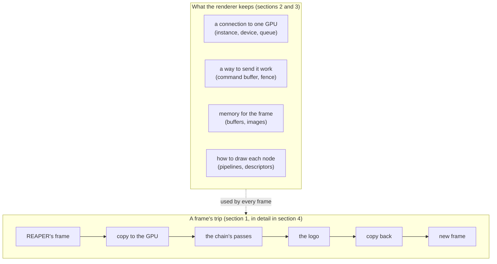

*What to see:* the trip happens once per frame and is short; the objects that feed it are built rarely (on activation, on a chain edit, on a resize) and reused by every frame. Section 2 explains what each kind of object is and why Vulkan has it, section 3 says when ours are built and destroyed, and section 4 walks a frame through them.

**Words used throughout** (Vulkan's own terms are explained in section 2, in **bold** where they first appear):

| Word | Meaning |
|---|---|
| CPU memory, GPU memory | the computer's ordinary memory, and the graphics card's own, which is much faster for the GPU |
| buffer | plain bytes in memory that both the CPU and the GPU can reach |
| image | pixels stored the way the GPU reads and draws fastest; the CPU can't read it directly |
| pass | one node of the chain drawn over the whole frame: it reads one image and writes another |
| frame lock | the mutex every renderer function takes, which the video thread only *tries* to take |
| passthrough | returning REAPER's input frame unchanged |

Contents:

1. [A frame's round trip](#1-a-frames-round-trip)
2. [The Vulkan you need](#2-the-vulkan-you-need)
3. [The objects and how long they live](#3-the-objects-and-how-long-they-live)
4. [A frame, step by step](#4-a-frame-step-by-step)
5. [How the shader contract is built](#5-how-the-shader-contract-is-built)
6. [Staying safe: threads, errors, failure](#6-staying-safe-threads-errors-failure)
7. [Working on the renderer](#7-working-on-the-renderer)

## 1. A frame's round trip

**A frame goes from REAPER's memory to the GPU and back in one trip, and the CPU waits for the GPU to finish before handing the frame back.**

### 1.1 Where the pixels go

**The frame changes hands twice in each direction, through buffers that both the CPU and the GPU can reach.**

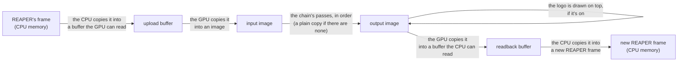

*What to see:* only the middle steps do real work. The copies exist because the CPU can't read images and the GPU draws only into images, so buffers are the meeting point.

- **A pass** is a shader node running the user's shader, or a LUT node running the built-in LUT shader. Between passes, the frame goes through two scratch images (section 4).
- **When nothing is rendered,** REAPER gets its own input back (passthrough). That happens when the renderer is busy (another thread is changing it), has failed, or has nothing to draw: no pass to run and the logo off.

### 1.2 When the CPU and the GPU work

**The CPU records the whole frame as a list of commands, sends it once, and sleeps until the GPU is done.**

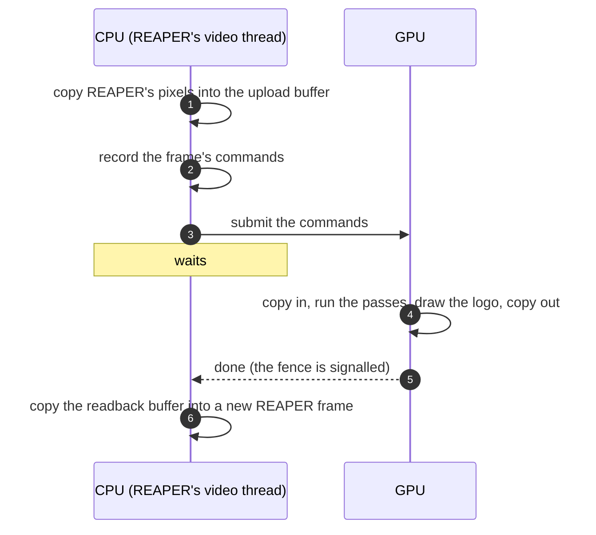

*The steps:*
- **1.** The CPU writes REAPER's pixels into the upload buffer.
- **2.** It records every GPU operation of the frame into one list (a command buffer, section 2.2). Nothing runs yet.
- **3.** It submits that list to the GPU in one call.
- **4–5.** The GPU runs the list while the CPU waits; when the GPU finishes, it signals a fence, which wakes the CPU.
- **6.** The CPU copies the result into a new frame for REAPER.

- **Why wait, instead of overlapping frames?** Games keep two or three frames "in flight": the CPU prepares frame N+1 while the GPU draws frame N. That only pays off when someone consumes frames later. REAPER's callback wants *this* frame back as its return value, so there's nothing useful to do in the meantime, and the simplest correct scheme (one submit, one wait) is also the right one.
- **What waiting buys:** after the wait, the GPU is done with every buffer and image of the frame. So the next frame can reuse them all, and nothing has to be synchronized *between* frames.

*In the code:* `ReaShaderPlugin::_processVideoFrame` (`src/plugin/plugin.cpp`) calls `ReaShaderRenderer::renderFrame`, which returns `false` for passthrough.

## 2. The Vulkan you need

**Vulkan's objects come in layers, each built on the one before: a connection to a GPU, a way to send it work, memory to work in, and descriptions of how to draw.** Vulkan does nothing implicitly: memory, the order of GPU work, and preparing an image for its next use are all spelled out by the program. That's why even a small renderer has a lot of code, and why each object below exists.

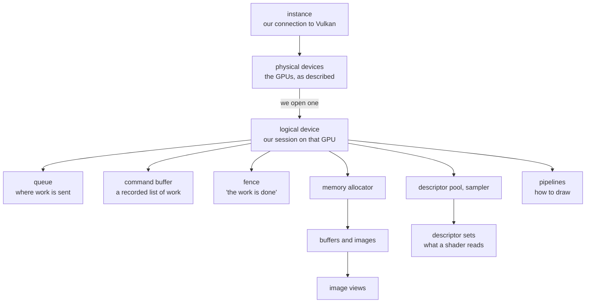

*What to see:* everything hangs off the logical device. That's why switching GPUs means rebuilding everything (section 3). The subsections follow this picture from the top: connecting (2.1), sending work (2.2), memory (2.3), ordering work (2.4), feeding shaders (2.5) and drawing (2.6).

### 2.1 Connecting to a GPU: instance, devices, queue

**The program opens Vulkan (the instance), picks a GPU from those Vulkan describes (a physical device), opens a session on it (a logical device), and sends work through one of its queues.**

- **The instance** connects the program to the Vulkan library (`vulkan-1.dll`). Vulkan keeps no global state, so everything starts from an instance, and a program may create several. Validation layers, which check the program's use of Vulkan in debug builds, are switched on here.
- **A physical device** is a GPU as the system describes it: its name, its features, its limits, its kinds of memory. It's read-only: nothing can be created on it directly.
- **A logical device** (from here on just **device**) is a session opened on one physical device, with the features and queues the program asked for. Almost every other Vulkan object belongs to a device, and dies with it. Objects of one device can't be used with another.
  - *Why two kinds of device:* the physical one is a description, the logical one is a configuration. Splitting them lets several programs, or several parts of one program, open the same GPU with different features, and lets the driver check and prepare only what each session enabled.
  - *Can there be more than one?* Yes. A program can open several devices, on the same GPU or on different ones. ReaShader does so naturally: **each ReaShader FX in a project has its own renderer, with its own instance and its own device**, on the GPU chosen in that FX's window. They don't share anything, so one FX switching GPUs or failing doesn't affect another.
- **A queue** is where a device accepts work. Queues come in families by what they can do: graphics, compute, copying. A GPU may offer several queues that run side by side; games use a separate copy queue to upload textures in the background while drawing. We use **one graphics queue**, which can also copy, because a frame is one batch that we wait for: there's never a second batch to run alongside it.

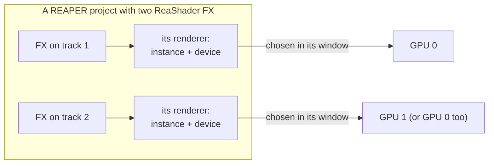

*What to see:* two FX are two independent sessions. They can use the same GPU or different ones; each has its own objects.

**In our code:**
- `Context::createInstance` (`context.cpp`) uses [vk-bootstrap](https://github.com/charles-lunarg/vk-bootstrap) to create the instance and list the usable GPUs. "Usable" means Vulkan 1.3 with the `dynamicRendering` and `synchronization2` features (sections 2.6 and 2.4). The instance is *headless*: we never show anything in a window, so there's no surface or swapchain (the objects that present images on a screen).
- The UI's GPU list is `Context::deviceNames()`, in the same order.
- `Context::createDevice(index)` creates the device on the chosen GPU and gets its graphics queue. It also creates everything that lives exactly as long as the device (see [section 3](#3-the-objects-and-how-long-they-live)).

### 2.2 Sending work: command buffers and fences

**GPU work is recorded into a command buffer first, submitted to a queue in one call, and a fence tells the CPU when it's finished.**

- **A command buffer** is a recorded list of commands: copies, barriers, draws. The `vkCmd...` functions only add to the list; nothing runs until the buffer is **submitted** to a queue.
  - *Why record instead of calling the GPU directly:* the driver can check and translate the commands once, while recording, so submitting is cheap. Recording can also happen on several threads at once, and a recorded buffer can be submitted again and again.
  - *Why we record every frame anyway:* what a frame does changes with the chain (nodes added, moved, bypassed) and with the frame size, and recording a few dozen commands takes microseconds. Re-recording is simpler than tracking when a recording goes stale.
  - A **command pool** allocates command buffers. `ONE_TIME_SUBMIT` tells the driver a recording is submitted once, then recorded again from scratch.
- **A fence** is a flag the GPU raises when a submitted batch is finished, and the CPU can wait for it.
  - Vulkan also has **semaphores**, which make one submission on the GPU wait for another, or wait for a screen to be ready, without involving the CPU. We have one submission per frame and no screen, so a fence is all we need.

**In our code:**
- The device has exactly one command buffer and one fence. `Context::beginCommands()` resets the buffer and starts recording. Each piece of the frame adds its commands (`recordUpload`, `ShaderPass::record`, ...). `Context::submitAndWait()` ends the recording, resets the fence, submits (`vkQueueSubmit2`), and waits on the fence for up to **2 seconds** (`kFrameTimeoutNs`).
- **A timeout counts as a GPU hang:** the wait returns `VK_TIMEOUT`, `VK_CHECK` throws, and the renderer goes to `failed` (see [section 6](#6-staying-safe-threads-errors-failure)).
- Uploading the logo's texture or a LUT reuses the same command buffer and fence, outside frames.

### 2.3 Memory: allocations, buffers, images and views

**In Vulkan the program allocates memory itself, picking memory that's fast for the GPU or memory the CPU can reach, and then places buffers and images in it.**

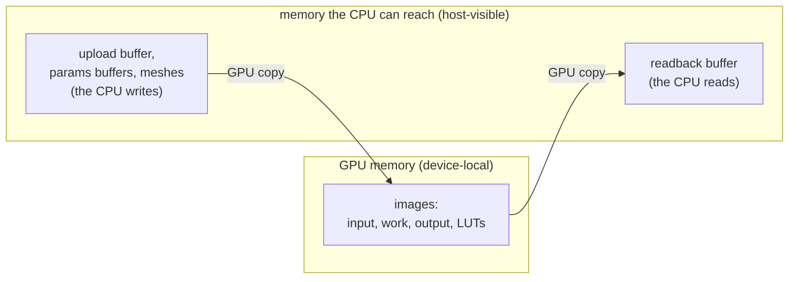

*What to see:* the GPU does its work in its own fast memory; the only memory the CPU touches is the buffers at the edges of the frame.

- **Memory comes in types** with different properties:
  - **device-local:** fast for the GPU, usually not reachable by the CPU;
  - **host-visible:** the CPU can **map** it (get a pointer to it) and read or write it directly;
  - **host-coherent or not:** on non-coherent memory, the CPU must **flush** its writes before the GPU sees them, and **invalidate** before reading what the GPU wrote.
- *Why manual memory:* the program knows how each resource is used, so it can place it where that use is fastest. Drivers also limit how many separate allocations a program may make (often around 4096), so real programs take large blocks and carve them up. [VMA](https://github.com/GPUOpen-LibrariesAndSDKs/VulkanMemoryAllocator) (Vulkan Memory Allocator) does that carving, and picks memory types from a description of the use. It's compiled in `gpu.cpp` (`VMA_IMPLEMENTATION`).
- **A buffer** is plain bytes. The GPU can copy from and to it, or read it as vertices, indices or a block of constants (a *uniform buffer*).
- **An image** is pixels with a **format** (e.g. `B8G8R8A8_UNORM`: 4 bytes per pixel, blue first, each channel 0..1). How its pixels are arranged in memory is up to the driver (**optimal tiling**), which is what makes sampling and drawing fast; that's also why the CPU can't read an image directly, and pixels go in and out through buffers (`vkCmdCopyBufferToImage`, `vkCmdCopyImageToBuffer`). An image declares up front what it will be used for (**usage flags**: copied from or into, sampled by a shader, drawn into, used as a depth buffer).
- **An image view** is how a shader or a draw sees an image: which part of it, read as what. One image can have many views, e.g. one per mip level (a smaller copy of the image), one per layer of an array, or reading the pixels as another compatible format. We only need one view per image, covering all of it.

**In our code:**
- **`gpu::Buffer`** (`gpu.h`) is always host-visible and stays mapped for its whole life (`mapped`). Its `hostAccess` flag tells VMA how the CPU uses it:
  - `HOST_ACCESS_SEQUENTIAL_WRITE`: the CPU only writes, front to back. VMA may pick *write-combined* memory, which is fast to write and very slow to read. Used by the upload buffer, the shaders' params buffers, and mesh data.
  - `HOST_ACCESS_RANDOM`: the CPU reads it back. VMA picks cached memory. Used by the readback buffer.
- **`flush()`** after CPU writes and **`invalidate()`** before CPU reads. Both do nothing on coherent memory, so we always call them.
- **`gpu::Image`** is an image plus its view, in device-local memory (`AUTO_PREFER_DEVICE`): 2D (`create`), or a 3D cube (`create3D`, for a LUT). Every image we make has one mip level and one layer.
- **`FrameTargets`** (`frame_targets.*`) owns the frame's buffers and images:

| Object | Kind | Usage | Role |
|---|---|---|---|
| `upload` | buffer, host write | copied from | REAPER's pixels are copied in here |
| `input` | image, `B8G8R8A8_UNORM` | copied into and from, sampled | the frame, as the first pass's input (a shader's `iChannel0`) |
| `output` | image, `B8G8R8A8_UNORM` | drawn into, copied from and into | what the last pass (and the logo) draws into |
| `work[2]` | images, `B8G8R8A8_UNORM` | drawn into, sampled | between passes: one pass draws into it, the next samples it. Created the first time a chain needs it |
| `readback` | buffer, host read | copied into | the result, copied back for REAPER |

- **A LUT** (`gpu::Lut`, `lut.*`) is a `size`×`size`×`size` 3D image in `R16G16B16A16_SFLOAT` (half floats; alpha unused). It's sampled with the shared linear sampler, so the hardware blends between the table's entries (trilinear interpolation).

### 2.4 Ordering work: layouts and barriers

**The GPU runs commands overlapped and through caches, so before an image is used in a new way, a barrier must say what earlier work has to finish, and how the image will be used next.** Most rendering bugs come from getting this wrong.

- **Why it's needed:** the GPU starts commands before earlier ones finish, as long as nothing says they depend on each other, and its units keep data in caches that others can't see. Without a barrier, a shader could sample an image while the copy into it is still running, or read stale cached pixels.
- **Layouts:** an image is always in a **layout**, an arrangement suited to one kind of use. The hardware may store pixels compressed or rearranged differently for drawing than for sampling, so the program says which use comes next:
  - `TRANSFER_DST_OPTIMAL` to be copied into;
  - `SHADER_READ_ONLY_OPTIMAL` to be sampled;
  - `COLOR_ATTACHMENT_OPTIMAL` to be drawn into;
  - `TRANSFER_SRC_OPTIMAL` to be copied from.

  `UNDEFINED` as the old layout means "I don't care about the current contents": the driver may throw them away, which is cheap.
- **A pipeline barrier** says: "work of *these* stages, with *these* memory accesses, must finish and be visible before work of *those* stages, with *those* accesses, starts". An **image barrier** can also change the image's layout on the way.

Here is an example, the barrier between copying the frame into the input image and sampling it in the first pass:

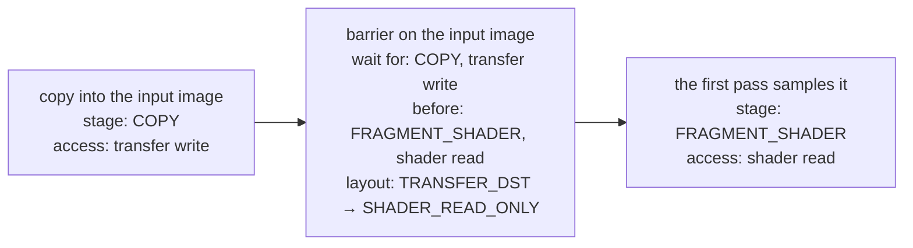

*What to see:* a barrier has two halves, what must be finished (the **source**: stage + access) and what must wait for it (the **destination**: stage + access), plus, for an image, the layout change in between.

- **Stages** are steps of the GPU's work: `COPY`, `FRAGMENT_SHADER` (computing pixel colors), `COLOR_ATTACHMENT_OUTPUT` (writing drawn pixels), `EARLY_FRAGMENT_TESTS` (the depth test), `HOST` (the CPU), ... `NONE` as the source means "nothing to wait for". Two barriers chain only if the first one's destination stages overlap the second one's source stages.
- **synchronization2** is the Vulkan 1.3 form of barriers (`VkImageMemoryBarrier2`, `vkCmdPipelineBarrier2`), with each stage next to its access in the same struct. It's much easier to read than the original form.

**In our code:** `gpu::transition()` (`gpu.cpp`) records one image barrier with all of the above as arguments. Every barrier of a frame is listed with its reason in [section 4](#4-a-frame-step-by-step). `FrameTargets::recordDownload` also records one **buffer** barrier, which makes the GPU's copy visible to the CPU.

### 2.5 Feeding shaders: descriptors and push constants

**A shader reads its images and blocks of constants through descriptors, and a few small values that change every draw through push constants.**

- **Descriptors** are handles to resources (an image with a sampler, a uniform buffer, ...):
  - a **descriptor set layout** declares the slots, called **bindings**: "binding 0 is a sampled image, binding 1 is a uniform buffer";
  - a **descriptor set** is one filled-in instance of a layout, allocated from a **descriptor pool** and written with `vkUpdateDescriptorSets`;
  - a **sampler** is the "how to read" part of a sampled image: filtering (linear) and what happens outside 0..1 (clamp to the edge);
  - a **uniform buffer** holds a block of constants the shader reads, like `uniform Params { ... }`.
- *Why sets:* binding a whole set at once is cheaper than binding resources one by one, and a pipeline can use several sets, typically grouped by how often they change (per frame, per material, per object). Large engines go further, with *bindless* tables of thousands of resources. Our passes read at most three resources, so each uses **one set**.
- **Push constants** are a few bytes (at least 128 are guaranteed) written straight into the command buffer with `vkCmdPushConstants`. They need no buffer or descriptor, which suits small values that change every draw, like the time.
- **A pipeline layout** ties them together: which set layouts and which push-constant ranges a pipeline uses.

What a user shader's pass reads:

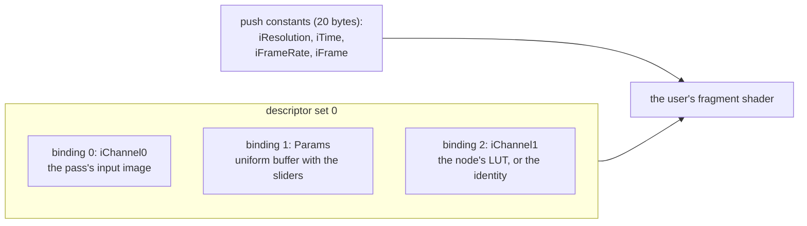

*What to see:* three bindings in one set, plus push constants. The shader contract (section 5) is exactly this list, as seen from GLSL.

**In our code:**
- `Context::createDevice` creates one descriptor pool (64 sets, 128 image samplers, 64 uniform buffers, with sets that can be freed one by one) and one sampler (linear, clamp to edge on all three axes), shared by everything.
- **`ShaderPass`** has the set above, and its push constants are `ShaderInputs`.
- **`LutPass`** has one set: binding 0 = the pass's input, binding 1 = the LUT. Its push constant is `amount` (the LUT node's Mix, one float).
- **`Scene`** has one set per object: binding 0 = the object's texture. Its push constant is the object's 4×4 matrix.

### 2.6 Drawing: pipelines, dynamic rendering and SPIR-V

**A pipeline is one object that holds everything about how to draw, built ahead of time; drawing then happens between "begin rendering" and "end rendering", naming the images to draw into.**

- **A graphics pipeline** holds: the shaders; how vertices are read (**vertex input**); the primitives (triangle list); rasterization (fill, no culling); depth testing; blending; and the formats of the images drawn into.
  - *Why build it ahead:* creating a pipeline is when the driver compiles the shaders into the GPU's own machine code, knowing all the state around them. That can take milliseconds, far too slow for every frame. So we build a pipeline once per shader and reuse it.
  - The few things we want to change per draw are declared **dynamic state**: we set the viewport and scissor (the area drawn into) at record time, so one pipeline works for any frame size.
- **Rendering** happens between `vkCmdBeginRendering` and `vkCmdEndRendering`, which name the images drawn into (**attachments**). Each attachment says:
  - **load op:** what to do with its current contents first: `LOAD` (keep), `CLEAR`, or `DONT_CARE` (anything is fine, since everything will be overwritten);
  - **store op:** whether to keep the result: `STORE`, or `DONT_CARE` (e.g. a depth buffer nobody reads afterwards).
- **Dynamic rendering** (Vulkan 1.3) is this "name the attachments when you begin" form. Older Vulkan needed separate *render pass* and *framebuffer* objects describing the attachments ahead of time. Those help tiled GPUs (common on phones) keep images on-chip between steps; desktop GPUs gain little from them, so we don't have them.
- **SPIR-V** is what Vulkan takes instead of GLSL: a binary intermediate language (an array of 32-bit words). Drivers then don't each have to ship a GLSL compiler, and a shader compiled once behaves the same on every driver. A **shader module** wraps SPIR-V for pipeline creation; we destroy modules right after `createPipeline`, since the pipeline keeps what it needs.

**In our code:**
- `gpu::createPipeline(device, PipelineDesc)` builds every pipeline we have: a triangle list; no culling, no blending; dynamic viewport and scissor; one color attachment in the frame format; a depth test only if `depthFormat` is set.
- There are three kinds of pipeline: one per `ShaderPass` (the user's shader), one per `LutPass`, and one in `Scene` (the logo). Both kinds of pass draw with `fullscreen.vert`.
- GLSL becomes SPIR-V in two places:
  - **built-in shaders** (`src/shaders/internal/`: `fullscreen.vert`, `lut.frag`, `scene.vert`, `scene.frag`) are compiled **at build time** by `glslc` into C arrays (`build/<preset>/generated/*.inc`), `#include`d into `pass.cpp`, `lut.cpp` and `scene.cpp`, so they're never read from disk;
  - **user shaders** are compiled **at runtime, once, when uploaded**, by [shaderc](https://github.com/google/shaderc) (`gpu::compileShader` in `shader_compiler.cpp`). [SPIRV-Reflect](https://github.com/KhronosGroup/SPIRV-Reflect) then reads the result to find the `Params` block. See [section 5](#5-how-the-shader-contract-is-built).

## 3. The objects and how long they live

**The renderer owns a handful of plain objects, grouped by what they depend on: the device, the frame size, a node's content, or the logo.** Each is a struct with `create()` and `destroy()` that list its Vulkan handles; there are no deletion queues or reference counting.

### 3.1 Who owns what

**The renderer owns everything, but everything else belongs to the device.**

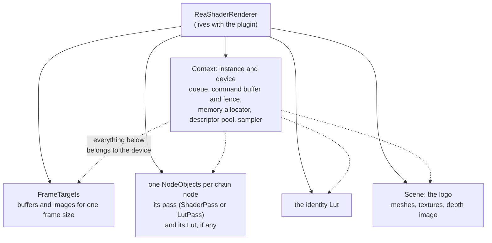

*What to see:* solid arrows are ownership in C++; dotted arrows are Vulkan's rule that an object can't outlive its device. That's why switching GPUs destroys all of it, and why the renderer also keeps the chain's compiled content (not only the GPU objects), so it can rebuild everything on the new device.

### 3.2 What happens when

**Objects are built when something first needs them and rebuilt only when what they depend on changes.** Here is an example session: activating the FX, playing, editing the chain, opening the about box, resizing the video, and switching GPUs.

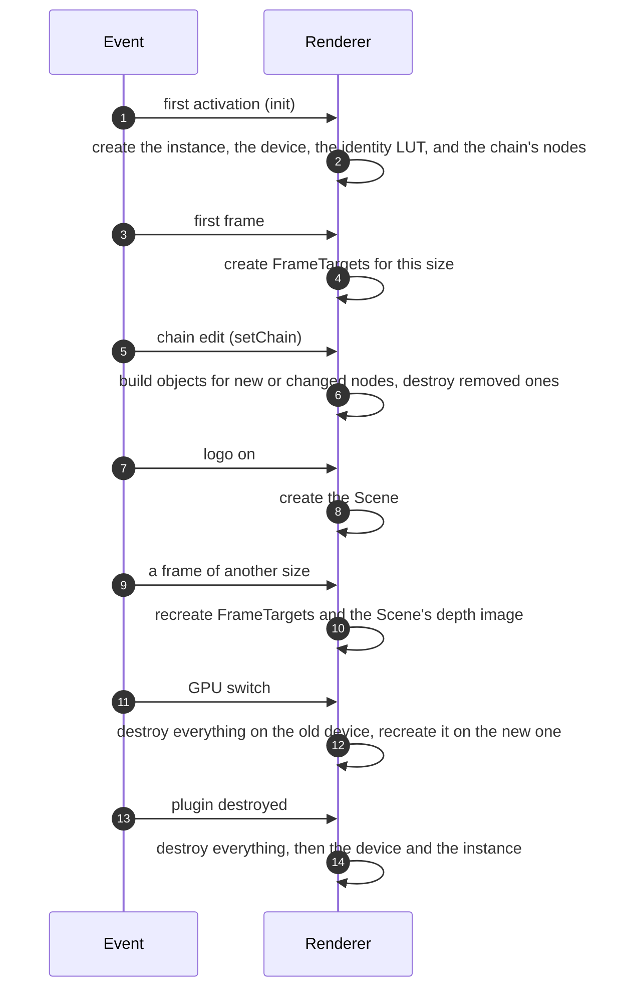

*The steps:*
- **1–2.** The first activation creates the connection to the GPU and everything that lives as long as the device. Later activations reuse it.
- **3–4.** The frame's buffers and images wait for the first frame, because only then is the frame size known.
- **5–6.** A chain edit builds only the nodes that are new or changed; the others keep their objects.
- **7–8.** The logo's scene is created the first time it's needed, and then kept until the device goes.
- **9–10.** A new frame size rebuilds only what depends on it.
- **11–12.** A GPU switch rebuilds everything, from the content the renderer kept.
- **13–14.** Destroying the plugin tears everything down.

| Object | Created | Destroyed |
|---|---|---|
| `Context` instance | `init()` (the plugin's first `activate()`, or after a failure) | `shutdown()` / the renderer's destructor (plugin destroyed), or `init()` starting over |
| `Context` device (+ queue, command buffer, fence, allocator, pool, sampler) | with the instance; `changeRenderingDevice()` | before the instance; `changeRenderingDevice()` |
| a node's pass (`ShaderPass` or `LutPass`) | `setChain()` for a new uid or new content, or with the device | a `setChain()` without that uid, or with new content; with the device |
| a node's `Lut` (a LUT node's table, or a shader node's `iChannel1`) | `setChain()` for a new uid or a new table, or with the device | a `setChain()` without that uid, or with a new table; with the device |
| the identity `Lut` | with the device | with the device |
| `Scene` | the first `setLogoEnabled(true)`, or with the device if the logo is on | with the device (turning the logo off only stops drawing it) |
| `FrameTargets` | the first frame, or a frame whose size or row stride changed | the next size/stride change; with the device |
| `FrameTargets`' work images | the first chain of two or more passes (the second work image: three or more) | with the targets |
| `Scene`'s depth image | `Scene::prepare()` when the frame size changes | the next size change; with the scene |

- **A node's objects are kept while its content is the same.** `setChain` keeps the pass of a node whose uid is in the current chain with the same `shader` pointer (or, for a LUT node, that is still a LUT node), and its `Lut` when the table pointer is the same. So adding, removing, moving or bypassing a node rebuilds nothing else. It builds everything new first, and only then takes the kept objects and destroys the old chain's leftovers, so an error leaves the current chain untouched.
- **A device change destroys in dependency order** (`_destroyDevice`): the scene, the nodes' objects, the identity, the targets, then the device.
- **And recreates in the opposite order** (`_createDevice`): the device, the identity, every node's objects (from the kept chain) and the scene (if the logo is on). The targets come back with the next frame.
- **The renderer keeps the chain itself** (`ChainNode`s holding `shared_ptr`s to the `CompiledShader`s and `LutData`s), not only its GPU objects. That's why a device change can rebuild the passes and re-upload the LUTs without recompiling or re-reading anything, and why `setChain` works with no device (the next `init()` installs the chain).

### 3.3 The files

| File | What it is |
|---|---|
| `renderer.h/.cpp` | **`ReaShaderRenderer`**: the only class the plugin talks to. Owns everything below, holds `frameMutex`, builds the chain's objects (`setChain`, `NodeObjects`), records a frame, never throws. |
| `context.h/.cpp` | **`gpu::Context`**: instance, GPU list, device, queue, the one command buffer + fence, VMA allocator, descriptor pool, sampler. |
| `frame_targets.h/.cpp` | **`gpu::FrameTargets`**: the frame's upload/readback buffers and input/output/work images, the commands that move pixels between them, and `recordPasses`, which chains the passes. |
| `pass.h/.cpp` | **`gpu::Pass`**: the interface of a fullscreen pass (`bindInput`, `record`), plus what passes share: `fullscreen.vert`, `beginFullscreenRendering`, `writeImageDescriptor`. |
| `shader_pass.h/.cpp` | **`gpu::ShaderPass`**: one user shader as a fullscreen pipeline, its descriptor set and params buffer. |
| `lut.h/.cpp` | **`gpu::Lut`**: a LUT as a 3D image, uploaded once. **`gpu::LutPass`**: the frame through a LUT (`lut.frag`), blended by its Mix. |
| `lut_file.h/.cpp` | **`gpu::parseCube`**: `.cube` files to a `LutData` table (1D LUTs and `DOMAIN`s baked into a 0..1 cube), and the stored JSON form. No Vulkan objects. |
| `shader_compiler.h/.cpp` | **`gpu::compileShader`**: the shader contract (preamble), GLSL → SPIR-V, reflection of `Params`, `//@param` annotations, and the stored JSON form. No Vulkan objects. |
| `scene.h/.cpp` | **`gpu::Scene`**: textured meshes drawn over the frame with a depth buffer (today: the logo). Also `Mesh` (.obj via tinyobjloader) and `Texture` (png/jpg via stb_image). |
| `gpu.h/.cpp` | Shared helpers: `VK_CHECK`, `Buffer`, `Image`, `createPipeline`, `transition`, `kFrameFormat`. The VMA implementation. |
| `frame_view.h` | **`FrameView`**: a CPU frame (width, height, `rowBytes`, BGRA pixels). The boundary between REAPER and the renderer. |

## 4. A frame, step by step

**Each frame, the renderer turns the chain into a list of passes, links them through two work images, and records the whole frame with a barrier before every change of use.**

### 4.1 From the chain to the passes

**The passes are the chain's nodes that aren't bypassed, in order: the first reads the input, the last writes the output, and the ones between hand the picture over through two work images, in turn.**

Here is an example: a chain of four nodes, A (a shader), B (a LUT, bypassed), C (a shader) and D (a LUT).

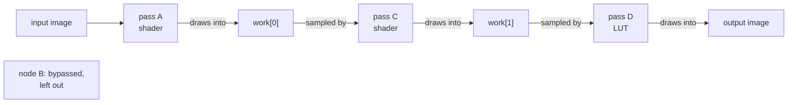

*What to see:* B doesn't appear in the frame at all. Three passes need two images between them; with more passes, the frame alternates between `work[0]` and `work[1]` (a *ping-pong*). Two images are enough because each pass only needs the previous pass's result.

- **The chain is a list of nodes** (`ReaShaderRenderer::ChainNode`), set with `setChain`. A shader node becomes a `ShaderPass`, with its own `Lut` as `iChannel1` (`shaderLut`) or the identity; a LUT node becomes a `LutPass` with its table.
- **With no passes** (every node bypassed, or none) and the logo on, the input is copied to the output; with no passes and no logo, the frame passes through.
- **Each node's params** are found by position in `FrameInputs::paramValues`, the plugin's values by param id: `firstParam` (the node's first slot) and `paramCount`. A shader node's values go to its `Params` block in order; a LUT node's one value is its Mix. A node whose values fall past `FrameInputs::paramCount` gets its defaults: the shader's own, and 1 for a Mix.
- **The plugin's chain maps one to one:** `rendererChain` in `plugin.cpp` turns each of its nodes into a `ChainNode` (see [architecture.md](architecture.md#4-the-chain-and-its-parameters)).
- **Each pass's input is bound right before it's recorded,** so a pass object can appear at most once in a chain: it has one descriptor set, which holds one input.

*In the code:* `FrameTargets::recordPasses` records the passes in order.

### 4.2 What one pass does

**A pass draws one triangle that covers the whole frame, so its fragment shader runs once per pixel of the target.**

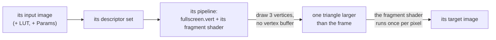

*What to see:* a pass has no geometry of its own. `fullscreen.vert` makes the three corners of a triangle from the vertex number alone, big enough to cover the frame, and the part outside the frame is clipped away. One triangle, rather than two forming a rectangle, avoids extra work along a shared diagonal: GPUs shade pixels in 2×2 blocks, and blocks straddling the diagonal would be shaded once for each triangle.

- **A pass begins rendering into its target** (`beginFullscreenRendering`) with `loadOp = DONT_CARE`, because it overwrites every pixel. That leaves the target in `COLOR_ATTACHMENT_OPTIMAL`.
- **The user's shader sees the frame through `uv`,** 0..1 across the frame with (0, 0) at the top left, which `fullscreen.vert` computes from the triangle's corners.

### 4.3 The commands of one frame

**A frame is four CPU steps, one recorded list of GPU commands with nine barriers, and one CPU step after the GPU finishes.** Here is an example: a chain of a shader node, then a LUT node, with the logo on. "B*n*" is a barrier.

**CPU, before recording:**

1. If needed, recreate `FrameTargets`. `scene->prepare()` makes the depth image the right size.
2. `FrameTargets::writeInput`: copy REAPER's pixels into the mapped upload buffer (`memcpy`), then `flush`.
3. `ShaderPass::writeParams`: write each slider's value at its byte offset in the mapped params buffer (the offset comes from reflection, section 5), then `flush`. Sliders without a value get their default.
4. Bind the LUTs: the shader's `iChannel1` (its node's LUT, otherwise the identity) and the LUT pass's table. Set the LUT pass's amount (its node's Mix).

**GPU commands** (`Context::beginCommands` → ... → `submitAndWait`):

| # | Where | Image / buffer | Layout | Waits for (src) | Before (dst) | Why |
|---|---|---|---|---|---|---|
| B1 | `recordUpload` | input | `UNDEFINED` → `TRANSFER_DST` | nothing | copy writes | the copy fully overwrites it, so the old contents can be thrown away |
| | | _copy upload buffer → input_ | | | | |
| B2 | `recordUpload` | input | `TRANSFER_DST` → `SHADER_READ_ONLY` | copy writes | fragment shader reads | the first pass must see the finished copy |
| B3 | `beginFullscreenRendering` (shader pass) | work[0] | `UNDEFINED` → `COLOR_ATTACHMENT` | fragment shader (execution only) | color attachment writes | the pass writes every pixel (`loadOp = DONT_CARE`). A work image may have been sampled by an earlier pass of the chain, and those reads must finish before it's overwritten |
| | | _draw: 3 vertices, the user's fragment shader, sampling input_ | | | | |
| B4 | `recordPasses` | work[0] | `COLOR_ATTACHMENT` → `SHADER_READ_ONLY` | color attachment writes | fragment shader reads | the next pass samples what this one drew |
| B5 | `beginFullscreenRendering` (LUT pass) | output | `UNDEFINED` → `COLOR_ATTACHMENT` | fragment shader (execution only) | color attachment writes | as B3 |
| | | _draw: 3 vertices, `lut.frag`, sampling work[0] and the LUT_ | | | | |
| B6 | `Scene::record` | output | `COLOR_ATTACHMENT` → same | color attachment writes | color attachment reads + writes | the logo is drawn over the last pass's result (`loadOp = LOAD`), so that must be finished first. No layout change, just a memory dependency |
| B7 | `Scene::record` | depth | `UNDEFINED` → `DEPTH_ATTACHMENT` | nothing | depth writes (early fragment tests) | cleared every frame (`loadOp = CLEAR`, `storeOp = DONT_CARE`) |
| | | _draw each object: indexed triangles, depth tested_ | | | | |
| B8 | `recordDownload` | output | `COLOR_ATTACHMENT` → `TRANSFER_SRC` | color attachment writes | copy reads | the copy must read the final pixels |
| | | _copy output → readback buffer_ | | | | |
| B9 | `recordDownload` | readback (buffer) | — | copy writes | host reads | makes the GPU's write visible to the CPU after the fence |

With more passes, B3 and B4 repeat for every pass but the last, which draws into `output` (B5).

**CPU, after the fence:**

5. `FrameTargets::readOutput`: `invalidate`, then copy the readback buffer into REAPER's new frame (`memcpy`).

### 4.4 The life of each image within a frame

**Every image starts the frame in `UNDEFINED` and moves through the layouts its uses need; the output always reaches `COLOR_ATTACHMENT` before the logo and the copy out.**

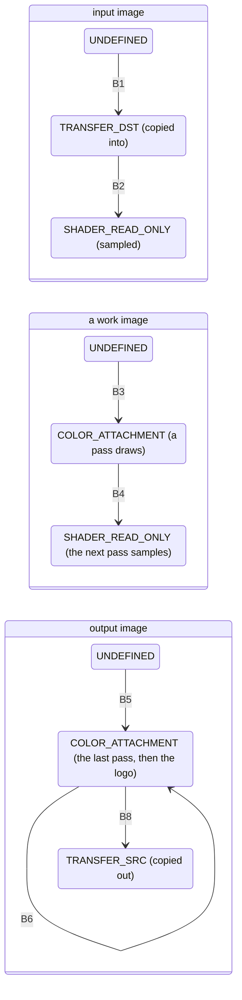

*What to see:* each arrow is one barrier from the table above. No image keeps its layout from the previous frame: each frame starts over from `UNDEFINED`, which is cheap and needs no barrier between frames.

- **The invariant:** after the passes, `output` is always in `COLOR_ATTACHMENT_OPTIMAL`, whether the last pass or `_recordInputToOutput` wrote it. `Scene::record` and `recordDownload` rely on it.
- **Without passes** (the logo alone), `recordPasses` calls `_recordInputToOutput` in place of B3–B5 and the draws:
  - input `SHADER_READ_ONLY` → `TRANSFER_SRC`;
  - output `UNDEFINED` → `TRANSFER_DST`;
  - copy input → output;
  - output `TRANSFER_DST` → `COLOR_ATTACHMENT`, before the scene's color reads and writes.
- **Row padding:** REAPER's rows may be longer than `width × 4` bytes (`rowBytes`, REAPER's "rowspan"). The GPU copies handle it with `bufferRowLength`, which counts the row length in *pixels*, so `rowBytes` must be a multiple of 4, or `FrameTargets::create` throws. The CPU copies move `rowBytes × (height − 1) + width × 4` bytes, because the last row may end right after its pixels.
- **Across frames:** there are no barriers between frames. The fence wait guarantees the previous frame's GPU work is complete, and every image of the frame starts from `UNDEFINED`.

## 5. How the shader contract is built

**A user's shader is compiled with a preamble in front of it, then inspected to find its sliders; the result is stored, so it never needs compiling again.** The user-facing side, what a shader can use and the `//@param` syntax with examples, is in [`src/shaders/examples/README.md`](../src/shaders/examples/README.md). This section covers how it's implemented.

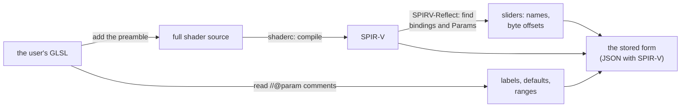

*What to see:* the sliders come from two places: their names and positions from the compiled code, and their labels, defaults and ranges from comments in the source.

### 5.1 The preamble

**The preamble declares everything a user shader may use, so the user writes only `main()`.** `withPreamble()` puts it in front of every user shader:

```
#version 450
<the user's #extension lines, moved here: they must come before any declaration>
<preamble: in vec2 uv, out vec4 fragColor, sampler2D iChannel0 at binding 0,
           sampler3D iChannel1 at binding 2,
           push constants ReaShaderInputs { iResolution, iTime, iFrameRate, iFrame },
           vec3 iLut(vec3 color)>
#line 1
<the user's source, with #version and #extension lines blanked, so line numbers are unchanged>
```

- **`#line 1`** makes the compiler's error messages use the user's own line numbers.
- **`uv` comes from `fullscreen.vert`** (section 4.2). It's 0..1 across the frame, with (0, 0) at the top left, because Vulkan's clip space has y pointing down.
- **`iLut`** samples `iChannel1` at the texel centers, `(c × (size − 1) + 0.5) / size`, so 0 and 1 land on the LUT's first and last entries rather than on the texture's edges. `lut.frag` does the same.
- **Push constants ↔ `ShaderInputs`:** the preamble's `ReaShaderInputs` block and the C++ struct `gpu::ShaderInputs` (`shader_compiler.h`) must describe the same bytes (std430 layout: `vec2` at 0, `float` at 8 and 12, `int` at 16 = 20 bytes). `renderFrame` fills it, except `iFrame`: each `ShaderPass` counts the frames it recorded since it was created, so a node kept by `setChain` keeps counting, and a bypassed one pauses.

*In the code:* `kShaderPreamble` and `withPreamble()` in `shader_compiler.cpp`.

### 5.2 Compiling and inspecting

**shaderc compiles the shader with bindings assigned automatically, and reflection rejects anything outside the contract.**

**Compiling** (`compileGlsl`): shaderc targets Vulkan 1.3, with automatic bindings.

- **Uniform blocks** have their binding shifted to start at 1 (`kParamsBinding`), so a plain `uniform Params { ... };` lands on binding 1.
- **Samplers** are shifted to 3 and up, so reflection rejects them.
- User shaders should leave `layout(set, binding)` out: the shift applies to explicit bindings too.

**Reflection** (`reflect`) walks the descriptor bindings SPIRV-Reflect finds in the SPIR-V:

- anything outside descriptor set 0 is an error ("only descriptor set 0 is available"): our pipeline layout has one set, and a shader using another would make pipeline creation invalid;
- `iChannel0` at binding 0 and `iChannel1` at binding 2 are skipped (checked by name too: a user declaration at those bindings would alias them);
- binding 1 must be a uniform buffer: that's the `Params` block;
- anything else is an error ("only iChannel0, iChannel1 and one uniform block (Params) are available").

Errors name the resource, or the block's type name (`Params`) when it has no instance name.

**Each `Params` member** must be `float`/`vec2`/`vec3`/`vec4`. Each component becomes one `ShaderParamField`:

- `name` is `member` or `member.x`;
- `offset` is its byte offset in the block, from reflection, so the C++ side never needs to know GLSL's layout rules;
- label, default and range come from `//@param member 'Label' default min max` (`parseAnnotations`), and are otherwise the member's name, 0.5, 0..1.

**The params buffer:** `ShaderPass` always creates it (at least 16 bytes) and binds it at binding 1, even when the shader has no `Params`. The descriptor set layout declares the binding, so it must be valid.

### 5.3 The stored form

**The compiled shader is stored as JSON: its slider fields and its SPIR-V** (`toJson`/`fromJson`): `{ version: 1, paramsSize, params: [{ name, label, defaultValue, minValue, maxValue, offset }], spirv: [words] }`.

- **Where it lives:** in `resources/shaders/compiled/<name>.json`, and embedded in the plugin's state, so projects never recompile.
- **Versioning:** `fromJson` rejects any other `version`. Bump `kStoredVersion` whenever old SPIR-V or JSON would be wrong for the current code (e.g. the preamble's bindings or push constants change). Adding `iChannel1` didn't need it: older SPIR-V just doesn't use binding 2, which the pipeline layout provides anyway.

## 6. Staying safe: threads, errors, failure

**Four threads call the renderer and one lock guards it, which the video thread only ever tries to take; errors never leave the renderer, and a failure turns rendering off rather than crashing REAPER.**

| Thread | Calls |
|---|---|
| REAPER's video thread | `renderFrame` |
| main | `init()` (from `activate()`), `shutdown()` (via the destructor) |
| webview (UI messages) | `setChain` (chain edits and uploads), `changeRenderingDevice`, `setLogoEnabled` |
| main (state load) | the same setters, when a project is loaded |

The full thread list is in `src/plugin/plugin.h`.

### 6.1 One lock, which the video thread never waits for

**Every public function takes `frameMutex`, because they all touch the same GPU objects and the one command buffer; `renderFrame` only tries to take it.**

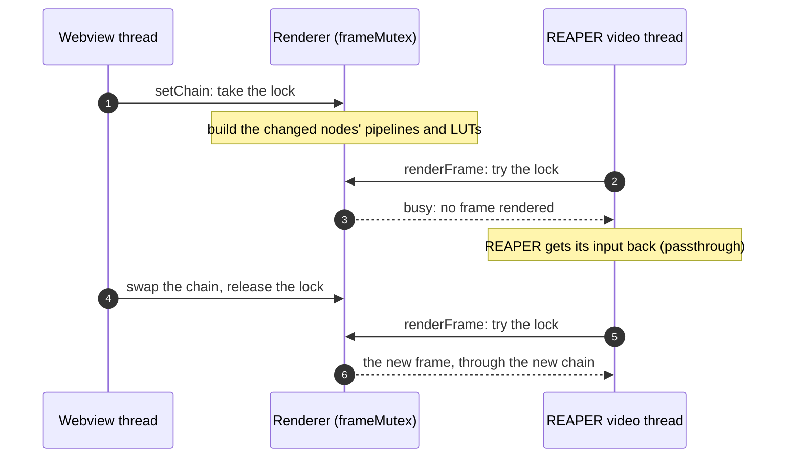

*The steps:*
- **1.** A chain edit from the web UI takes the lock to install the new chain.
- **2–3.** A frame arrives meanwhile. The video thread tries the lock, finds it busy, and doesn't wait.
- **4.** That one frame passes through unchanged, so REAPER's playback never stalls.
- **5–6.** The edit finishes and releases the lock; the next frame takes it and renders with the new chain.

- **What can hold the lock:** a device switch, a chain install, `init()` creating the instance.
- **Compiling and parsing happen outside the lock:** they run on the upload path, before `setChain`. Under the lock there's only pipeline creation and LUT uploads, for the nodes that changed, which are short.
- **Swapping the chain needs no waiting for the GPU:** frames render one at a time and each waits on its fence. So whenever `setChain` holds the lock, the GPU isn't using the old passes or LUTs, and they can be destroyed at once. The same holds for descriptor sets, which is why passes can rebind their inputs every frame.

### 6.2 Nothing throws out

**Vulkan errors throw inside the render code, and every public function of `ReaShaderRenderer` catches them.**

- **How errors are raised:** `VK_CHECK`, and `unwrap` for vk-bootstrap's results, throw `std::runtime_error`.
- **Why it matters:** an exception escaping into REAPER or the CLAP host is fatal to REAPER.
- **Where errors go:** they're logged (with a message box for the user where it matters), or returned as a string (`setChain`: the UI shows the error, and the previous chain stays).

### 6.3 A failed renderer passes video through

**A Vulkan error in `init()`, `changeRenderingDevice()` or `renderFrame()` sets `failed`, and from then on every frame passes through.**

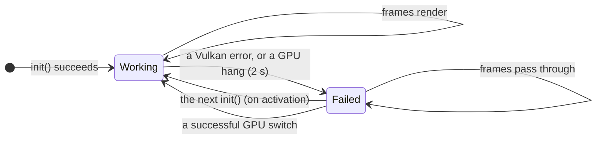

*What to see:* a failure never stops video, and it's never permanent: reactivating the FX, or picking a GPU, starts over.

- **`init()` starts over** from scratch: it tears everything down and rebuilds it. The plugin calls it on every `activate()`; while the renderer works, it does nothing after the first time.
- **The GPU stays up across deactivation.** The plugin's `deactivate()` removes REAPER's video processor, so frames stop arriving, but it doesn't shut the renderer down. CLAP hosts may deactivate and reactivate a plugin at any time (REAPER does it when an FX is toggled offline, for example), and recreating the Vulkan instance and device each time would take noticeable time.

## 7. Working on the renderer

**Before changing the renderer, know why it's built this way; then extend it through the existing seams, and debug it with validation and the render tests.**

### 7.1 Decisions and why

- **Vulkan 1.3, dynamic rendering and synchronization2.** These remove render pass and framebuffer objects and make barriers readable, which means far less code for a renderer that draws into a few images. Any GPU with current drivers has 1.3. GPUs without it aren't listed.
- **One submit and one fence wait per frame, no frames in flight.** REAPER's callback is synchronous and wants the result before returning, so there's no next frame to overlap with (section 1.2). This also gives us one command buffer, no per-frame copies of resources, and no synchronization between frames.
- **One device and one queue per FX.** Each ReaShader FX opens its own session on its own GPU (section 2.1), so instances never interfere. A frame is one batch, so a second queue would have nothing to run in parallel.
- **Host-visible buffers for frame I/O, device-local images for the work.** The CPU writes into the upload buffer, the GPU copies it into an optimally tiled image (sampling and drawing need images), and the reverse on the way out. Separate host-access flags keep the readback buffer in CPU-cached memory, since reading write-combined memory is very slow.
- **`B8G8R8A8_UNORM` everywhere (`kFrameFormat`).** REAPER's `'RGBA'` frames are B, G, R, A in memory, the same byte order as this format. Copies are byte-for-byte, and the format itself maps channels, so the shader's `.r` is red. There's no blit, swizzle or conversion pass. `UNORM` (not sRGB) means values pass through untouched.
- **Compile only on upload.** Compiling GLSL is slow, and shaderc is big. Doing it once, and storing SPIR-V plus the reflected params, means loading a project or selecting a shader never compiles, and projects are self-contained.
- **One sampler, one descriptor pool, one command buffer per device.** Nothing needs more. The pool's 64 sets cover two full chains of 16 nodes (the old chain is still there while `setChain` builds the new one) plus the scene's objects.
- **Viewport and scissor are dynamic.** Pipelines don't depend on the frame size, so a size change recreates only `FrameTargets` (and the scene's depth image), never pipelines.
- **The logo texture is sRGB, drawn onto a UNORM target.** Sampling an `R8G8B8A8_SRGB` texture converts it to linear values, and writing to a UNORM target stores them without converting back, so the logo comes out darker than the PNG. `scene.frag` adds 0.2. This is the logo's established look, and it's kept on purpose.
- **A chain of passes, not a fixed shader-then-LUT sequence.** Each pass samples one image and draws into another, and `recordPasses` links them through two ping-pong images. A node's position is just an order in a list, and any number of shaders and LUTs need no new recording code.
- **Nodes are identified by uid, content by pointer.** The chain's content is immutable and shared (`shared_ptr<const ...>`), so "the same content" is a pointer comparison, with no hashing or deep comparison, and the renderer keeps no copies.
- **Inputs are rebound every frame.** A pass's input depends on its place in the chain, which changes when nodes are added, moved or bypassed. Rewriting one descriptor per pass per frame is cheap, and legal because the previous frame has finished (the fence).
- **`SHADER_READ`, not `SHADER_SAMPLED_READ`, before sampling.** Synchronization2's narrower `SHADER_SAMPLED_READ` is the textbook access for sampling, but Intel's Windows driver (UHD 620) doesn't invalidate its texture cache for it: in a four-pass chain, the last pass sampled `work[0]` as the first pass left it, not as the third pass rewrote it. `SHADER_READ` includes sampled reads, and every barrier before sampling uses it. The render test "four passes ping-pong through the work images" catches it.
- **The LUT is a 3D texture, filtered by the hardware.** Trilinear interpolation between entries is what `.cube` LUTs expect, and the sampler does it for free. The format is RGBA16F: every GPU filters it (3-channel formats aren't guaranteed), and half floats are plenty for an 8-bit frame.
- **LUTs are normalized when read.** A 1D LUT becomes a 33³ cube, and a `DOMAIN` other than 0..1 is resampled onto 0..1 (`lut_file.cpp`), so the GPU side knows one kind of LUT and `lut.frag` / `iLut` need no domain uniforms.
- **The shader always has an `iChannel1`.** When its node has no LUT, a 17³ identity is bound, so the descriptor is always valid and a shader calling `iLut` gets its input back. 17 points, not 2: some GPUs interpolate with 8-bit weights, which on a 2-point identity can be off by one 8-bit step.
- **Plain `create()`/`destroy()` structs, no deletion queues.** There are few objects with clear owners ([section 3](#3-the-objects-and-how-long-they-live)), so an explicit list of handles per struct is easier to follow than a generic mechanism.

### 7.2 Extending

**Add a kind of pass:**

- **Implement `gpu::Pass`:** `bindInput` writes the input's descriptor (with `writeImageDescriptor`), and `record` starts with `beginFullscreenRendering(commandBuffer, target)`, draws, and ends rendering. That leaves the target in `COLOR_ATTACHMENT_OPTIMAL`, as the invariant needs.
- **One descriptor set per pass object:** a pass object can appear only once in a chain. That's why every node has its own objects, and the same shader in two nodes builds two passes.
- **A new kind of node:** give `ChainNode` its content, and `NodeObjects` (`renderer.cpp`) its objects: what to build in `create`, what `reuse` can keep, and the per-frame setup in `renderFrame`.
- **Tests:** `test::render` takes the same list (`RenderInputs::passes`), so a render test runs the real chaining code.

**Add a scene object or texture:**

- In `Scene::create`, load a `Mesh` (`.obj`) and a `Texture` (any format stb_image reads), and add an `Object { mesh, createTextureSet(context, texture), localTransform }`.
- Free them in `Scene::destroy`: the texture set is freed per object, but meshes and textures are members, so add them there.
- Each object uses one descriptor set from the shared pool (64 sets in total, shared with the passes).
- Assets live in `res/`. The build copies them to `resources/` next to the plugin on every build.

**Add a built-in shader input** (like `iTime`):

1. Add the field to `ReaShaderInputs` in `kShaderPreamble` **and** to `gpu::ShaderInputs`. Match std430 alignment: `float`/`int` 4 bytes, `vec2` 8, `vec3`/`vec4` 16. Push constants are guaranteed only up to 128 bytes.
2. Fill it in `ReaShaderRenderer::renderFrame`.
3. Document it for users in `src/shaders/examples/README.md`.
4. **Mind stored shaders,** which carry SPIR-V compiled against the old preamble, both in `resources/shaders/compiled/` and inside saved projects:
   - appending a field keeps them working, since they just don't read it;
   - reordering or changing fields breaks them, so bump `kStoredVersion` in that case.

### 7.3 Debugging

- **The validation layer (debug builds).** `Context::createInstance` requests the Khronos validation layer with **synchronization validation** on. Sync validation checks every barrier against what the commands actually access, and reports hazards (e.g. "WRITE_AFTER_WRITE hazard detected") that core validation doesn't catch.
  - Warnings and errors go to `rs.log` (next to the plugin, or next to the test binary) as `Vulkan / Validation`.
  - Normal use produces none, so **any message is a bug**. The test application fails the GPU test that caused one.
  - The layer comes with the Vulkan SDK. `VK_LOADER_DEBUG=layer` shows whether the loader found it.
  - Release builds have no validation.
- **The test application** ([testing.md](testing.md)): the `render` suite compiles the render code without the plugin and runs it on every GPU of the machine, checking exact output pixels for an example shader, params and channel order, param defaults, the logo scene, the LUT pass, a LUT before or after a shader, `iLut`, a four-pass chain, and consecutive frames. The `renderer` suite runs `ReaShaderRenderer` itself, the `shader_compiler` suite covers the contract (reflection, `//@param`, errors, the stored form), and the `lut` suite the `.cube` parser. Run it with the VS Code `test` task, or `build/tests-debug/reashader_tests --test-suite=render`.
- **A GPU hang** shows up as "Rendering failed" (the 2-second fence timeout) and passthrough until re-activation. Recurring `nvlddmkm` events in the Windows System log mean the Vulkan code did something invalid.
- **Crashes and hangs in REAPER** (dumps, lldb, symbolizing): see [gotchas.md](gotchas.md#2-debugging-crashes-and-hangs).
