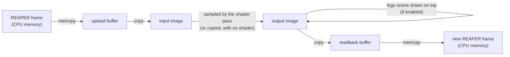

# How ReaShader renders

This is a guide to `src/render/`. It explains the Vulkan concepts the renderer uses, maps each one to our code, and gives the reasons behind the design, so you can change the renderer without reverse-engineering it first.

It assumes you know C++ and what a shader is, but not Vulkan. Each Vulkan term is explained where it first appears (in **bold**), then used freely.

Contents:

1. [The big picture](#1-the-big-picture)
2. [Vulkan in ten concepts](#2-vulkan-in-ten-concepts)
3. [File by file](#3-file-by-file)
4. [A frame, step by step](#4-a-frame-step-by-step)
5. [The shader contract](#5-the-shader-contract)
6. [Threads and safety](#6-threads-and-safety)
7. [Decisions and why](#7-decisions-and-why)
8. [How to extend](#8-how-to-extend)
9. [Debugging](#9-debugging)

---

## 1. The big picture

REAPER calls the plugin once per video frame, on its video thread, and waits for the result (`ReaShaderPlugin::_processVideoFrame` in `src/plugin/plugin.cpp`). The plugin hands the frame to `ReaShaderRenderer::renderFrame`, which sends it through the GPU and back:



- **One command buffer, one submit, one wait per frame.** Everything between the two `memcpy`s is recorded into a single list of GPU commands. It is sent to the GPU once, and the CPU waits for it to finish.
- **Why wait?** REAPER's callback is synchronous: it wants the finished frame as the return value. There is nothing useful to overlap, so the simplest correct scheme is also the right one (see [Decisions](#7-decisions-and-why)).
- **When nothing is rendered:** `renderFrame` returns `false` if the renderer is busy (another thread holds it), has failed, or has no shader and no logo. The plugin then returns REAPER's input frame unchanged: **passthrough**.

---

## 2. Vulkan in ten concepts

Vulkan is explicit: nothing happens unless you ask for it, including memory allocation, the order of GPU operations, and telling the GPU how an image will be used next. That's why even a simple renderer needs a lot of code. These ten concepts cover everything `src/render/` does.

### 2.1 Instance and physical devices

- The **instance** is the connection between our code and the Vulkan library (`vulkan-1.dll`). Validation layers are enabled on it.
- A **physical device** is a GPU as the system reports it: its name, its features, the Vulkan version it supports.

**In our code:** `Context::createInstance` (`context.cpp`) uses [vk-bootstrap](https://github.com/charles-lunarg/vk-bootstrap) to create the instance and list the usable GPUs:
- "usable" means Vulkan 1.3 with the `dynamicRendering` and `synchronization2` features (both explained below);
- the instance is *headless*: we never show anything in a window, so there's no surface or swapchain.

The UI's GPU list is `Context::deviceNames()`, in the same order.

### 2.2 Logical device and queue

- The **device** (logical device) is our open session with one physical device. Almost every other Vulkan object belongs to a device and dies with it.
- A **queue** is where work is sent to the GPU. Queues come in families by capability (graphics, compute, transfer). We use one graphics queue, which can also copy.

**In our code:** `Context::createDevice(index)` creates the device on the chosen GPU and gets its graphics queue. It also creates everything that lives exactly as long as the device (see [lifetimes](#lifetimes)).

### 2.3 Command buffers

The GPU doesn't execute calls one at a time. You **record** commands (copies, barriers, draws) into a **command buffer**, then **submit** the whole buffer to a queue. `vkCmd...` functions only record, and nothing runs until the submit.

- A **command pool** allocates command buffers.
- `ONE_TIME_SUBMIT` tells the driver a recording is used once and then re-recorded.

**In our code:** the device has exactly one command buffer. `Context::beginCommands()` resets it and starts recording. Each piece of the frame appends its commands (`recordUpload`, `ShaderPass::record`, ...). `Context::submitAndWait()` ends the recording and submits it. Loading the logo's texture reuses the same pair for its one-time upload.

### 2.4 Fences: the CPU waits for the GPU

A **fence** is a flag the GPU sets when a submitted batch has finished. The CPU can wait on it.

**In our code:** `submitAndWait()` resets the fence, submits (`vkQueueSubmit2`), then waits on the fence for up to **2 seconds** (`kFrameTimeoutNs`).
- **A timeout counts as a GPU hang:** the wait returns `VK_TIMEOUT`, `VK_CHECK` throws, and the renderer goes to `failed` (see [Threads and safety](#6-threads-and-safety)).
- **What it guarantees:** after the wait, the GPU has finished with every buffer and image of that frame. That's why the next frame can safely overwrite them, and why nothing needs to be synchronized *between* frames.

### 2.5 Memory and VMA

In Vulkan you allocate GPU memory yourself, then bind buffers and images to it. Memory comes in types with different properties:
- **device-local:** fast for the GPU, usually not reachable by the CPU;
- **host-visible:** the CPU can **map** it (get a pointer) and read or write it directly;
- **host-coherent or not:** on non-coherent memory, CPU writes must be **flushed** before the GPU sees them, and GPU writes must be **invalidated** before the CPU sees them.

[VMA](https://github.com/GPUOpen-LibrariesAndSDKs/VulkanMemoryAllocator) (Vulkan Memory Allocator) picks memory types and suballocates them for us. It is compiled in `gpu.cpp` (`VMA_IMPLEMENTATION`).

**In our code:**
- **`gpu::Buffer`** (`gpu.h`) is always host-visible and stays mapped for its whole life (`mapped`). Its `hostAccess` flag tells VMA how the CPU uses it:
  - `HOST_ACCESS_SEQUENTIAL_WRITE`: the CPU only writes, front to back. VMA may pick write-combined memory, which is fast to write and very slow to read. Used by the upload buffer, the shader's params, and mesh data.
  - `HOST_ACCESS_RANDOM`: the CPU reads it back. VMA picks cached memory. Used by the readback buffer.
- **`flush()`** after CPU writes and **`invalidate()`** before CPU reads. Both are no-ops on coherent memory, so we always call them.
- **`gpu::Image`** asks VMA for device-local memory (`AUTO_PREFER_DEVICE`).

### 2.6 Buffers, images and image views

- A **buffer** is plain bytes. The GPU can copy from and to it, or read it as vertices, indices or uniforms.
- An **image** is pixels with a **format** (e.g. `B8G8R8A8_UNORM`: 4 bytes per pixel, blue first, each channel 0..1). Its memory layout is up to the driver (**optimal tiling**), which is what makes sampling and rendering fast. The CPU can't read it directly, so pixels go in and out through buffers (`vkCmdCopyBufferToImage`, `vkCmdCopyImageToBuffer`).
- An image declares up front what it will be used for (**usage flags**: transfer source or destination, sampled, color attachment, depth attachment).
- Shaders and rendering don't use an image directly but an **image view**: which part of it, and read as what.

**In our code:**
- `gpu::Image` is a 2D image plus its view. Every image we make has one mip level and one layer.
- `FrameTargets` (`frame_targets.*`) owns the frame's buffers and images:

| Object | Kind | Usage | Role |
|---|---|---|---|
| `upload` | buffer, host write | transfer source | REAPER's pixels are copied in here |
| `input` | image, `B8G8R8A8_UNORM` | transfer destination and source, sampled | the frame as the shader's `iChannel0` |
| `output` | image, `B8G8R8A8_UNORM` | color attachment, transfer source and destination | what the shader (and the logo) renders into |
| `readback` | buffer, host read | transfer destination | the result, copied back for REAPER |

### 2.7 Image layouts and barriers

This is the concept most bugs come from.

**Layouts.** An image is always in a **layout** that suits one kind of use:
- `TRANSFER_DST_OPTIMAL` to be copied into;
- `SHADER_READ_ONLY_OPTIMAL` to be sampled;
- `COLOR_ATTACHMENT_OPTIMAL` to be rendered to;
- `TRANSFER_SRC_OPTIMAL` to be copied from.

You change layouts explicitly. `UNDEFINED` as the old layout means "I don't care about the current contents": the driver may discard them, which is cheap.

**Barriers.** The GPU runs commands in parallel and out of order, unless told otherwise. A **pipeline barrier** tells it: "work of *these* stages, with *these* memory accesses, must finish and be visible before work of *those* stages with *those* accesses starts". An **image barrier** can also change the image's layout on the way.

A barrier has two halves:
- **source** (`srcStage` + `srcAccess`): what must be finished, e.g. `COPY` stage + `TRANSFER_WRITE`;
- **destination** (`dstStage` + `dstAccess`): what must wait for it, e.g. `FRAGMENT_SHADER` stage + `SHADER_SAMPLED_READ`.

Stages are steps of the GPU's work: `COPY`, `FRAGMENT_SHADER`, `COLOR_ATTACHMENT_OUTPUT` (writing rendered pixels), `EARLY_FRAGMENT_TESTS` (depth test), `HOST` (the CPU), ... `NONE` as the source means "nothing to wait for".

Two barriers chain only if the first one's destination stages overlap the second one's source stages.

**synchronization2** is the Vulkan 1.3 form of barriers (`VkImageMemoryBarrier2`, `vkCmdPipelineBarrier2`), with each stage and access in the same struct. It's easier to read than the original API.

**In our code:** `gpu::transition()` (`gpu.cpp`) records one image barrier with all of the above as arguments. Every barrier of a frame is listed with its reason in [A frame, step by step](#4-a-frame-step-by-step). `FrameTargets::recordDownload` also records one **buffer** barrier, which makes the GPU's copy visible to the CPU.

### 2.8 Descriptors and push constants: feeding data to shaders

A shader reads two kinds of external data. Vulkan offers several ways to provide them, and we use two.

**Descriptors** are handles to resources (an image plus a sampler, a uniform buffer, ...), organized as follows:
- A **descriptor set layout** declares the slots: "binding 0 is a sampled image, binding 1 is a uniform buffer".
- A **descriptor set** is one filled instance of a layout, allocated from a **descriptor pool** and written with `vkUpdateDescriptorSets`.
- A **sampler** is the "how to read" part of a sampled image: filtering (linear) and what happens outside 0..1 (clamp to edge).
- A **uniform buffer** holds a block of constants the shader reads (`uniform Params { ... }`).

**Push constants** are a few bytes (at least 128 are guaranteed) written straight into the command buffer with `vkCmdPushConstants`. They need no buffer or descriptor, and suit small values that change every draw.

A **pipeline layout** ties them together: which set layouts and which push-constant ranges a pipeline uses.

**In our code:**
- `Context::createDevice` creates one descriptor pool (16 sets, with individually freeable sets) and one sampler (linear, clamp to edge), shared by everything.
- **`ShaderPass`** has one set:
  - binding 0 = `iChannel0` (the input image);
  - binding 1 = the `Params` uniform buffer.

  Its push constants are `ShaderInputs` (resolution, time, frame rate, frame: 20 bytes).
- **`Scene`** has one set per object:
  - binding 0 = the object's texture.

  Its push constant is the object's 4×4 matrix.

### 2.9 Pipelines and dynamic rendering

A **graphics pipeline** is one baked, immutable object that holds everything about how to draw:
- the shaders;
- how vertices are read (**vertex input**);
- primitives (triangle list);
- rasterization (fill, no culling);
- depth testing;
- blending;
- the formats of the images drawn into.

Baking it once lets the driver optimize. The few things we want to change per draw are declared **dynamic state**: we set the viewport and scissor at record time, so one pipeline works for any frame size.

**Rendering.** Drawing happens between `vkCmdBeginRendering` and `vkCmdEndRendering`. **Dynamic rendering** (Vulkan 1.3) names the target images (**attachments**) right there. Older Vulkan needed separate render pass and framebuffer objects, which we don't have. Each attachment says:
- **load op:** what to do with the existing contents first: `LOAD` (keep), `CLEAR`, or `DONT_CARE` (garbage is fine, since we'll overwrite everything);
- **store op:** whether to keep the result: `STORE`, or `DONT_CARE` (e.g. a depth buffer nobody reads afterwards).

**In our code:** `gpu::createPipeline(device, PipelineDesc)` builds every pipeline we have:
- triangle list;
- no culling, no blending;
- dynamic viewport and scissor;
- one color attachment in the frame format;
- a depth test only if `depthFormat` is set.

There are two pipelines, one per `ShaderPass` (the user's shader) and one in `Scene` (the logo).

### 2.10 SPIR-V and shader modules

Vulkan doesn't take GLSL. It takes **SPIR-V**, a binary intermediate language (an array of 32-bit words). A **shader module** wraps SPIR-V for pipeline creation. We destroy modules right after `createPipeline`, since the pipeline keeps what it needs.

**In our code**, GLSL becomes SPIR-V in two places:
- **Built-in (internal) shaders** (`src/shaders/internal/`: `fullscreen.vert`, `scene.vert`, `scene.frag`) are compiled **at build time** by `glslc` into C arrays (`build/<preset>/generated/*.inc`). They are `#include`d into `shader_pass.cpp` and `scene.cpp`, so they are never read from disk.
- **User shaders** are compiled **at runtime, once, when uploaded**, by [shaderc](https://github.com/google/shaderc) (`gpu::compileShader` in `shader_compiler.cpp`). [SPIRV-Reflect](https://github.com/KhronosGroup/SPIRV-Reflect) then reads the result to find the `Params` block. See [The shader contract](#5-the-shader-contract).

---

## 3. File by file

| File | What it is |
|---|---|
| `renderer.h/.cpp` | **`ReaShaderRenderer`**: the only class the plugin talks to. Owns everything below, holds `frameMutex`, records a frame, never throws. |
| `context.h/.cpp` | **`gpu::Context`**: instance, GPU list, device, queue, the one command buffer + fence, VMA allocator, descriptor pool, sampler. |
| `frame_targets.h/.cpp` | **`gpu::FrameTargets`**: the frame's upload/readback buffers and input/output images, with the commands that move pixels between them. |
| `shader_pass.h/.cpp` | **`gpu::ShaderPass`**: one user shader as a fullscreen pipeline, its descriptor set and params buffer. |
| `shader_compiler.h/.cpp` | **`gpu::compileShader`**: the shader contract (preamble), GLSL → SPIR-V, reflection of `Params`, `//@param` annotations, and the stored JSON form. No Vulkan objects. |
| `scene.h/.cpp` | **`gpu::Scene`**: textured meshes drawn over the frame with a depth buffer (today: the logo). Also `Mesh` (.obj via tinyobjloader) and `Texture` (png/jpg via stb_image). |
| `gpu.h/.cpp` | Shared helpers: `VK_CHECK`, `Buffer`, `Image`, `createPipeline`, `transition`, `kFrameFormat`. The VMA implementation. |
| `frame_view.h` | **`FrameView`**: a CPU frame (width, height, `rowBytes`, BGRA pixels). The boundary between REAPER and the renderer. |

### Lifetimes

There are no deletion queues or reference counting. Each object is a plain struct with `create()`/`destroy()` that list its handles, owned by `ReaShaderRenderer` through a `unique_ptr`, and grouped by what it depends on:

| Object | Created | Destroyed |
|---|---|---|
| `Context` instance | `init()` (the plugin's first `activate()`, or after a failure) | `shutdown()` / the renderer's destructor (plugin destroyed), or `init()` starting over |
| `Context` device (+ queue, command buffer, fence, allocator, pool, sampler) | with the instance; `changeRenderingDevice()` | before the instance; `changeRenderingDevice()` |
| `ShaderPass` | `setShader()`, or with the device if a shader is kept | replaced by the next `setShader()`; `clearShader()`; with the device |
| `Scene` | the first `setLogoEnabled(true)`, or with the device if the logo is on | with the device (turning the logo off only stops drawing it) |
| `FrameTargets` | the first frame, or a frame whose size or row stride changed | the next size/stride change; with the device |
| `Scene`'s depth image | `Scene::prepare()` when the frame size changes | the next size change; with the scene |

- **Destroy order on a device change** (`_destroyDevice`): scene, pass, targets, then the device. They all belong to it.
- **Recreate order** (`_createDevice`): the device, then the pass (from the kept `CompiledShader`) and the scene (if the logo is on). The targets come back with the next frame.
- **`CompiledShader` is kept by the renderer**, not only by the pass. That's why a device change can rebuild the pass without recompiling.

---

## 4. A frame, step by step

`ReaShaderRenderer::renderFrame` with a shader loaded and the logo on. The steps are in order; "B*n*" is a barrier.

**CPU, before recording:**
1. If needed, recreate `FrameTargets` (and rebind the pass's `iChannel0` to the new input image). `scene->prepare()` makes the depth image the right size.
2. `FrameTargets::writeInput`: `memcpy` REAPER's pixels into the mapped upload buffer, then `flush`.
3. `ShaderPass::writeParams`: write each slider's value at its reflected byte offset in the mapped params buffer, then `flush`. Sliders without a value (the plugin's params are still pending) get their default.

**GPU commands** (`Context::beginCommands` → ... → `submitAndWait`):

| # | Where | Image / buffer | Layout | Waits for (src) | Before (dst) | Why |
|---|---|---|---|---|---|---|
| B1 | `recordUpload` | input | `UNDEFINED` → `TRANSFER_DST` | nothing | copy writes | the copy fully overwrites it, so the old contents can be discarded |
| | | *copy upload buffer → input* | | | | |
| B2 | `recordUpload` | input | `TRANSFER_DST` → `SHADER_READ_ONLY` | copy writes | fragment shader sampling | the shader must see the finished copy |
| B3 | `ShaderPass::record` | output | `UNDEFINED` → `COLOR_ATTACHMENT` | nothing | color attachment writes | the pass writes every pixel (`loadOp = DONT_CARE`) |
| | | *draw: 3 vertices, the user's fragment shader* | | | | |
| B4 | `Scene::record` | output | `COLOR_ATTACHMENT` → same | color attachment writes | color attachment reads + writes | the logo is drawn over the pass's result (`loadOp = LOAD`), so that must be finished first. No layout change, just a memory dependency |
| B5 | `Scene::record` | depth | `UNDEFINED` → `DEPTH_ATTACHMENT` | nothing | depth writes (early fragment tests) | cleared every frame (`loadOp = CLEAR`, `storeOp = DONT_CARE`) |
| | | *draw each object: indexed triangles, depth tested* | | | | |
| B6 | `recordDownload` | output | `COLOR_ATTACHMENT` → `TRANSFER_SRC` | color attachment writes | copy reads | the copy must read the final pixels |
| | | *copy output → readback buffer* | | | | |
| B7 | `recordDownload` | readback (buffer) | — | copy writes | host reads | makes the GPU's write visible to the CPU after the fence |

**CPU, after the fence:**
4. `FrameTargets::readOutput`: `invalidate`, then `memcpy` the readback buffer into REAPER's new frame.

**Without a shader** (the logo alone), `FrameTargets::recordInputToOutput` replaces B3 and the draw:
- input `SHADER_READ_ONLY` → `TRANSFER_SRC`;
- output `UNDEFINED` → `TRANSFER_DST`;
- copy input → output;
- output `TRANSFER_DST` → `COLOR_ATTACHMENT`, before the scene's color reads and writes.

**The invariant:** after the passes, `output` is always in `COLOR_ATTACHMENT_OPTIMAL`, whether the shader pass or `recordInputToOutput` wrote it. `Scene::record` and `recordDownload` rely on it.

**Row padding:** REAPER's rows may be longer than `width × 4` bytes (`rowBytes`, REAPER's "rowspan"). The copies handle it with `bufferRowLength` (the row length in *pixels*, so `rowBytes` must be a multiple of 4, or `FrameTargets::create` throws). The `memcpy`s copy `rowBytes × (height − 1) + width × 4` bytes, because the last row may end right after its pixels.

**Across frames:** there are no barriers between frames. The fence wait guarantees the previous frame's GPU work is complete, and every image of the frame starts from `UNDEFINED`.

---

## 5. The shader contract

The user-facing documentation, which covers what a shader can use and the `//@param` syntax with examples, is [`src/shaders/examples/README.md`](../src/shaders/examples/README.md). This section covers how the contract is implemented.

**The preamble** (`kShaderPreamble` in `shader_compiler.cpp`) is prepended to every user shader by `withPreamble()`:

```
#version 450
<the user's #extension lines, moved here: they must come before any declaration>
<preamble: in vec2 uv, out vec4 fragColor, sampler2D iChannel0 at binding 0,
           push constants ReaShaderInputs { iResolution, iTime, iFrameRate, iFrame }>
#line 1
<the user's source, with #version and #extension lines blanked, so line numbers are unchanged>
```

`#line 1` makes the compiler's error messages use the user's own line numbers.

**`uv` comes from `fullscreen.vert`.** It draws one triangle bigger than the screen from `gl_VertexIndex` alone, with no vertex buffer. `uv` is 0..1 across the frame, with (0, 0) at the top left, because Vulkan's clip space has y pointing down.

**Push constants ↔ `ShaderInputs`:** the preamble's `ReaShaderInputs` block and the C++ struct `gpu::ShaderInputs` (`shader_compiler.h`) must describe the same bytes (std430 layout: `vec2` at 0, `float` at 8 and 12, `int` at 16 = 20 bytes). `renderFrame` fills it. `iFrame` counts frames since the pass was installed.

**Compiling** (`compileGlsl`): shaderc targets Vulkan 1.3, with automatic bindings.
- **Uniform blocks** have their binding shifted to start at 1 (`kParamsBinding`), so a plain `uniform Params { ... };` lands on binding 1.
- **Samplers** are shifted to 2 and up, so reflection rejects them.

User shaders should leave `layout(set, binding)` out: the shift applies to explicit bindings too.

**Reflection** (`reflect`) walks the descriptor bindings SPIRV-Reflect finds in the SPIR-V:
- anything outside descriptor set 0 is an error ("only descriptor set 0 is available"): our pipeline layout has one set, and a shader using another would make pipeline creation invalid;
- binding 0 (`iChannel0`) is skipped;
- binding 1 must be a uniform buffer: that's the `Params` block;
- anything else is an error ("only iChannel0 and one uniform block (Params) are available").

Errors name the resource, or the block's type name (`Params`) when it has no instance name.

Each `Params` member must be `float`/`vec2`/`vec3`/`vec4`. Each component becomes one `ShaderParamField`:
- `name` is `member` or `member.x`;
- `offset` is its byte offset in the block, from reflection, so the C++ side never needs to know GLSL's layout rules;
- label, default and range come from `//@param member 'Label' default min max` (`parseAnnotations`), and are otherwise the member's name, 0.5, 0..1.

**Params buffer:** `ShaderPass` always creates it (at least 16 bytes) and binds it at binding 1, even when the shader has no `Params`. The descriptor set layout declares the binding, so it must be valid.

**The stored form** (`toJson`/`fromJson`): `{ version: 1, paramsSize, params: [{ name, label, defaultValue, minValue, maxValue, offset }], spirv: [words] }`.
- **Where it lives:** in `resources/shaders/compiled/<name>.json`, and embedded in the plugin's state, so projects never recompile.
- **Versioning:** `fromJson` rejects any other `version`. Bump `kStoredVersion` whenever old SPIR-V or JSON would be wrong for the current code (e.g. the preamble's bindings or push constants change).

---

## 6. Threads and safety

Four threads touch the renderer (the full list is in `src/plugin/plugin.h`):

| Thread | Calls |
|---|---|
| REAPER's video thread | `renderFrame` |
| main | `init()` (from `activate()`), `shutdown()` (via the destructor) |
| webview (UI messages) | `setShader` / `clearShader` (shader select or upload), `changeRenderingDevice`, `setLogoEnabled` |
| main (state load) | the same setters, when a project is loaded |

**`frameMutex`:**
- **The lock:** every public function locks `frameMutex`, because they all touch the same GPU objects and the one command buffer.
- **The video thread never waits:** `renderFrame` uses `try_lock`, and if another thread holds the mutex (a device switch, a shader install, `init()` creating the instance), the frame passes through. REAPER's video thread must never block.
- **Compiling happens outside the lock:** it runs on the upload path, before `setShader`. Under the lock there's only pipeline creation, which is short.

**Nothing throws out:**
- **Exceptions stay inside:** Vulkan errors throw inside the render code (`VK_CHECK`, `unwrap` for vk-bootstrap), and every public function of `ReaShaderRenderer` catches them.
- **Why it matters:** an exception escaping into REAPER or the CLAP host is fatal to REAPER.
- **Where errors go:** they are logged (with a message box for the user where it matters), or returned as a string (`setShader`: the UI shows the error, and the previous shader stays).

**`failed`:** a Vulkan error in `init()`, `changeRenderingDevice()` or `renderFrame()` sets `failed`, and from then on every frame passes through. It is cleared by:
- the next `init()`, which tears everything down and starts over (the plugin calls it on every `activate()`);
- a successful `changeRenderingDevice()`.

**Why the GPU stays up across deactivate:**
- The plugin's `deactivate()` removes REAPER's video processor, so frames stop arriving, but it doesn't shut the renderer down.
- CLAP needs a deactivate/activate cycle whenever the param list changes, which happens on every shader change (a host "restart").
- Recreating the Vulkan instance and device each time would take noticeable time.

**Swapping the shader is safe without waiting:** frames render one at a time and each waits on its fence. So whenever `setShader` holds the mutex, the GPU isn't using the old pass, and `_installShader` can destroy it immediately.

---

## 7. Decisions and why

- **Vulkan 1.3, dynamic rendering and synchronization2.** These remove render pass and framebuffer objects and make barriers readable, which means far less code for a renderer that draws into one or two images. Any GPU with current drivers has 1.3. GPUs without it aren't listed.
- **One submit and one fence wait per frame, no pipelining.** REAPER's callback is synchronous and wants the result before returning, so there's no next frame to overlap with. This also gives us one command buffer, no per-frame resource copies, and no synchronization between frames.
- **Host-visible buffers for frame I/O, device-local images for the work.** The CPU writes into the upload buffer, the GPU copies it into an optimal-tiled image (sampling and rendering need images), and the reverse on the way out. Separate host-access flags keep the readback buffer in CPU-cached memory, since reading write-combined memory is very slow.
- **`B8G8R8A8_UNORM` everywhere (`kFrameFormat`).** REAPER's `'RGBA'` frames are B, G, R, A in memory, the same byte order as this format. Copies are byte-for-byte, and the format itself maps channels, so the shader's `.r` is red. There's no blit, swizzle or conversion pass. `UNORM` (not sRGB) means values pass through untouched.
- **Compile only on upload.** Compiling GLSL is slow, and shaderc is big. Doing it once, and storing SPIR-V plus the reflected params, means loading a project or selecting a shader never compiles, and projects are self-contained.
- **One sampler, one descriptor pool, one command buffer per device.** Nothing needs more. The pool's 16 sets cover the pass plus a handful of scene objects.
- **Viewport and scissor are dynamic.** Pipelines don't depend on the frame size, so a size change recreates only `FrameTargets` (and the scene's depth image), never pipelines.
- **The logo texture is sRGB, drawn onto a UNORM target.** Sampling an `R8G8B8A8_SRGB` texture converts it to linear values, and writing to a UNORM target stores them without converting back, so the logo comes out darker than the PNG. `scene.frag` adds 0.2. This is the logo's established look, and it was kept on purpose.
- **Plain `create()`/`destroy()` structs, no deletion queues.** There are few objects with clear owners (the lifetime table above), so an explicit list of handles per struct is easier to follow than a generic mechanism.

---

## 8. How to extend

### Add a pass (e.g. chaining two shaders)

Today there's exactly one `ShaderPass`, reading `input` and writing `output`. To chain passes:
- **An intermediate image:** add one with usage `COLOR_ATTACHMENT | SAMPLED` to `FrameTargets`. Pass 1 renders to it, and pass 2 samples it.
- **A barrier between the passes** on the intermediate image: `COLOR_ATTACHMENT` → `SHADER_READ_ONLY`, from color attachment writes to fragment shader sampled reads.
- **Binding:** each pass needs its own descriptor set bound to its input view. Rebind after `FrameTargets` is recreated, as `bindInput` does now.
- **Keep the invariant:** the last pass must leave `output` in `COLOR_ATTACHMENT_OPTIMAL`.

### Add a scene object or texture

- In `Scene::create`, load a `Mesh` (`.obj`) and a `Texture` (any format stb_image reads), and add an `Object { mesh, createTextureSet(context, texture), localTransform }`.
- Free them in `Scene::destroy`: the texture set is freed per object, but meshes and textures are members, so add them there.
- Each object uses one descriptor set from the shared pool (16 sets in total).
- Assets live in `res/`. The build copies them to `resources/` next to the plugin on every build.

### Add a built-in shader input (like `iTime`)

1. Add the field to `ReaShaderInputs` in `kShaderPreamble` **and** to `gpu::ShaderInputs`. Match std430 alignment: `float`/`int` 4 bytes, `vec2` 8, `vec3`/`vec4` 16. Push constants are guaranteed only up to 128 bytes.
2. Fill it in `ReaShaderRenderer::renderFrame`.
3. Document it for users in `src/shaders/examples/README.md`.
4. **Stored shaders** carry SPIR-V compiled against the old preamble, both in `resources/shaders/compiled/` and inside saved projects:
   - appending a field keeps them working, since they just don't read it;
   - reordering or changing fields breaks them, so bump `kStoredVersion` in that case.

---

## 9. Debugging

- **Validation layer (debug builds).** `Context::createInstance` requests the Khronos validation layer with **synchronization validation** on. Sync validation checks every barrier against what the commands actually access, and reports hazards (e.g. "WRITE_AFTER_WRITE hazard detected") that core validation doesn't catch.
  - Warnings and errors go to `rs.log` (next to the plugin, or next to the test binary) as `Vulkan / Validation`.
  - Normal use produces none, so **any message is a bug**. The test application fails the GPU test that caused one.
  - The layer comes with the Vulkan SDK. `VK_LOADER_DEBUG=layer` shows whether the loader found it.
  - Release builds have no validation.
- **The test application** ([testing.md](testing.md)): the `render` suite compiles the render code without the plugin and runs it on every GPU of the machine. It checks exact output pixels for an example shader, params and channel order, param defaults, and the logo scene. The `shader_compiler` suite covers the contract (reflection, `//@param`, errors, the stored form). Run it with the VS Code `test` task, or `build/tests-debug/reashader_tests --test-suite=render`.
- **A GPU hang** shows up as "Rendering failed" (the 2-second fence timeout) and passthrough until re-activation. Recurring `nvlddmkm` events in the Windows System log mean the Vulkan code did something invalid.
- **Crashes in REAPER:**
  - Windows writes a full dump to `%LOCALAPPDATA%\CrashDumps
eaper.exe.<pid>.dmp`. Open it with `lldb -c <dump>`, then run `bt all`.
  - An address inside the plugin is symbolized with `llvm-symbolizer --obj=build/windows-debug/ReaShader-Debug.clap <address − module base + 0x180000000>`, as long as the binary hasn't been rebuilt since.
