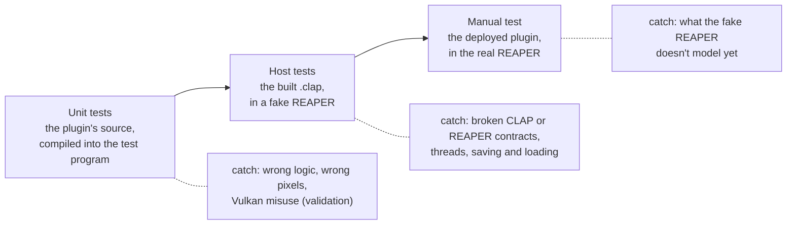
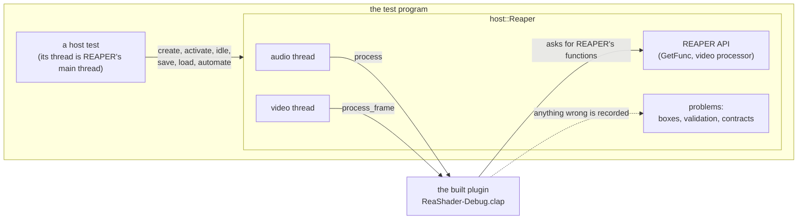

# Testing ReaShader

A change to ReaShader is checked at three levels, from the fastest and narrowest to the slowest and widest: **unit tests** call pieces of the plugin's source directly, **host tests** load the built plugin into a fake REAPER, and the **manual test** runs it in the real REAPER. The first two make up the **test application** in `test/`, run with the `test` task before every manual test. The manual test stays the final check, because only real REAPER can show that the fake one is faithful.



*What to see:* each level runs more of the real thing than the one before, and catches a different kind of bug. The automated levels run in seconds; the manual one needs a person and REAPER.

**Words this doc uses:**

| Word | Meaning |
|---|---|
| test application | the program in `test/`, `reashader_tests`, built separately from the plugin |
| suite | a group of tests about one area (`params`, `render`, `host`, ...), which can be run on its own |
| test case | one test, named by a sentence saying what it checks |
| fixture | a file a test reads, such as `test/shaders/broken.frag` |
| fake host | `test/host/`: a small stand-in for REAPER that loads the plugin and calls it the way REAPER does |
| observed / assumed | whether a REAPER behavior the fake host copies was verified in REAPER, or is still a guess |
| problems | everything the fake host saw go wrong during a test: message boxes, validation messages, broken contracts |

Contents:

1. [Running the tests](#1-running-the-tests)
2. [What each level covers](#2-what-each-level-covers)
3. [Writing a test](#3-writing-a-test)
4. [The fake REAPER host](#4-the-fake-reaper-host)
5. [Manual testing in REAPER](#5-manual-testing-in-reaper)
6. [Reference](#6-reference)

## 1. Running the tests

**Run the `test` task in VS Code (or `build.cmake` with `-DTEST=ON`); it builds the plugin without deploying it, then builds and runs the test application.**

**VS Code:** run the **`test`** task and pick the profile (debug or release). It:

1. builds the plugin's preset, like `build+deploy`, but **doesn't deploy**;
2. configures (first time only) and builds the test application in `build/tests-<profile>/`;
3. runs it, and fails the task if any test fails.

**Command line:**

```bash
cmake -DTEST=ON -P build.cmake
```

```bash
cmake -DPROFILE=release -DTEST=ON -P build.cmake
```

```bash
cmake -DTEST=ON -DTEST_ARGS="--test-suite=render" -P build.cmake
```

**Running the binary directly** is faster when only tests changed: `build/tests-debug/reashader_tests`. It takes [doctest's command line](https://github.com/doctest/doctest/blob/master/doc/markdown/commandline.md):

| Option | Effect |
|---|---|
| `--test-suite=render` | only one suite (the suites are listed in [Reference](#test-suites)) |
| `--test-case="*logo*"` | only matching test cases |
| `--success` | also print passing checks |
| `--list-test-cases` | list everything |
| `--help` | all options |

- **The output** ends with a summary line, `[doctest] Status: SUCCESS!` or `FAILURE!`, and the exit code is 0 on success. Each failure prints the file and line, the expression with both sides' values, and its context (e.g. which GPU).
- **Tests don't run on `build+deploy`,** so an experiment can still be deployed to REAPER while a test is red. A change is done only when they pass.
- **The two profiles test different things:**
  - **debug** runs the GPU code with the Vulkan validation layer, including synchronization validation (see [rendering.md](rendering.md#73-debugging)), and any validation message fails the test that caused it;
  - **release** runs without validation, closer to what users run.

## 2. What each level covers

**Unit tests check pieces of the source in isolation, and host tests check the built plugin as REAPER sees it; between them, every area of the plugin has a suite.**

- **Unit tests** compile parts of the plugin's source into the test program and call them directly: the parameter list, the web UI protocol (on a plugin object that's never activated, so no GPU), the shader compiler, the LUT parser, the renderer's building blocks and the renderer itself. The GPU suites run on **every GPU** of the machine and compare output pixels exactly.
- **Host tests** load the **built plugin** (`build/windows-<profile>/ReaShader[-Debug].clap`) into the fake REAPER, and drive it only through CLAP and the REAPER API, as REAPER does. The plugin has no test hooks: whatever a host test needs, like a shader in the chain, arrives the way it would in REAPER (in a saved project).

| Level | Suite | Checks |
|---|---|---|
| unit | `params` | the fixed param list, host and real values, nodes' params in their slots, values carried across edits |
| unit | `protocol` | every web UI message and the saved state, on a plugin that's never activated |
| unit | `shader_compiler` | the shader contract: reflection, `//@param`, `iLut`, errors, the stored form |
| unit | `lut` | the `.cube` parser and the stored LUT form |
| unit, GPU | `render` | the renderer's building blocks, pixel by pixel |
| unit, GPU | `renderer` | `ReaShaderRenderer` itself, with its chain code and device switches |
| host | `host` | the built plugin's lifecycle, and whole-project scenarios |

The full list of what each suite covers is in [Reference](#test-suites).

## 3. Writing a test

**A test is a sentence-named case in its area's file, checking results that come out the same on every run and every GPU.** Each kind of test has a helper that sets up what it needs.

### 3.1 The format

One file per area in `test/cases/`, all in the same format. A new file is added to `target_sources` in `test/CMakeLists.txt`.

```cpp
#include "support/support.h"

#include <doctest/doctest.h>

TEST_SUITE("area")
{
    TEST_CASE("what it checks, as a sentence")
    {
        REQUIRE(precondition);     // stops this test case if false
        CHECK(a == b);             // records a failure and continues
        CHECK_THROWS_WITH(f(), doctest::Contains("message part"));
        INFO("context: ", value);  // printed with any failure after it, in this scope
    }
}
```

- **Name tests as a sentence** saying what they check. Failures print it.
- **Prefer `CHECK` over `REQUIRE`,** except for a precondition the rest of the test can't do without (e.g. a list's size before indexing it).
- **Keep `std::rand`, timing and wall-clock values out of checks:** results must be the same on every run and every GPU. Tolerances (e.g. ±1 per channel) are fine where the GPU rounds.

### 3.2 GPU tests of the building blocks

**`test::forEachGpu` runs a test's body once per GPU, on one shared Vulkan instance, and fails it on any validation message.**

```cpp
test::forEachGpu([&](gpu::Context& context) {
    gpu::ShaderPass pass;
    pass.create(context, shader);
    gpu::FrameTargets targets;
    test::render(context, targets, input, output, { .passes = { &pass }, .params = { 0.2f } });
    CHECK(...);
    pass.destroy(context);    // destroy what you created, before the device goes
    targets.destroy(context);
});
```

- **One Vulkan instance for the whole run.** `forEachGpu` creates a device per GPU, runs the body, then destroys the device, even if a `REQUIRE` throws.
- **Failures are tagged with the GPU** (`GPU 0: <name>`).
- **Validation:** any validation message logged meanwhile (debug builds) fails the test. The messages come from `rs.log` next to the test binary.
- **`test::render`** records a frame like `ReaShaderRenderer::renderFrame`: upload → the passes, chained by the renderer's own `FrameTargets::recordPasses` (none: a plain copy) → scene → download.
  - `.params` go to every shader pass, whose `iChannel1` is `.shaderLut` (default: an identity).
  - A `gpu::LutPass` gets its LUT (`bindLut`) and amount (`setAmount`) from the test.
  - A pass object may appear only once in `.passes` (one descriptor set each).
- **Test frames:** `test::TestFrame(width, height, padding)` is a BGRA frame with `padding` extra bytes per row, like REAPER's row stride. Use odd widths and padded rows where layout matters. `test::gradient()` is a 256×4 frame with every 8-bit value in every color channel, and `test::mismatches(input, output, expected, tolerance)` counts the color channels that differ from `expected(input value)` (alpha must be unchanged).

### 3.3 Tests of the whole renderer

**The `renderer` suite tests `ReaShaderRenderer` itself, with its real chain code, on its own Vulkan instance, as in REAPER.**

- **`TestRenderer`** (`cases/renderer.cpp`) is a `ReaShaderPlugin` (never initialized: the renderer only asks it for the rendering device) and a `ReaShaderRenderer`.
- **`forEachGpu(body)`** runs `init()`, then the body once per GPU (`test::gpuCount()`), switching with `changeRenderingDevice()` before each, so the chain carries over from one GPU to the next. Validation messages logged meanwhile (`test::validationMessages()`) fail the test.
- **`render(input, output, params)`** calls `renderFrame` with `params` as the plugin's values by index, and returns `false` when the frame passed through.

### 3.4 Host tests

**A host test creates the fake REAPER, drives the plugin through it, and ends by checking that nothing went wrong.**

```cpp
TEST_CASE("what it checks")
{
    host::Reaper reaper(host::builtPlugin());
    reaper.createPlugin();
    reaper.activate();

    host::Reaper::VideoResult result = reaper.renderVideo(frame, 0.0);
    CHECK(result.passthrough);

    reaper.idle();
    reaper.destroyPlugin();
    test::checkNoProblems(reaper); // FAIL_CHECK on each of reaper.problems()
}
```

**Shaders and LUTs arrive as in a saved project,** since the plugin has no test hooks. `test::projectState(chain, params, logo)` (`support/host_helpers.h`) builds a state document from a chain of nodes:

- `test::shaderNode(uid, "brightness.frag", bypass)` compiles an example shader with the shader compiler, as the plugin would have on upload;
- `test::lutNode(uid, name, lut, bypass)` stores a `LutData` (e.g. `test::invertLut()`) as the plugin would have on upload.

Load it with `loadState()`: the plugin applies the new params right away, active or not, as REAPER needs when it opens a project (it activates the plugin first, then loads the state; observed). Param values go by saved name (`"<uid>/<member>"`), and params are found by the name REAPER shows (`"[A] brightness: Brightness"`, with the node's tag: A for uid 0). `test::v3ProjectState` and `test::v3ProjectLut` make a version 3 document (from before chains), to test its migration.

## 4. The fake REAPER host

**`test/host/` is our model of REAPER: what the plugin may expect from REAPER is written down there, as code, and each behavior is marked as observed in REAPER or only assumed.**



*What to see:* the test talks only to the fake REAPER, and the fake REAPER talks to the plugin through the same doors REAPER uses: CLAP calls on the right threads, and the REAPER API. Whatever goes wrong on the way is collected, and every host test fails on it.

### 4.1 What it does

**It loads one plugin instance and drives it like an FX on a track, on the threads REAPER would use.**

- **Loading:** `LoadLibrary` on the `.clap`, `clap_entry.init`, the plugin factory. The thread that creates the `host::Reaper` is REAPER's **main thread**. There is one `host::Reaper` at a time, because REAPER's `GetFunc` has no context argument. `test/host/reaper_sdk.h` includes `<windows.h>` with `NOMINMAX` defined, for test code only (the plugin doesn't define it).
- **The plugin's lifecycle:** `createPlugin()` (`create_plugin` + `init` + a param scan), `activate()`, `deactivate()`, `destroyPlugin()`.
- **REAPER's threads:** `start_processing`, `process` and `stop_processing` run on an **audio** thread, and `process_frame` on a **video** thread (`host::HostThread`, `test/host/thread.h`). Each call waits for its thread, so a test reads top to bottom, while the plugin still sees the calls come from the right threads.
- **`idle()`** is REAPER's main-thread timer: it makes the main-thread callback when the plugin asked for one, restarts the plugin (`deactivate` + `activate`) when it asked for a restart (the plugin doesn't ask for restarts), and flushes params when asked.
- **Audio:** `processAudio(blocks, input)` runs stereo 256-sample blocks of a constant input and returns the output.
- **Video:** `renderVideo(frame, time)` hands the frame to `process_frame` as REAPER's upstream frame, with wet/dry 1 and the host's param values, and returns what the plugin returned. It also says whether that was the input frame itself (passthrough).
- **State:** `saveState()` / `loadState(data)`, on the main thread, like saving and opening a project. The host feeds the state to the plugin in chunks of 1000 bytes.
- **Params:** `params()` is every param after the last scan, hidden ones too; `visibleParams()` and `param(name)` only the ones REAPER shows (observed: a hidden param with an empty name is in none of REAPER's menus). `rescan(INFO)` and `rescan(VALUES)` are taken while active (observed), `rescan(ALL)` only while inactive.
- **Automation:** `automate(id, value)` is an envelope on the id: the host's value (what `process_frame` gets) changes right away and stays through rescans, hidden or not (observed), even after the plugin clears the id (`params.clear`: observed, REAPER keeps them; `cleared()` lists the ids). It also queues a CLAP param event for the next audio block. `pluginValue(id)` asks the plugin (`params.get_value`), and `paramText(id, value)` and `paramFromText(id, text)` convert like REAPER's param displays (`params.value_to_text`, `text_to_value`).
- **The REAPER API** the plugin uses, through the `cockos.reaper_extension` host extension and its `GetFunc`:
  - `clap_get_reaper_context` (4 = the FX's FxDsp, 1 = its track);
  - `video_CreateVideoProcessor`, which returns a `host::VideoProcessor` that the plugin deletes on deactivate;
  - `GetSetMediaTrackInfo(P_NAME)` and `GetMediaTrackInfo_Value(IP_TRACKNUMBER)`.
- **Frames** (`host::VideoFrame`, `test/host/video.h`) are reference-counted, `'RGBA'` (B,G,R,A in memory), with padded rows (`host::rowspanFor`).

### 4.2 What it checks

**`reaper.problems()` lists everything that went wrong, and every host test ends by failing on each one** (`test::checkNoProblems`). It contains:

- **message boxes** the plugin showed: a watcher closes them within about 20 ms, so a run never hangs;
- **Vulkan validation messages** in the plugin's `rs.log` (debug builds), which the host deletes before loading the plugin;
- **broken contracts:**
  - `params.rescan(ALL)` while active, or any rescan or `params.clear` off the main thread;
  - a `GetFunc` name the host doesn't emulate;
  - a second video processor created before the first was deleted;
  - frames the plugin neither returned nor released;
  - `process_frame` returning nothing.

### 4.3 Observed and assumed

**Every REAPER behavior in the fake host is commented as observed (verified in REAPER, saying how) or assumed (not verified yet).**

- **Observed so far:** the REAPER extension and the contexts 4 and 1, which the plugin's working video tap relies on; REAPER opens a project by activating the plugin, then loading its state; it binds envelopes by param id, and keeps them bound across rescans and while a param is hidden; it takes `rescan(INFO)` while active; a hidden param with an empty name is in none of its menus; it keeps a param's envelope and modulation after `params.clear`.
- **Assumed, for example:** the order of calls in `idle()`, the frames' row padding, `force_format` 0, state in 1000-byte chunks.

**When REAPER turns out to behave differently,** fix the fake host first and mark the behavior observed. Then add a test that fails the way REAPER did, and fix the plugin.

## 5. Manual testing in REAPER

**After the test application passes, deploy with `build+deploy` and run through this list in REAPER; it's the final check.**

1. Load "ReaShader" (CLAP) on a track that has a video item.
2. Check that the FX window shows the embedded web UI, and that the UI resizes with the window.
3. With an empty chain (the initial state), check that video passes through unchanged.
4. Upload each of `resources/shaders/examples/*.frag` from the plugin folder. Each one should:
   - be appended to the chain as a card with its sliders, and appear in the shader list;
   - show its params in REAPER's generic parameter list, after "Audio Gain", named `[<tag>] <shader>: <slider>`, the tag being the letter on the node's card;
   - keep those params in sync both ways with the web UI's sliders.

   `grain.frag` should show new noise on every frame, also while paused when a slider moves (`iFrame`).
5. Upload `test/shaders/broken.frag`: the compile error shows in the UI, and the chain stays as it was.
6. Upload a real `.cube` LUT (a 33³ and a 65³ one, and a 1D one if you have it). With `brightness.frag` in the chain:
   - moving the LUT before or after the shader (↑ / ↓) gives visibly different results;
   - picked as `lut_split.frag`'s "LUT (iLut)", it shows left of the split line; `brightness.frag`'s card has no "LUT (iLut)" selector, since it doesn't use one;
   - its Mix (web UI slider, REAPER's generic list, automation) blends from its input at 0% to the LUT at 100%.
7. Upload `test/luts/broken.cube`: the error (line 6) shows in the UI, and the chain stays as it was.
8. The chain editor:
   - add the same shader twice from "Add a shader": two cards, each with its own sliders and host params;
   - bypass a node: the video skips it, its sliders dim and keep their values, and REAPER's param list doesn't change;
   - swap a node for another stored shader or LUT with its drop-down, and remove one with ×;
   - automate a shader's slider in REAPER, then move its node: the automation still drives the same slider, and the envelope's name still matches the card's letter;
   - remove an automated node, then add another: the new node takes the removed node's letter and **inherits its envelope**. The plugin asks REAPER to drop a removed param's automation (`params.clear`), and dropping it is the intended result, but REAPER keeps it (observed, see [gotchas.md](gotchas.md#reaper)). Check that the new node is the one driven, on the letter just removed, so the leftover envelope is visible at once rather than surfacing later.
9. Save the project, close it and reopen it: the chain (order, bypass, a shader's LUT), values and envelopes come back, each envelope still on its param. `rs.log` says whether REAPER loaded the state while the plugin was active or inactive. Open a project saved before chains (one shader, one LUT and a LUT mode): it becomes the matching chain, with its automation. Switch the GPU with a chain loaded: it keeps applying.
10. Click the UI's logo: the about box opens and the 3D logo spins in the video window. Closing the box removes the logo.

## 6. Reference

Details to look up, not to read through.

### Layout

```
test/
  CMakeLists.txt       the test application's own CMake project (never included by the main build)
  main.cpp             doctest's runner, plus teardown of the shared GPU instance
  support/             helpers shared by the cases (no tests here): support.* for unit tests (repoPath, readFile,
                       TestFrame, gradient, mismatches, forEachGpu, gpuCount, validationMessages, render,
                       invertLut), host_helpers.h for host tests (checkNoProblems, frames, mismatches,
                       brightnessMismatches, shaderNode, lutNode, projectState, v3ProjectState, v3ProjectLut)
  host/                the fake REAPER host (no tests here; Windows only)
  cases/               the tests: one file per area, each a TEST_SUITE
  shaders/             fixtures: broken.frag
  luts/                fixtures: invert.cube, curve_1d.cube, domain.cube, broken.cube
```

### Test suites

| Suite | File | Covers |
|---|---|---|
| `params` | `cases/params.cpp` | the parameter list: a fixed list (Audio Gain and 16 × 40 node slots, index = id, unused slots with no name), host values (0..1 over each range) vs. real values, nodes' params in their node's slots (values saved by name, kept for the same id and name and clamped to a new range, otherwise defaults), params that go away reported and their slots freed, the 40-per-node limit, values to and from JSON and `toJson` for the UI (used params only), params flagged for the host taken once, by id, with their latest value (never an unused slot, or a param that went away). |
| `protocol` | `cases/protocol.cpp` | the web UI protocol and the state on a plugin that's never activated (no GPU): `ready`'s snapshot, `paramValue` (to the host through a flush, unknown ids ignored), host automation echoed on the main thread, `shaderUpload` and `lutUpload` (stored, appended as a node with its params, which the host rescans; a broken one leaves the chain as it was), `nodeAdd` (by name, at an index or last, the same shader twice, no paths, errors), the 16-node limit (an upload is still stored), `nodeRemove` (its params cleared in the host; the uid free again at once; no restart ever), real values in the UI vs. 0..1 for the host (and as text both ways), `nodeMove` (ids, values and labels stay, nothing cleared), `nodeSet` clearing the swapped-out params, shaders with more than 40 sliders rejected on upload (not stored), add, swap and project load (left out, the UI told), 40 exactly accepted, `nodeBypass` and `nodeLut` (saved, no rescan; no LUT for LUT nodes; `samplesLut` in the snapshot), `nodeSet`, a LUT node's Mix to the host, `logo` and `renderingDevice` saved, the state round trip (params there as soon as an inactive plugin loads it, nothing cleared), invalid saved nodes skipped, version 3 states migrated (every mode, param values and ids kept), unrecognized states ignored, unknown, old and malformed messages ignored. Uploads are stored in `resources/shaders/compiled` and `resources/luts` next to the test binary, emptied at the start of each test. `openUrl` isn't tested, since a valid URL opens the browser. |
| `shader_compiler` | `cases/shader_compiler.cpp` | the shader contract: the examples compile, `Params` reflection and offsets, `//@param`, `iLut`, whether a shader samples a LUT (`samplesLut`: only if `main()` reaches it, kept through `fromJson`), error line numbers, rejected resources, the stored JSON form. No GPU. |
| `lut` | `cases/lut.cpp` | the `.cube` parser: the table as written (red fastest), comments/CRLF/unknown keywords, a 1D LUT baked into a cube, a `DOMAIN` resampled onto 0..1, errors with file and line, the stored JSON form at half precision, base64. No GPU. |
| `render` | `cases/render.cpp` | the renderer's building blocks on **every GPU**, checked pixel by pixel: an example shader at an odd width with padded rows, `Params` values and B,G,R,A order, defaults for params not given, the logo scene over a plain copy, the LUT pass (identity, inverting, blended), a LUT before or after a shader, a shader sampling the LUT with `iLut`, four passes through the work images, consecutive frames. |
| `renderer` | `cases/renderer.cpp` | `ReaShaderRenderer` itself on **every GPU**, on its own Vulkan instance with a device switch between GPUs (the chain carries over): no chain or only bypassed nodes pass through, nodes in order with their own params (the same shader twice, a reorder), five nodes with two bypassed, a LUT node's Mix (1 without a value), shader params the frame doesn't have yet at their defaults, a shader node's own LUT as `iChannel1`, a node's objects kept while its content is the same (its `iFrame` goes on, pauses while bypassed, restarts with new content or another uid), invalid chains rejected with the current one kept, a chain set before `init()`. |
| `host` | `cases/host_lifecycle.cpp` | the built plugin in the fake host: its descriptor, the initial visible params (Audio Gain), activate/process/deactivate twice (audio unchanged at gain 1, the video processor created and deleted), video passthrough with no shader, destroying an active plugin. |
| `host` | `cases/host_scenarios.cpp` | project scenarios: the param list (every id from the start, unused slots hidden and nameless); a project opened as REAPER opens one (activate, then the state: its params at once, no restart); an envelope bound to a still-hidden id before the state loads, driving the node at once; a project loaded before activation; param values at video time vs. the plugin's own; a chain of four nodes with one bypassed (params in id order, frames through it); automation staying with its node when a project reorders the chain; the state round trip (the chain, values by name, logo); the logo over video; version 3 projects in each LUT mode, with the LUT node's Mix; every param 0..1 to the host, its real value as text; an unrecognized state. |

### How the test application is built

`test/CMakeLists.txt` follows the main build's structure:

- it compiles the plugin sources under unit test (`src/plugin/*`, `src/render/*`, `src/util/*`, everything except the CLAP shell and the GUI) straight into `reashader_tests`, with the plugin's warning flags and `REASHADER_VERSION="test"`;
- the host tests load the plugin built by the main build's preset of the same profile (`REASHADER_CLAP`), which the `test` task builds first;
- it compiles the internal shaders with `glslc`, like the main build;
- it stages `res/meshes` and `res/images` next to the binary, because the render code finds `resources/` next to its own binary.

**Framework:** [doctest](https://github.com/doctest/doctest), a single header, as the submodule `external/doctest` (pinned to `v2.5.3`).
