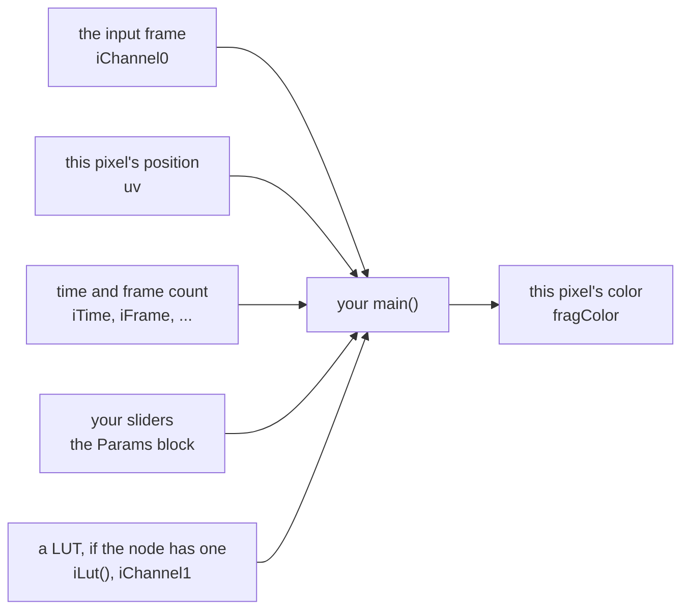

# Writing a ReaShader shader

A ReaShader shader is a small GLSL program that computes the color of one pixel of the video; the GPU runs it once for every pixel of every frame. You write only its `main()` function: ReaShader declares everything else for you, the input frame, the pixel's position, the time, and a LUT. To get sliders in the plugin window, which REAPER can also automate, you declare them in a `Params` block.



*What to see:* your code sits in the middle. Everything on the left is handed to it; all it has to do is write `fragColor`.

The shaders in this folder are examples to upload, try and copy from. Upload one from the plugin window, with the folder button next to "Add a shader": the plugin compiles it once, keeps the compiled version in its shader list, and adds it to the chain.

Contents:

1. [The smallest shader](#1-the-smallest-shader)
2. [What every shader gets](#2-what-every-shader-gets)
3. [Sliders](#3-sliders)
4. [Time and frames](#4-time-and-frames)
5. [Using a LUT](#5-using-a-lut)
6. [The examples](#6-the-examples)

## 1. The smallest shader

**A shader reads the input frame at its pixel and writes a color.** Here is an example that inverts the video's colors:

```glsl
void main()
{
    vec4 video = texture(iChannel0, uv);       // this pixel of the input frame
    fragColor = vec4(1.0 - video.rgb, video.a); // its colors inverted, alpha kept
}
```

- **No `#version` and no declarations are needed:** `uv`, `iChannel0` and `fragColor` come from ReaShader. A `#version` line of your own is ignored.
- **Errors show in the plugin window,** with line numbers matching your file.

## 2. What every shader gets

**These names exist in every shader without being declared:**

| Name | Type | What it is |
|---|---|---|
| `uv` | `vec2` | this pixel's position in the frame, 0..1, with (0, 0) at the top left |
| `fragColor` | `vec4` | the color you write for this pixel |
| `iChannel0` | `sampler2D` | the input video frame: `texture(iChannel0, uv)` |
| `iChannel1` | `sampler3D` | the shader's LUT, as a 3D texture (see [Using a LUT](#5-using-a-lut)) |
| `iLut(color)` | `vec3 → vec3` | `color` through the shader's LUT |
| `iResolution` | `vec2` | the frame's size in pixels |
| `iTime` | `float` | the project time, in seconds |
| `iFrameRate` | `float` | frames per second |
| `iFrame` | `int` | frames this shader has rendered since it was loaded (see [Time and frames](#4-time-and-frames)) |

## 3. Sliders

**Put the values you want to control in a `Params` block, and describe each with a `//@param` comment: it gets a slider in the plugin window, and becomes a REAPER parameter you can automate.**

```glsl
//@param amount 'Amount' 0.5 0 1
uniform Params
{
    float amount;
};
```

- **Types:** `float`, `vec2`, `vec3` and `vec4`. A `float` gets one slider; a vector gets one per component (`color.x`, `color.y`, ...).
- **The annotation** is `//@param <member> '<Label>' <default> <min> <max>`. The label and the numbers are optional, in that order. Without an annotation, a slider is labelled with the member's name, starts at 0.5 and ranges from 0 to 1.
- **At most 40 sliders** per shader (a `vec3` counts 3, a `vec4` 4), as in REAPER's own video processor. A shader with more is rejected when you upload it, with an error in the plugin window.
- **In REAPER,** each slider's parameter is named after the shader's letter in the chain, the shader's name and the slider's label: for example, `tint.frag`'s Amount slider, in the chain's node B, is `[B] tint: Amount`.

## 4. Time and frames

**Use `iTime` for anything that should line up with the project, and `iFrame` for anything that should simply change on every frame.**

- **`iTime`** is the project's time. It follows the timeline: seeking, looping or exporting shows the same picture at the same position. `wave.frag` uses it.
- **`iFrame`** counts the frames this shader has rendered, from 0 when it was loaded. It isn't tied to the timeline:
  - seeking back doesn't lower it, and REAPER may render the same position more than once (while paused, or when a slider moves);
  - it pauses while the shader is bypassed, and starts over when the shader is swapped.

  So use it where every frame should just be different, like the noise in `grain.frag`, never for anything that must look the same on every export.

## 5. Using a LUT

**A LUT (a `.cube` color grade) can be its own step in the chain, or be handed to your shader, which then decides how to use it.**

- **As its own step,** a LUT node sits before or after your shader in the chain, and its Mix blends it in. Your shader needs nothing for this.
- **Inside your shader,** pick the LUT in your shader card's "LUT (iLut)" drop-down. The drop-down appears once your `main()` uses `iLut` or `iChannel1`. Then:
  - `iLut(color)` returns `color` (0..1 RGB) through that LUT, and blending is up to you;
  - `iChannel1` is the LUT as a 3D texture, if you want to sample it yourself.

  With no LUT picked, `iLut` returns its input unchanged, so a shader that uses it still works.

Here is an example: `lut_split.frag` shows the LUT on one side of a movable line.

```glsl
vec4 video = texture(iChannel0, uv);
fragColor = vec4(uv.x < split ? iLut(video.rgb) : video.rgb, video.a);
```

## 6. The examples

| File | What it does | What it shows |
|---|---|---|
| `brightness.frag` | brightens the video | the simplest slider |
| `tint.frag` | tints the video towards a color | a `vec3` slider (one per color component) |
| `pixelate.frag` | pixelates the video into square blocks | a slider with its own range (1 to 128 pixels), and `iResolution` |
| `wave.frag` | ripples the video with a moving sine wave | animation with `iTime`, which follows the project |
| `grain.frag` | adds film grain | new noise on every frame, with `iFrame` |
| `lut_split.frag` | shows the LUT on one side of a movable line | a LUT used inside the shader, with `iLut()` |
